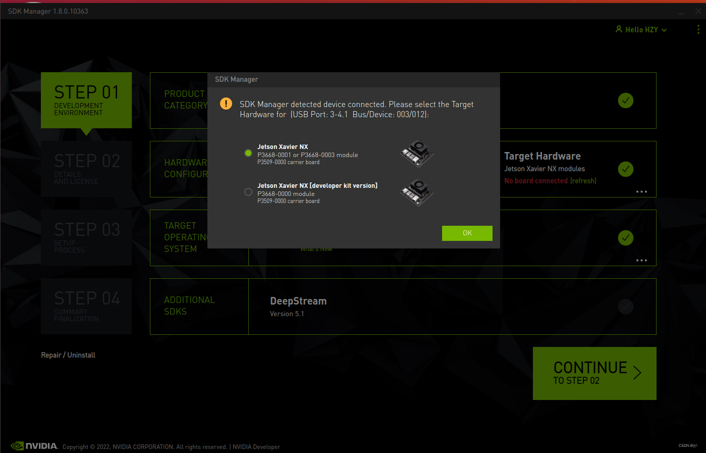
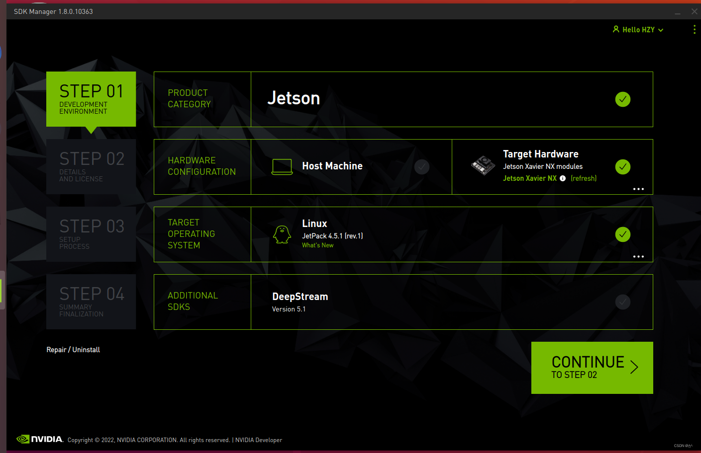
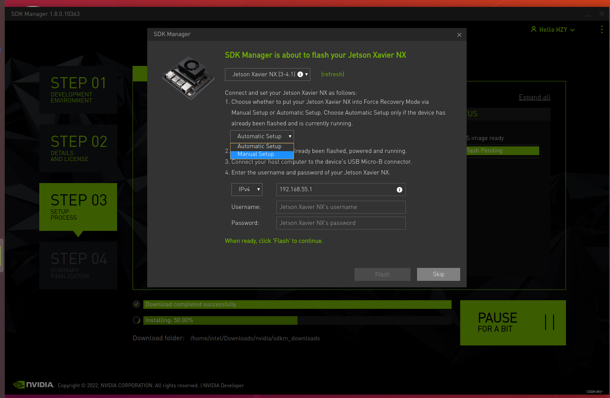

1. 下载sdkmanager，并进行安装.

2. 运行sdkmanager
```
1. 运行的时候nx盒子连线并配置和host同一网段的ip，同事网线需要连接，且强制刷机线连接。 
```

```
2. 将host取消，不勾选，且切换target system 到jetpack 4.6.4
```


3. 勾选先下载后install

4. 下载完成后，重新进行install,选择手动安装,如果错误可以切换连接方式多试一下，根据界面提示安装就好了。此时需要连接nx盒子到显示屏输入密码登操作。  实在不行就先跳过安装组件，先进系统后再选择安装组件.

