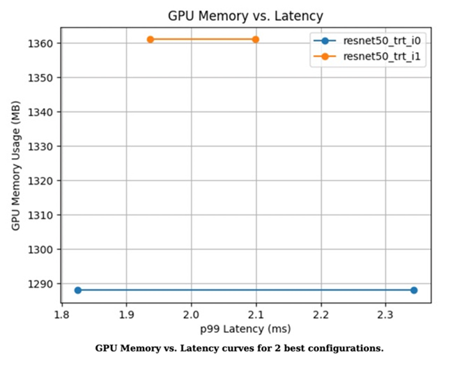

# **优化模型，加速推理**
```
本文以PyTorch官方提供的Resnet50模型为例，说明如何通过PyTorch Profiler发现模型的性能瓶颈，进而使用TensorRT优化模型，然后使用Triton Inference Server部署优化后的模型。

参考: https://help.aliyun.com/zh/ack/cloud-native-ai-suite/use-cases/optimize-a-pytorch-model
```

## **背景信息**
```
Nvidia TensorRT是一个加速深度学习模型推理的SDK，包含可以降低推理时延、提高吞吐量的优化器和运行时。Triton Inference Server则是Nvidia官方推出的一个开源模型推理框架，可以支持PyTorch、Tensorflow、TensorRT、ONNX等主流的模型。

深度学习模型在训练完成，准备部署上线时，通常需要对模型进行性能分析和优化，以便降低推理时延、提高吞吐量。同时可以减少模型占用的显存，通过共享GPU，提高GPU的使用率。

本文以PyTorch官方提供的Resnet50模型为例，通过对下图dog.jpg识别，说明如何通过使用PyTorch Profiler发现模型的性能瓶颈，进而使用TensorRT优化模型，然后使用Triton Inference Server部署优化后的模型。
```


## **前提条件**

1. 已创建包含GPU的Kubernetes集群。具体操作，请参见 **[使用Kubernetes默认GPU调度](https://help.aliyun.com/zh/ack/ack-managed-and-ack-dedicated/user-guide/use-gpu-scheduling-in-ack-clusters#task-1664343)**
2. 集群节点可以访问公网。具体操作，请参见 **[为已有集群开启公网访问能力](https://help.aliyun.com/zh/ack/ack-managed-and-ack-dedicated/user-guide/enable-an-existing-ack-cluster-to-access-the-internet#task-1936294)**。
3. 已安装Arena工具。具体操作，请参见 **[安装Arena](https://help.aliyun.com/zh/ack/cloud-native-ai-suite/user-guide/install-arena#task-1917487)**。
4. 已为集群配置了Arena使用的PVC。更多信息，请参见 **[配置NAS共享存储](https://help.aliyun.com/zh/ack/cloud-native-ai-suite/user-guide/configure-a-shared-nas-volume#task-1917776)**。

## **步骤一：使用PyTorch模型的Profiler能力**
PyTorch自1.8.1版本开始提供了Profiler能力，可以帮助分析模型训练、推理过程中的性能瓶颈。并能与Tensorboard集成，方便查看分析报告。

### 1. 执行以下命令，生成Profiler日志.

```
import torch
from torchvision import models
import torchvision.transforms as T
from PIL import Image
import time

#图片预处理。
def preprocess_image(img_path):
    transform = T.Compose([
    T.Resize(224),
    T.CenterCrop(224),
    T.ToTensor(),
    T.Normalize(mean=[0.485, 0.456, 0.406], std=[0.229, 0.224, 0.225]),])

    #读取图片。
    input_image = Image.open(img_path)
    #图片格式转换。
    input_data = transform(input_image)

    batch_data = torch.unsqueeze(input_data, 0)

    return batch_data


#预测结果后处理。
def postprocess(output_data):
    #读取Imagenet分类数据。
    with open("imagenet_classes.txt") as f: 
        classes = [line.strip() for line in f.readlines()]
    #通过Softmax得到可读的预测结果。
    confidences = torch.nn.functional.softmax(output_data, dim=1)[0] * 100
    _, indices = torch.sort(output_data, descending=True)
    i = 0
    #打印预测结果。
    while confidences[indices[0][i]] > 0.5:
        class_idx = indices[0][i]
        print(
            "class:",
            classes[class_idx],
            ", confidence:",
            confidences[class_idx].item(),
            "%, index:",
            class_idx.item(),
        )
        i += 1


def main():
    model = models.resnet50(pretrained=True)

    input = preprocess_image("dog.jpg").cuda()

    model.eval()
    model.cuda()

    with torch.profiler.profile(
        activities=[
            torch.profiler.ProfilerActivity.CPU,
            torch.profiler.ProfilerActivity.CUDA,
        ],
        on_trace_ready=torch.profiler.tensorboard_trace_handler('./logs'),
        profile_memory=True,
        record_shapes=True,
        with_stack=True
    ) as profiler:
        start = time.time()
        output = model(input)
        cost = time.time() - start
        print(f"predict_cost = {cost}")

        postprocess(output)
        profiler.step()


if __name__ == '__main__':
    main()
```

### 2. 使用Tensorboard查看分析报告.
执行以下命令安装PyTorch Profiler Tensorboard Plugin并在本地启动Tensorboard。

pip install torch_tb_profiler
tensorboard --logdir ./logs --port 6006

### 3. 在浏览器地址栏输入localhost:6006查看Tensorboard分析结果。
使用Tensorboard可以查看GPU Kernel、PyTorch Op、Trace Timeline等分析结果，进而给出优化建议。


从Tensorboard分析结果可得：

    该Resnet50模型的GPU利用率比较低，可以考虑通过增大Batch size的方式提高利用率。

    大部分时间消耗在GPU Kernel加载上，可以通过降低精度的方式提高推理速度。


## **步骤二：优化PyTorch模型**
通过TensorRT优化模型时，需要先把PyTorch模型转为ONNX，再把ONNX转换成TensorRT Engine。

### 1. 执行以下命令，导出ONNX。
```
#加载预训练模型。
model = models.resnet50(pretrained=True)

#预处理阶段。
input = preprocess_image("dog.jpg").cuda()

#推理阶段。
model.eval()
model.cuda()

#转换为ONNX。
ONNX_FILE_PATH = "resnet50.onnx"
torch.onnx.export(model, input, ONNX_FILE_PATH, input_names=["input"], output_names=["output"], export_params=True)
onnx_model = onnx.load(ONNX_FILE_PATH)

#检查模型是否转换良好。
onnx.checker.check_model(onnx_model)

print("Model was successfully converted to ONNX format.")
print("It was saved to", ONNX_FILE_PATH)
```

### 2. 构建并导出TensorRT Engine。
```
重要
构建TensorRT Engine时，依赖的TensorRT及CUDA版本，要与步骤四：部署优化后的模型使用Triton部署模型推理任务时的版本保持一致，同时也要和ECS实例的GPU Driver、CUDA版本一致。
```
建议直接使用Nvidia提供的TensorRT镜像，这里使用的镜像版本为nvcr.io/nvidia/tensorrt:21.05-py3，对应的Triton镜像为nvcr.io/nvidia/tritonserver:21.05-py3

```
def build_engine(onnx_file_path, save_engine=False):
    if os.path.exists(TRT_ENGINE_PATH):
        #如果存在序列化引擎，请加载该引擎，而不是构建新引擎。
        print("Reading engine from file {}".format(TRT_ENGINE_PATH))
        with open(TRT_ENGINE_PATH, "rb") as f, trt.Runtime(TRT_LOGGER) as runtime:
            engine = runtime.deserialize_cuda_engine(f.read())
            context = engine.create_execution_context()
            return engine, context

    #初始化TensorRT引擎并解析ONNX模型。
    builder = trt.Builder(TRT_LOGGER)

    explicit_batch = 1 << (int)(trt.NetworkDefinitionCreationFlag.EXPLICIT_BATCH)
    network = builder.create_network(explicit_batch)
    parser = trt.OnnxParser(network, TRT_LOGGER)

    #允许TensorRT使用高达1 GB的GPU内存进行策略选择。
    builder.max_workspace_size = 1 << 30
    #本示例批处理中只有一个图像。
    builder.max_batch_size = 1
    #请尽可能使用FP16模式。
    if builder.platform_has_fast_fp16:
        builder.fp16_mode = True

    #解析ONNX。
    with open(onnx_file_path, 'rb') as model:
        print('Beginning ONNX file parsing')
        parser.parse(model.read())
    print('Completed parsing of ONNX file')

    #生成针对目标平台优化的TensorRT引擎。
    print('Building an engine...')
    engine = builder.build_cuda_engine(network)
    context = engine.create_execution_context()
    print("Completed creating Engine")

    with open(TRT_ENGINE_PATH, "wb") as f:
        print("Save engine to {}".format(TRT_ENGINE_PATH))
        f.write(engine.serialize())

    return engine, context
```

### 3. 对比原来的PyTorch模型与经过TensorRT优化后模型的Latency及Size。

#### a. 行以下命令，计算原始PyTorch模型在GPU上的推理耗时。
```
model = models.resnet50(pretrained=True)
input = preprocess_image("dog.jpg").cuda()
model.eval()
model.cuda()
start = time.time()
output = model(input)
cost = time.time() - start
print(f"pytorch predict_cost = {cost}")
```

#### b. 执行以下命令，计算优化后的TensorRT Engine在GPU上的推理耗时。
```
#初始化TensorRT引擎并解析ONNX模型。
engine, context = build_engine(ONNX_FILE_PATH)
#获取输入和输出的大小，并分配输入数据和输出数据所需的内存。
for binding in engine:
    if engine.binding_is_input(binding):  # we expect only one input
        input_shape = engine.get_binding_shape(binding)
        input_size = trt.volume(input_shape) * engine.max_batch_size * np.dtype(np.float32).itemsize  # in bytes
        device_input = cuda.mem_alloc(input_size)
    else:  #输出。
        output_shape = engine.get_binding_shape(binding)
        #创建页面锁定的内存缓冲区（即不会交换到磁盘）。
        host_output = cuda.pagelocked_empty(trt.volume(output_shape) * engine.max_batch_size, dtype=np.float32)
        device_output = cuda.mem_alloc(host_output.nbytes)
#创建一个Stream，在其中复制输入或输出并运行推断。
stream = cuda.Stream()
#预处理输入数据。
host_input = np.array(preprocess_image("dog.jpg").numpy(), dtype=np.float32, order='C')
cuda.memcpy_htod_async(device_input, host_input, stream)
#运行推理。
start = time.time()
context.execute_async(bindings=[int(device_input), int(device_output)], stream_handle=stream.handle)
cuda.memcpy_dtoh_async(host_output, device_output, stream)
stream.synchronize()
cost = time.time() - start
print(f"tensorrt predict_cost = {cost}")
```

通过计算原始PyTorch模型和计算优化后的TensorRT Engine在GPU上的推理耗时，以及查看优化前后模型文件的Size，可得到以下指标值：


对比原来的PyTorch模型与经过TensorRT优化后模型的Latency及Size值可得，Latency降低为原来的20%左右，同时模型体积也缩小了一半。

## **步骤三：模型性能压测**
在使用Triton Inference Server部署优化后的模型前，可以使用Triton提供的Model Analyzer工具对模型进行压测，分析Latency、吞吐量、GPU显存占用等是否符合预期。关于Model Analyzer工具的更多信息，请参见model_analyzer。

### 1.执行以下命令，对模型进行分析。
执行命令后，会在当前目录生成一个output_model_repository文件夹，包含Profile结果。
```
model-analyzer profile -m /triton_repository/ \
    --profile-models resnet50_trt \
    --run-config-search-max-concurrency 2 \
    --run-config-search-max-instance-count 2 \
    --run-config-search-preferred-batch-size-disable true
```

### 2.执行以下命令，生成分析报告。
为了便于查看分析结果，可以使用model-analyzer的analyze对上一步的分析数据生成PDF格式的文件。
```
mkdir analysis_results
model-analyzer analyze --analysis-models resnet50_trt -e analysis_results
```

### 3.查看分析报告。
图 1. 两种最佳配置的吞吐量与延迟曲线

图 2. 两种最佳配置的GPU内存与延迟曲线

图 3. 两种模型的性能


## **步骤四：部署优化后的模型**
如果模型的性能符合预期，就可以通过Arena把优化后的模型部署在ACK集群中。

### 1. 编写config.pbtxt

```
name: "resnet50_trt"
platform: "tensorrt_plan"
max_batch_size: 1
default_model_filename: "resnet50.trt"
input [
    {
        name: "input"
        format: FORMAT_NCHW
        data_type: TYPE_FP32
        dims: [ 3, 224, 224 ]
    }
]
output [
    {
        name: "output",
        data_type: TYPE_FP32,
        dims: [ 1000 ]
    }
]
```

### 2. 执行以下命令，使用Arena部署模型推理任务
如果使用GPU共享的方式部署，显存大小的设置（--gpumemory）可以参考步骤三：模型性能压测，分析报告中建议的显存大小，该模型显存可设置为2 GB。
```
arena serve triton \
  --name=resnet50 \
  --gpus=1 \
  --replicas=1 \
  --image=nvcr.io/nvidia/tritonserver:21.05-py3 \
  --data=model-pvc:/data \
  --model-repository=/data/profile/pytorch \
  --allow-metrics=true
```

### 3. 执行以下命令，查看推理服务状态
```
arena serve list
```
预期输出：
```
NAME      TYPE    VERSION       DESIRED  AVAILABLE  ADDRESS         PORTS                   GPU
resnet50  Triton  202111121515  1        1          172.16.169.126  RESTFUL:8000,GRPC:8001  1
```
### 4. 使用GRPC Client调用部署在ACK集群中的推理服务
```
img_file = "dog.jpg"
service_grpc_endpoint = "172.16.248.19:8001"

#创建用于与服务器通信的grpc_stub。
channel = grpc.insecure_channel(service_grpc_endpoint)
grpc_stub = service_pb2_grpc.GRPCInferenceServiceStub(channel)

#确保模型符合需求，并获得需要预处理模型的一些属性。
metadata_request = service_pb2.ModelMetadataRequest(
    name=model_name, version=model_version)
metadata_response = grpc_stub.ModelMetadata(metadata_request)
config_request = service_pb2.ModelConfigRequest(name=model_name,
                                                version=model_version)
config_response = grpc_stub.ModelConfig(config_request)
input_name, output_name, c, h, w, format, dtype = parse_model(
    metadata_response, config_response.config)
request = requestGenerator(input_name, output_name, c, h, w, format, dtype, batch_size, img_file)
start = time.time()
response = grpc_stub.ModelInfer(request)
cost = time.time() - start
print("predict cost: {}".format(cost))
```

### 5. 查看监控数据
可以通过8002端口，调用/metrics接口查看指标，本示例为172.16.169.126:8002/metrics。
```
#HELP nv_inference_request_success Number of successful inference requests, all batch sizes
#TYPE nv_inference_request_success counter
nv_inference_request_success{gpu_uuid="GPU-0e9fdafb-5adb-91cd-26a8-308d34357efc",model="resnet50_trt",version="1"} 4.000000
#HELP nv_inference_request_failure Number of failed inference requests, all batch sizes
# TYPE nv_inference_request_failure counter
nv_inference_request_failure{gpu_uuid="GPU-0e9fdafb-5adb-91cd-26a8-308d34357efc",model="resnet50_trt",version="1"} 0.000000
#HELP nv_inference_count Number of inferences performed
#TYPE nv_inference_count counter
nv_inference_count{gpu_uuid="GPU-0e9fdafb-5adb-91cd-26a8-308d34357efc",model="resnet50_trt",version="1"} 4.000000
#HELP nv_inference_exec_count Number of model executions performed
#TYPE nv_inference_exec_count counter
nv_inference_exec_count{gpu_uuid="GPU-0e9fdafb-5adb-91cd-26a8-308d34357efc",model="resnet50_trt",version="1"} 4.000000
#HELP nv_inference_request_duration_us Cumulative inference request duration in microseconds
#TYPE nv_inference_request_duration_us counter
nv_inference_request_duration_us{gpu_uuid="GPU-0e9fdafb-5adb-91cd-26a8-308d34357efc",model="resnet50_trt",version="1"} 7222.000000
#HELP nv_inference_queue_duration_us Cumulative inference queuing duration in microseconds
#TYPE nv_inference_queue_duration_us counter
nv_inference_queue_duration_us{gpu_uuid="GPU-0e9fdafb-5adb-91cd-26a8-308d34357efc",model="resnet50_trt",version="1"} 116.000000
#HELP nv_inference_compute_input_duration_us Cumulative compute input duration in microseconds
#TYPE nv_inference_compute_input_duration_us counter
nv_inference_compute_input_duration_us{gpu_uuid="GPU-0e9fdafb-5adb-91cd-26a8-308d34357efc",model="resnet50_trt",version="1"} 1874.000000
#HELP nv_inference_compute_infer_duration_us Cumulative compute inference duration in microseconds
#TYPE nv_inference_compute_infer_duration_us counter
nv_inference_compute_infer_duration_us{gpu_uuid="GPU-0e9fdafb-5adb-91cd-26a8-308d34357efc",model="resnet50_trt",version="1"} 5154.000000
#HELP nv_inference_compute_output_duration_us Cumulative inference compute output duration in microseconds
#TYPE nv_inference_compute_output_duration_us counter
nv_inference_compute_output_duration_us{gpu_uuid="GPU-0e9fdafb-5adb-91cd-26a8-308d34357efc",model="resnet50_trt",version="1"} 66.000000
#HELP nv_gpu_utilization GPU utilization rate [0.0 - 1.0)
#TYPE nv_gpu_utilization gauge
nv_gpu_utilization{gpu_uuid="GPU-0e9fdafb-5adb-91cd-26a8-308d34357efc"} 0.000000
#HELP nv_gpu_memory_total_bytes GPU total memory, in bytes
#TYPE nv_gpu_memory_total_bytes gauge
nv_gpu_memory_total_bytes{gpu_uuid="GPU-0e9fdafb-5adb-91cd-26a8-308d34357efc"} 16945512448.000000
#HELP nv_gpu_memory_used_bytes GPU used memory, in bytes
#TYPE nv_gpu_memory_used_bytes gauge
nv_gpu_memory_used_bytes{gpu_uuid="GPU-0e9fdafb-5adb-91cd-26a8-308d34357efc"} 974913536.000000
#HELP nv_gpu_power_usage GPU power usage in watts
#TYPE nv_gpu_power_usage gauge
nv_gpu_power_usage{gpu_uuid="GPU-0e9fdafb-5adb-91cd-26a8-308d34357efc"} 55.137000
#HELP nv_gpu_power_limit GPU power management limit in watts
#TYPE nv_gpu_power_limit gauge
nv_gpu_power_limit{gpu_uuid="GPU-0e9fdafb-5adb-91cd-26a8-308d34357efc"} 300.000000
#HELP nv_energy_consumption GPU energy consumption in joules since the Triton Server started
#TYPE nv_energy_consumption counter
nv_energy_consumption{gpu_uuid="GPU-0e9fdafb-5adb-91cd-26a8-308d34357efc"} 9380.053000
```


Triton Inference Server内置了对Prometheus支持，您也可通过配置Grafana展示监控数据。具体操作，请参见 **[对接Grafana](https://help.aliyun.com/zh/sls/developer-reference/connect-log-service-to-grafana#concept-cfp-pnq-zdb)**。