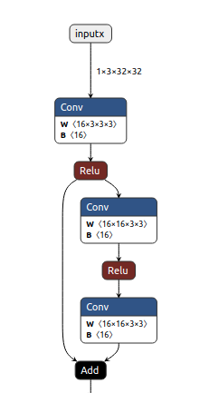
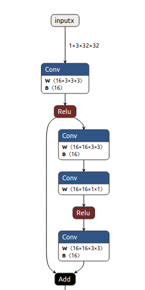
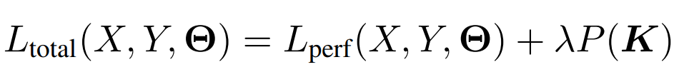
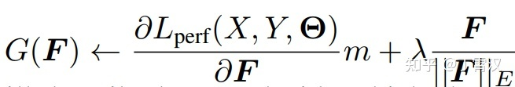

# **resrep 源码阅读记录**
[LINK](https://zhuanlan.zhihu.com/p/402106979)
## **一.模型构建**
**在ndp_train.py脚本中构建正常训练模型，构建代码如下：**
```
# ----------------------------- build model ------------------------------
if convbuilder is None:
    convbuilder = ConvBuilder(base_config=cfg)# 初始化默认的builder为none
if net is None:
    net_fn = get_model_fn(cfg.dataset_name, cfg.network_type)#通过数据集名称来得到需要使用的模型结构构建函数
    model = net_fn(cfg, convbuilder)#以cifar10为例来构建模型，调用stagewise_resnet.py中的create_SRC56函数进行模型构建。
else:
    model = net
model = model.cuda()
# ----------------------------- model done ------------------------------
```

**SRCNet 模型构建(stagewise_resnet.py脚本)**
```
1. 在模型构建的时候使用deps列表来规定模型的输入输出通道数量。
2. 通过deps控制仅仅在resblock中进行剪枝行为。
3. 具体的剪枝操作：在resblock的第一个卷积层后添加一个compact层(1*1的卷积)，同时在当前层添加mask.
如下图所示为网络结构对比图：
```
<div>
<table style="margin-left: auto; margin-right: auto;">
    <tr>
        <td align=center>
        正常结构
        </td>
        <td align=center>
        compact结构
        </td>
    </tr>
    <tr>
        <td align=center>
            
        </td>
        <td align=center>
            
        </td>
    </tr>
</table>
</div>

## **二.模型训练**

```
1. 根据正常结构模型，使用ce进行训练，然后保存最优权重。
2. 将模型进行修改，在每一个block中的第一个conv后添加一个compactor层，作为遗忘部分。同时在此层添加一个mask用以保存训练的遗忘数据。
3. 使用训练好的模型权重初始化修改后的模型（加载模型参数代码在engine.py的262行，load_from_weights_dict函数中）,将named_parameters()和named_buffers()中的值赋值给新模型。在此时named_buffers()中是空的。
4. 使用函数get_compactor_mask_dict得到compactor和mask层的值并保存在dict中，然后根据公式14来进行训练模型。
```
**Note:**真实的训练步骤是，首先在公式14的约束下进行训练，当训练到了规定的训练次数的时候再对compactor中的权重进行排序，以次排序来修改mask值是1还是0。

**公式14中的具体实现代码如下：**
```
pred = net(data)
loss = criterion(pred, label)
loss.backward()
for compactor_param, mask in compactor_mask_dict.items():
    compactor_param.grad.data = mask * compactor_param.grad.data
    lasso_grad = compactor_param.data * ((compactor_param.data ** 2).sum(dim=(1, 2, 3), keepdim=True) ** (-0.5))
    compactor_param.grad.data.add_(resrep_config.lasso_strength, lasso_grad)
```
**mask更新代码如下：**
具体代码实现是在resrep_util.py文件中的resrep_mask_model函数.
```
def resrep_mask_model(origin_deps, resrep_config:ResRepConfig, model:nn.Module):
    origin_flops = resrep_config.flops_func(origin_deps)
    # print('origin flops ', origin_flops)
    # 对当前的compactor层进行统计其当前的deps通道数量，同时根据模型中存在‘conv_idx’属性为条件进行
    cur_deps, metric_dict = resrep_get_deps_and_metric_dict(origin_deps, model,
                                                            pacesetter_dict=resrep_config.pacesetter_dict)
    # print(valve_dict)
    sorted_metric_dict = sorted(metric_dict, key=metric_dict.get)
    # print(sorted_valve_dict)
    # print(sorted_metric_dict)

```

**具体的排序代码如下:**
对compactor层的卷积进行权重group lasso 计算
```
def get_pwc_kernel_detach(self):
    return self.pwc.weight.detach()

def get_metric_vector(self):
    metric_vector = torch.sqrt(torch.sum(self.get_pwc_kernel_detach() ** 2, dim=(1, 2, 3))).cpu().numpy()
    return metric_vector

def set_mask(self, zero_indices):
    new_mask_value = np.ones(self.num_features, dtype=np.float32)
    new_mask_value[np.array(zero_indices)] = 0.0
    self.mask.data = torch.from_numpy(new_mask_value).cuda().type(torch.cuda.FloatTensor)

# 根据计算出的layer_masked_out_filters对模型中的mask进行修改.
def set_model_masks(model, layer_masked_out_filters):
    for child_module in model.modules():
        if hasattr(child_module, 'conv_idx') and child_module.conv_idx in layer_masked_out_filters:
            child_module.set_mask(layer_masked_out_filters[child_module.conv_idx])
```

**排序的解释:**
```
对compactor进行metric的实现,例如：对输入为12，输出为16的卷积层进行metric，此时卷积核会被拉伸为16*12*1*1。对dim=0进行相加,然后得到16维的数组，此时数组中的数据可以用来进行排序，然后根据排序后的结果进行mask设置。

同时在每次进行mask的时候，是根据每次增加4个channel进行mask的。具体的控制代码在函数resrep_mask_model中，控制核心代码如下:
```

```
while True:
    attempt_flops = resrep_config.flops_func(attempt_deps)
    # print('attempt flops ', attempt_flops)
    if attempt_flops <= resrep_config.flops_target * origin_flops:
        break
    attempt_layer_filter = sorted_metric_dict[i]
    if attempt_deps[attempt_layer_filter[0]] <= resrep_config.num_at_least:
        skip_idx.append(i)
        i += 1
        continue
    attempt_deps[attempt_layer_filter[0]] -= 1
    # TODO include pacesetter dict here
    if resrep_config.pacesetter_dict is not None:
        for follower, pacesetter in resrep_config.pacesetter_dict.items():
            if pacesetter == attempt_layer_filter[0] and pacesetter != follower:
                attempt_deps[follower] -= 1
    i += 1
    if i >= next_deactivated_max:
        break
```


## **三.结构重参数原理(REP)**

**思想.**
```
本文主要考虑通道剪枝（channel pruning, 即filter pruning, 也叫network slimming），采用的实现方式是在要剪的卷积层（记作convA）后加入一个1x1卷积（记作convB，称为compactor）
```

**等价拆分：** 
```
若convB的kernel为单位矩阵，则整个结构的输出不变（对任意x，convB(convA(x)) == convA(x)）
```

**训练.**
```
训练（应用我们提出的花式操作，即Res，稍后详细介绍）结束后，假设已经把convB剪成了有D'（D' < D）个输出通道的convP（也就是将compactor的kernel从一个单位矩阵变成行数少于列数的矩阵），如何将convA和convP等价转换为一层呢？
```

**等价合并：** 
```
用convP的kernel来卷convA的kernel，得到convM，（注意要经过适当的转置）则convM和原convA-convP输出相同（对任意x，convM(x) == convP(convA(x))）。直观上也很好理解：由于convP是1x1卷积，它的实质是对输入进行通道之间的线性重组，不涉及空间上的聚合运算，所以convP(convA(x))等价于【先用convP的kernel对convA的kernel进行通道之间的线性重组，然后用重组后的kernel去卷x】。注意，convM的输出通道等于convP的输出通道，所以剪掉compactor的输出通道等价于剪掉合并后的卷积层的输出通道！
```

## **四. Res:魔改SGD的花式操作**

**思考:**
```
为什么常规的往loss上加惩罚项的做法无法将很多通道变得非常接近于0呢？

L(total)是总的损失函数，L(perf)是与模型性能（精度）相关的损失函数（例如分类任务上就是交叉熵），K是任意一个kernel的参数张量，P表示某种惩罚项（L1/L2/Lasso），λ是我们预定义的系数。
```
<div align=center>

</div>

```
当我们加载一个训好的模型，刚开始剪枝训练时，L(perf)较小（因为这初始模型已经训好了嘛），P(K)较大（因为kernel都还比较大嘛），所以第一项导出的梯度显著小于第二项导出的梯度，K在惩罚项主导的梯度影响下，逐渐变小。很好，这是我们需要的。

随着训练的继续，问题来了：由于K变得越来越小，P(K)变得越来越小，而L(perf)变得越来越大（因为精度变差了嘛），第一项导出的梯度和第二项导出的梯度变得量级相近，它们俩开始对抗了，所以K就不再减小了。这时候，模型性能既变差了，K也没有很多通道变得接近0。剪掉这些“小了，但没有特别小”的通道，依然会造成性能损失。

解决方案非常的简单粗暴：第一项梯度不是跟第二项梯度对抗了嘛，那我们选出一部分通道（选的方法不重要，详见论文），把它的第一项梯度强行置为0，这种对抗就不存在了，这些通道就可以在第二项的作用下无限接近0了嘛！

听起来挺复杂，但实现其实很简单：我们不往原来的损失函数上加惩罚项loss（即L(perf) == L(total)），正常地前传和反传，求出每个K的梯度，往梯度上加惩罚项梯度（往loss上加惩罚项loss等价于往梯度上加惩罚项梯度）。如下式所示，F表示kernel中的任意一个通道（即filter），G(F)表示用于更新F的梯度，我们这里用Lasso做惩罚项，第二项就是Lasso的梯度。当选出一部分我们想要变为0的通道之后，我们往这些通道的由L(perf)导出的梯度上乘一个0（下式中的m），用如此魔改后的G(F)去更新F即可。
```

<div align=center>

</div>

```
这种粗暴做法的问题：第一项梯度是从损失函数导出的，带着维持模型性能不降低（即指导参数如何更新）的信息呢，直接去掉，信息损失会不会太大了？

这里就是Rep的解耦思想的妙处了：我们将这种魔改SGD只用在compactor上。compactor是我们故意构造出来的，去掉的也是那些我们故意构造的结构的梯度信息，模型原来的部分（负责“记忆”的部分），我们可是一点都没碰！也就是说，通过将模型分解成“记忆”和“遗忘”两部分，我们凭空创造出了一些结构，让它们去承载我们的花式操作，就避免了这种花式操作对模型原本结构的直接负面影响。

训完之后，compactor中就会有一些通道变得非常非常接近于0，将它们剪掉（去掉参数矩阵中的一些行）完全没有性能损失。接下来进行上一小节介绍过的等价转换，也不会有任何性能损失。在整个流程中，唯一可能造成性能损失的过程就是训练过程，毕竟整个网络等效地变小了，表征能力变弱了，而这也是剪枝中不可避免的、本质的损失。（怎么可能存在一种方法将模型变得任意小，而且不论多小都一定没有性能损失呢？）

```