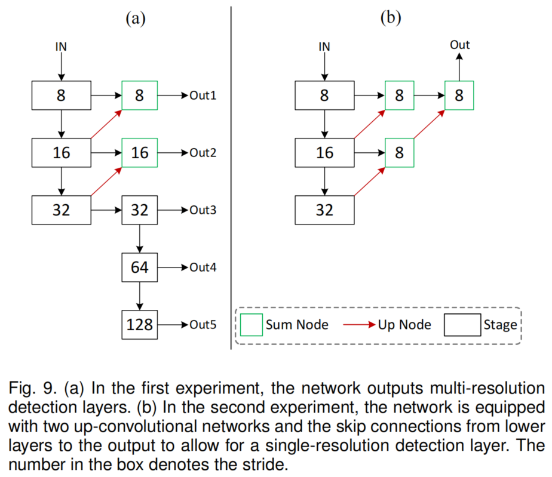

# **CenterNet++论文阅读**
[LINK](https://mp.weixin.qq.com/s?__biz=MzI2Nzg4NjA5OQ==&mid=2247509977&idx=2&sn=21de59cd40f7bd4749dfec98a9289c24&chksm=eafaeca5dd8d65b313ff882f9ad21b30e4dd70fbcd99f4f8101d8fe6bf2abe5d22ba93dbd2e4&key=63a6569d7626fcfa476f8f4d0c42ef7283ff00dd760550fcbc77dd7f6109b738d652a79e292e7123da715fc806aad2f1f78c686adc6b7d8ca51760ac20f6b2dd36bec4b2e1dd8676b6bd4bcabc84f9bf85c6865ec8c96cde69f8c044a13886cff036ae22d51a47341b434ab33a26f2c9f3f2df6b0e770247d29655722dbdc2d1&ascene=1&uin=MTc5OTk4OTk0Mg%3D%3D&devicetype=Windows+XP&version=62060841&lang=en&exportkey=A94UJT5ewjwze7vPAGRg1yA%3D&acctmode=0&pass_ticket=c38hpx3NKHEi9m0qW1g%2B%2FzRSwnMtL2jOBy%2BAxpKphlImD442ngILZ4emucBKkJtk&wx_header=0)

```
CenterNet++ for Object Detection

源码：https://github.com/Duankaiwen/PyCenterNet
论文:https://arxiv.org/abs/2204.08394

目标检测有2种主流:top-down和bottom-up。最先进的方法大多属于第一类。在本文中，作者证明了bottom-up方法与top-down的方法具有同样的竞争能力，并且具有更高的召回率。
```

## **简介**

```
所有top-down的方法都将每个目标建模为一个先验点或预定义的Anchor boxes，然后预测到边界框的相应偏移量。top-down方法更多是将目标视为一个整体，这简化了生成边界框的后处理。然而，top-down方法通常难以感知特殊形状的物体(例如，物体的高宽比很大)。

另一方面，作者发现bottom-up的方法在定位任意几何形状的目标时可能更好，因此有更高的召回率。但是传统的bottom-up方法也会产生很多误检，不能准确地表示目标。以最具代表性的bottom-up方法之一CornerNet为例，它使用一对角关键点对每个目标进行建模，实现了最先进的目标检测精度。然而，由于对全局信息的表征能力相对较弱，CornerNet的性能仍然受到限制。也就是说，由于每个目标都是由一对Corne构造的，该算法敏感地检测目标的边界，而不知道应该将哪些对关键点分组到目标中。CornerNet经常会生成不正确的边框，其中大部分都可以通过一些补充信息过滤掉，例如长宽比。

在分析bottom-up方法的驱动下，作者的核心观点是，只要提高bottom-up方法感知目标全局信息的能力，bottom-up方法将可以达到与top-down方法一样具有竞争力。
```

<div  align=center>

</div>


## **提出的方法**
```
在本文中提出了一种低成本但有效的解决方案，名为CenterNet，这是一种强大的bottom-up目标检测方法，它将每个目标检测为一个三元组关键点(左上角、右下角和中心关键点)。CenterNet探索一个方案的中心部分，即靠近一个box的几何中心的区域，有一个额外的关键点。

作者直觉地认为，如果预测的边界框与GT框的IoU很高，那么边界框中心区域的center keypoints被预测为同一类的概率就很高，反之亦然。因此，在推理过程中，在proposal作为corner keypoints对生成后，通过检查是否有同一类的center keypoints落在其中心区域内来确定该proposal是否确实是一个目标。思路如图1(c)所示。

本文设计了2个框架来适应不同结构的网络，第一个框架适用于hourglass网络，它可以在单一分辨率的特征图上检测物体。这种网络在关键点估计任务中非常流行，如 hourglass network，将其应用于更好地预测corner keypoints和center keypoints。

作者还设计了适合pyramid-like网络的框架，在多分辨率特征图上检测目标。这带来了2个优势:
1. 较强的通用性，大多数网络都可以适配金字塔结构，如ResNet及其变体;
2. 不同尺度的目标在不同的感受野中被检测出较高的检测精度。

虽然金字塔结构在top-down的方法中得到了广泛的应用，但据作者描述，它是第一次在bottom-up的方法中使用。

作者主要从以下几个方面改进了工作：
1. 原来的CenterNet仅适用于基于Hourglass的Backbone网络，所有目标仅在一个单分辨率特征图进行检测。作者扩展了CenterNet的思想，使其能够工作在具有金字塔结构的网络中，这使得CenterNet可以在多分辨率特征图中检测目标。为此，作者也提出了新的检测关键点(包括corner keypoints和center keypoints)以及分组keypoints的方法。
2. 由于对CenterNet的进行了新的设计，作者可以尝试更多具有金字塔结构的Backbone，如ResNet, ResNext和Res2Net。作者甚至使用Transformer的Backbone进行了实验。实验结果表明，引入金字塔结构可以使网络利用更丰富的感受野来检测目标，从而显著提高了检测精度。
3. 作者还提出了一个实时CenterNet，它在流行的检测器中实现了更好的精度/速度权衡。

```

## **主要贡献**
```
本文的主要贡献:
1. 提出了一种强bottom-up的目标检测方法，命名为CenterNet。它将每个目标检测为一个三重关键点，具有对任意几何形状的目标进行定位和感知目标内部全局信息的能力。
2. 设计了2个框架来适应不同结构的网络，具有更强的通用性,可以适用于几乎所有的网络。
3. 没有花里胡哨的东西，CenterNet在bottom-up方法中实现了最先进的检测精度，并与其他top-down方法的最先进性能相当。
4. 通过适当降低结构复杂度，CenterNet实现了精度与速度的良好平衡。证明了bottom-up方法是必要的，并且与top-down方法一样具有竞争力。
```

## **Top-down方法**

```
Top-down方法首先找到代表整个目标的proposals，然后通过对proposals进行分类和回归，进一步确定类和目标的边界框。根据proposals形式的不同，可以将proposals进一步分为anchor-based和anchor-free。
```
### **Anchor-based方法**
```
Anchor-based proposals，也称为Anchors，从具有不同预定义大小、比例和形状的矩形开始。它们均匀地分布在特征图上，并在GT物体的帮助下训练返回到所需的位置。其中，一些方法更注重检测结果的质量。其中最具代表性的是RCNN。它把目标确定的过程分为两个阶段。在第一阶段挑选出一些有意义的proposals，并在第二阶段进一步验证。

之后，提出了大量的工作来扩展它，如SPPNet、Fast R-CNN、Faster R-CNN、Cascade R-CNN、MR-CNN、ION、OHEM、HyperNet、CRAFT、R-FCN、FPN、Libra R-CNN、Mask R-CNN、fit-nms、Grid R-CNN、TridentNet等。

其他一些方法更注重检测速度。它们通常没有proposals验证阶段。代表性的方法有SSD、DSSD、RON、YOLOv2、RetinaNet、RefineDet、AlignDet、ATSS、M2Det、GFL、FreeAnchor、FSAF等。
```

### **Anchor-free方法**
```
尽管Anchors的应用取得了巨大成功,他们依然遇到了许多缺点,例如,大量的Anchors往往需要确保与GT框具有足够高IoU，同时每个Anchors box的大小和长宽比都需要手工设计。因此，有研究者提出了非常简洁的Anchor-free proposals。Anchor-free proposals将目标表示为目标中的点。Anchor-free proposals的关键是准确地预测相对稀疏点的标签和点到目标边界的距离。典型的方法有FCOS系列、Objects as Points系列、FoveaBox系列、SAPD系列、RepPoints系列等。
```

## **Bottom-up方法**
```
Bottom-up方法检测目标的各个部分，而不是将目标视为一个整体。随后，属于同一目标的各个部分将通过一些可训练的后处理算法组合在一起。Bottom-up方法可以追溯到前深度学习时代，Felzenszwalb等人使用多尺度可变形部件模型的混合物来表示对象，称为DPM。

最近，关键点估计启发了目标检测，通过检测和分组关键点来识别对象，例如，CornerNet和CornerNet-lite将目标检测为成对的角，而ExtremeNet则检测一个目标的4个极值点(最上、最左、最下、最右)。

Bottom-up方法不需要Anchors，属于Anchor-free检测器的一种。Bottom-up方法大多基于最先进的关键点估计框架，这也带来了一些缺点，如过度依赖高分辨率的热力图，推断速度太慢等。
```

## **Object Detection as Keypoint Triplets**
<div  align=center>

</div>

### **Single-resolution检测框架**
```
受位姿估计的启发，将常用的位姿估计网络用于更好地检测corner keypoints和center keypoints，其中大多数都是在单分辨率特征图上检测关键点，如hourglass network。
```
<div  align=center>

</div>

```
整个网络架构如图2所示。用一个corner keypoints和一对center keypoints来表示每个对象。在此基础上，嵌入了corner keypoints heatmap，并预测了corner keypoints的偏移量。然后，使用在CornerNet中提出的方法生成top-k边界框。但是，为了有效地过滤出不正确的边框，利用检测到的center keypoints，采用以下步骤:
1. 根据得分选取top-k的center keypoints;
2. 利用相应的偏移量将这些center keypoints映射到输入图像;
3. 为每个边框定义一个中心区域，并检查中心区域是否包含center keypoints。注意，选中的center keypoints的类标签应该与边框的类标签相同;
4. 如果在中心区域检测到一个center keypoints，将保留边界框。边界框的得分将替换为左上角、右下角和center keypoints三个点的平均得分。如果在其中心区域没有检测到center keypoints，则边界框将被移除。
```

### **Multi-resolution检测框架**

<div  align=center>

</div>

```
整个Multi-resolution检测框架如图3所示。它从一个Backbone(如ResNet,ResNeXt等)开始，从输入图像中提取特征。从Backbone中选择C3-C5特征映射作为特征金字塔结构(FPN)的输入。然后FPN输出P3-P7 feature map作为最终的预测层。

在每个预测层中，分别使用heatmap和回归来预测关键点。在基于heatmap的预测中，预测了3个光二元heatmap，用于预测corner keypoints和center keypoints。heatmap的分辨率与预测层相同，因此，为每个关键点预测一个额外的偏移量，以学习将关键点从heatmap映射到输入图像。

在基于回归的预测中，为了对左上角和右下角进行解耦，将GT框沿几何中心划分为4个GT框，并分别选取左上角和右下角的GT框来监督回归。以左上角框的回归为例，在左上角次GT框中选择了一些特征点，每个选择的特征点预测2个向量，分别指向顶部corner keypoints和center keypoints。

此外，还给每个选定的特征点分配一个类标签来监督分类。采用常见的Anchor-Free检测方法训练网络预测子边界框(如FCOS和RepPoints)。

在推理过程中，回归向量作为线索，在相应的heatmap中找到最近的关键点，以细化关键点的位置。接下来，每个有效的关键点对定义一个边界框。这里的有效是指两个关键点属于同一个类(即对应的同一类的左上角和右下角的子边界框)，并且左上角点的x坐标和y坐标分别小于右下角点的x坐标和y坐标。

最后，为每个边界框定义一个中心区域，并检查该中心区域是否包含2个预测的center keypoints。如果在其中心区域最多检测到一个中心关键点，则边界框将被移除，边界框得分将被替换为各得分的平均值（即上角、右下角和center keypoints得分）。
```

### **中心区域的定义**
```
边界框中中心区域的大小会影响检测结果。例如，小的中心区域导致小边界框的查全率较低，而大的中心区域导致大边界框的精度较低。因此，作者提出了一个尺度感知的中心区域来自适应地拟合边界框的大小。尺度感知的中心区域倾向于为一个小的边界框产生一个相对较大的中心区域，对于一个大的边界框产生一个相对较小的中心区域。
```
<div  align=center>


</div>

```
图4分别显示了n=3和n=5时的两个中心区域。根据等式可以确定一个尺度感知的中心区域，然后检查该中心区域是否包含中心关键点。
```

## **丰富的center和corner的信息**
```
center keypoints和corner都与目标有严格的几何关系，但包含有限的对象的视觉模式。这里以一种完全监督的方式训练网络来学习几何关系和有限的视觉特征，从而定位关键点。如果为center keypoints和corner引入更多的视觉模式，它们将能够被更好地检测出来。
```

### **Center pooling**
```
物体的几何中心并不总是传达非常容易识别的视觉模式(例如，人的头部包含强烈的视觉模式，但中心重点往往是在人体的中间)。为了解决这个问题，作者提出Center pooling来捕捉更丰富、更容易识别的视觉模式。
```
<div  align=center>

</div>

```
Center pooling的详细过程如下:
Backbone输出一个feature map，为了判断feature map中的一个像素是否为center keypoints，需要在水平和垂直两个方向上都找到最大值，并将这些值相加。通过这样做，Center pooling可以提高中心关键点的检测。
```

### **Cascade corner pooling**

```
corner通常是物体的外部，缺乏局部外观特征。CornerNet使用Corner pooling来解决这个问题。Corner pooling原理如图5(b)所示。Corner pooling的目的是在边界方向上找到最大值来确定corner。然而，这使得corner对边很敏感。为了解决这个问题，需要让corner从对象的中心区域提取特征。
```
<div  align=center>

</div>

```
图6(a)显示了Center pooling模块的结构。要在特定的方向(如水平方向)取最大值，只需要依次连接左、右池化即可。图6(b)显示了Cascade corner pooling模块的结构，其中白色矩形表示3×3卷积之后是批归一化。与CornerNet的Corner pooling相比，在top-corner池化之前增加了一个left-corner池化。

Cascade corner pooling的详细过程如下:
首先沿边界查找边界最大值，然后沿边界最大值的位置查找框内查找内部最大值;最后，将两个最大值相加。通过Cascade corner pooling，corner既获得了物体的边界信息，又获得了物体的视觉模式。
```

## **损失函数**

### **Single-resolution检测框架损失函数**
<div  align=center>

</div>

### **Multi-resolution检测框架损失函数**
<div  align=center>

</div>
