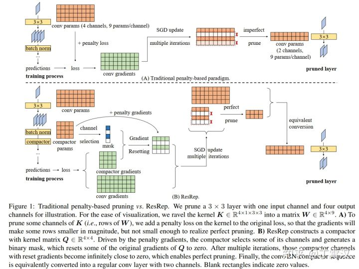
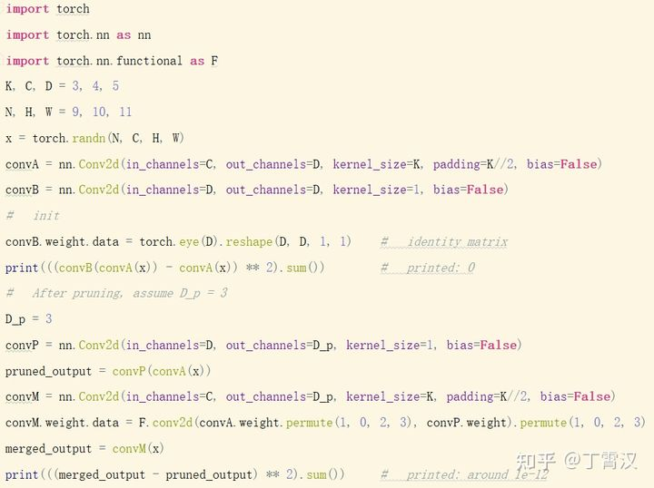
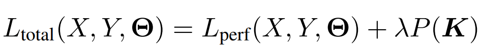
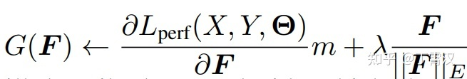

# **ResRep** [LINK](https://zhuanlan.zhihu.com/p/402106979)

```
ResRep这个名字包括两部分：Res指的是Gradient Resetting，本文提出的一种魔改SGD更新规则；Rep指的是Convolutional Re-parameterization，也就是本文的核心。所以，这一方法也是“重参数化宇宙”的一部分，可以看成重参数化方法论在剪枝领域的成功应用。我想到这个idea主要是是因为我想用结构重参数化来做剪枝，拓展重参数化的应用领域，觉得这样做很有意思。

顺便再提一下结构重参数化代表作，一叠3x3卷积堆起来的RepVGG，GitHub 2000star，最新版达到84.16% ImageNet top-1，反超若干Transformer！RepVGGplus的工作正在进展中！
```

## **Motivation：解耦“记忆”和“遗忘"**

```
这一方法多多少少跟神经科学研究有关：动物脑中的记忆和遗忘是两个相对独立的过程，由不同的机制和化学物质控制，并不是说我们记住了什么东西就会自然而然地“覆盖”掉什么记忆。

这似乎意味着，如果我们把CNN类比于动物脑，CNN的结构类比于脑结构，CNN的训练（让一些参数变大，一些变小）类比于脑的记忆（一些突触变强，一些变弱），CNN的剪枝（去掉一些结构，如链接、kernel、通道）类比于脑的遗忘（一些神经元和突触的失活），我们就会想到：让CNN中的不同结构负责“记忆”和“遗忘”应该是有好处的。

但是在大多数现有的剪枝方法中，“记忆”和“遗忘”是耦合的。例如，一些方法在卷积层的kernel上加一个惩罚项，如L1/L2/Lasso，然后先通过训练使一些通道变小（也就是说，使其对应的参数张量接近0）再剪枝。这样的解决方案是自然的，因为剪掉小的通道造成的精度损失自然就小。问题是，在这一训练过程中，每一个通道的参数既参与了“记忆”（计算原目标函数，导出与目标函数相关的梯度，用这部分梯度更新参数）又参与了“遗忘”（计算惩罚项，导出与惩罚项相关的梯度，用这部分梯度更新参数）。这就造成了一个左右为难的困境：模型既“记不好”（该变小的通道变小了，不该变小的也变小了，精度降低）又“忘不掉”（该变小的也没变得足够小，剪的时候依然有性能损失）。（如下图A）

ResRep提出的解决方案是：将原CNN等价拆分成负责“记忆”（保持精度不降低）的部分和负责“遗忘”（去掉某些通道）的部分，前者进行“记忆训练”（不改变原目标函数、不改变训练超参、不改变更新规则），后者进行“遗忘训练”（一种基于SGD的魔改更新规则，即Res），应该能取得更好的效果（更高压缩率、更少精度损失）。然后，如果我们能将“记忆”和“遗忘”部分等价合并成一个更小的模型，不就能实现剪枝了吗？（如下图B）
```
<div  align=center>

</div>

## **Rep：结构重参数化原理**

显然，我们得先找到等价拆分和等价合并的方式，也就是**Rep**的具体形式。本文主要考虑通道剪枝（channel pruning, 即filter pruning, 也叫network slimming），采用的实现方式是在要剪的卷积层（记作convA）后加入一个1x1卷积（记作convB，称为 **compactor** ）。

**等价拆分：** 若convB的kernel为单位矩阵，则整个结构的输出不变（对任意x，convB(convA(x)) == convA(x)）。

训练（应用我们提出的花式操作，即Res，稍后详细介绍）结束后，假设已经把convB剪成了有D'（D' < D）个输出通道的convP（也就是将compactor的kernel从一个单位矩阵变成行数少于列数的矩阵），如何将convA和convP等价转换为一层呢？

等价合并：用convP的kernel来卷convA的kernel，得到convM，（注意要经过适当的转置）则convM和原convA-convP输出相同（对任意x，convM(x) == convP(convA(x))）。直观上也很好理解：由于convP是1x1卷积，它的实质是对输入进行通道之间的线性重组，不涉及空间上的聚合运算，所以convP(convA(x))等价于【先用convP的kernel对convA的kernel进行通道之间的线性重组，然后用重组后的kernel去卷x】。注意，**convM的输出通道等于convP的输出通道，所以剪掉compactor的输出通道等价于剪掉合并后的卷积层的输出通道！**

代码如图所示。注意这里省略了从convB到convP的过程，只是为了展示拆分和合并的等价性。

<div  align=center>

</div>

## **Res：魔改SGD的花式操作**

上文我们已经介绍了在将compactor从convB（一个单位矩阵）训练成convP（一个行数少于列数的矩阵）前后我们要做的事，下面介绍我们如何实现从convB到convP。

首先思考一个问题：为什么常规的往loss上加惩罚项的做法无法将很多通道变得非常接近于0呢？

这种做法可以表示为下式，L(total)是总的损失函数，L(perf)是与模型性能（精度）相关的损失函数（例如分类任务上就是交叉熵），K是任意一个kernel的参数张量，P表示某种惩罚项（L1/L2/Lasso），λ是我们预定义的系数。

<div  align=center>

</div>

当我们加载一个训好的模型，刚开始剪枝训练时，L(perf)较小（因为这初始模型已经训好了嘛），P(K)较大（因为kernel都还比较大嘛），所以第一项导出的梯度显著小于第二项导出的梯度，K在惩罚项主导的梯度影响下，逐渐变小。很好，这是我们需要的。

随着训练的继续，问题来了：由于K变得越来越小，P(K)变得越来越小，而L(perf)变得越来越大（因为精度变差了嘛），第一项导出的梯度和第二项导出的梯度变得量级相近，它们俩开始对抗了，所以K就不再减小了。这时候，模型性能既变差了，K也没有很多通道变得接近0。剪掉这些“小了，但没有特别小”的通道，依然会造成性能损失。

我们的解决方案非常的简单粗暴：第一项梯度不是跟第二项梯度对抗了嘛，那我们选出一部分通道（选的方法不重要，详见论文），把它的第一项梯度强行置为0，这种对抗就不存在了，这些通道就可以在第二项的作用下无限接近0了嘛！

听起来挺复杂，但实现其实很简单：我们不往原来的损失函数上加惩罚项loss（即L(perf) == L(total)），正常地前传和反传，求出每个K的梯度，往梯度上加惩罚项梯度（往loss上加惩罚项loss等价于往梯度上加惩罚项梯度）。如下式所示，F表示kernel中的任意一个通道（即filter），G(F)表示用于更新F的梯度，我们这里用Lasso做惩罚项，第二项就是Lasso的梯度。当选出一部分我们想要变为0的通道之后，我们往这些通道的由L(perf)导出的梯度上乘一个0（下式中的m），用如此魔改后的G(F)去更新F即可。

<div  align=center>

</div>

读者可能已经发现了这种粗暴做法的问题：第一项梯度是从损失函数导出的，带着维持模型性能不降低（即指导参数如何更新）的信息呢，直接去掉，信息损失会不会太大了？

这里就是Rep的解耦思想的妙处了：我们将这种魔改SGD只用在compactor上。compactor是我们故意构造出来的，去掉的也是那些我们故意构造的结构的梯度信息，模型原来的部分（负责“记忆”的部分），我们可是一点都没碰！也就是说，通过将模型分解成“记忆”和“遗忘”两部分，我们凭空创造出了一些结构，让它们去承载我们的花式操作，就避免了这种花式操作对模型原本结构的直接负面影响。

这样训完之后，compactor中就会有一些通道变得非常非常接近于0，将它们剪掉（去掉参数矩阵中的一些行）完全没有性能损失。接下来进行上一小节介绍过的等价转换，也不会有任何性能损失。在整个流程中，唯一可能造成性能损失的过程就是训练过程，毕竟整个网络等效地变小了，表征能力变弱了，而这也是剪枝中不可避免的、本质的损失。（怎么可能存在一种方法将模型变得任意小，而且不论多小都一定没有性能损失呢？）