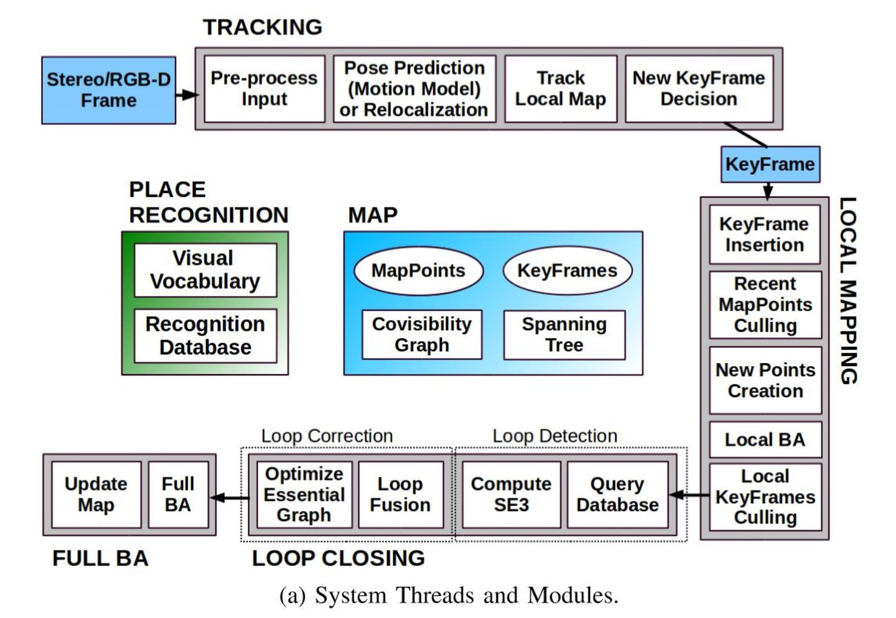

# **ORB-SLAM2阅读笔记**
主要以rgbd_tum来进行系统的梳理。使用的代码地址[Github](https://github.com/electech6/ORB_SLAM2_detailed_comments)。同时不使用ROS进行启动系统而是直接使用可执行文件加准备好了的数据配置。

## **准备工作**
1. 下载tum的压缩文件并解压[tun-datas](https://vision.in.tum.de/rgbd/dataset/freiburg1/rgbd_dataset_freiburg1_xyz.tgz),下载的数据为freiburg1。

2. 拷贝TUM1.yaml并改名为TUM.yaml

3. 使用build.sh编译项目，然后使用命令（rgbd_tum Vocabulary/ORBvoc.txt Examples/RGB-D/TUM.yaml 解压tum数据的目录/rgbd_dataset_freiburg1_xyz Examples/RGB-D/associations/fr1_xyz.txt）

## **源码阅读**

### **系统的整体概括**
1. 系统由System脚本来统筹规划，其和Tracking脚本共同组成运行的主线程，包含有2个子线程（1.LoopClosing  2. LocalMapping）来完成系统的主要功能。其他的还有显示等线程。

2. 除了以上大模块外，还包括ORB特征提取模块、关键帧模块、全局提取模块、Pnp模块 等。

3. 系统概略图如下：

### **rgbd_tum脚本**
1. 读取配置文件，然后根据配置文件进行RGB图像和深度图像路径进行缓存，并检查数据的一致性。
2. 初始化System对象，初始化的时候一并将其它线程进行初始化。
3. 循环图像路径进行SLAM。
4. 使用SLAM.TrackRGBD进行跟踪。

### **System脚本**
1. 检查模式改变，如果模式改变的话，需要将局部见图停止，然后改变跟踪的 mbOnlyTracking 模式，控制仅仅定位还是定位+更新地图。
2. 检查是否有复位请求，有的话调用Tracking中的复位操作。
3. 调用Tracking中的GrabImageRGBD函数进行相机位姿的计算。

### **Tracking脚本**
1. 构造函数会将相机的内外参、图像矫正系数 和一些其他的系统参数。构建orb特征提取器。
2. GrabImageRGBD函数分四步骤：将RGB或RGBA图像转为灰度图像；将深度相机的disparity转为Depth；构造Frame；跟踪。
3. 构造Frame的时候需要会得到当前帧的ID、图像金字塔的参数。然后进行orb特征提取。
4. 进行Track
    * track包含两部分：估计运动、跟踪局部地图
    * Step 1：初始化,需要>500的设置为关键帧。
    * Step 2：跟踪
    * Step 3：记录位姿信息，用于轨迹复现

### **Frame脚本**
1. 用OpenCV的矫正函数、内参对提取到的特征点进行矫正
2. 获取图像的深度，并且根据这个深度推算其右图中匹配的特征点的视差
3. 初始化本帧的地图点
4. 计算去畸变后图像边界，将特征点分配到网格中
5. 将特征点分配到图像网格中

### **LocalMapping**

