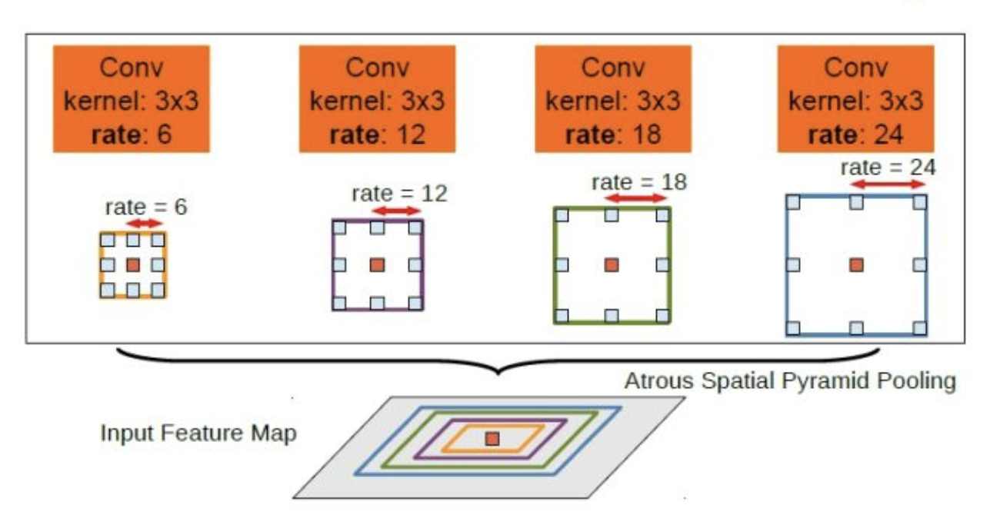
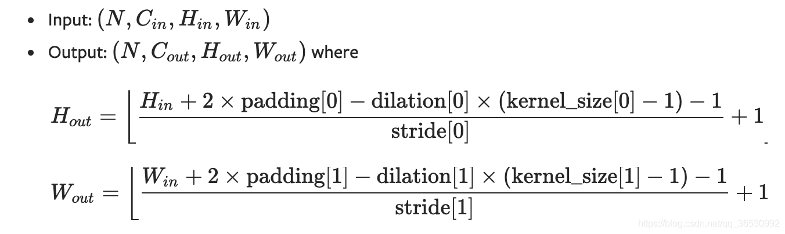
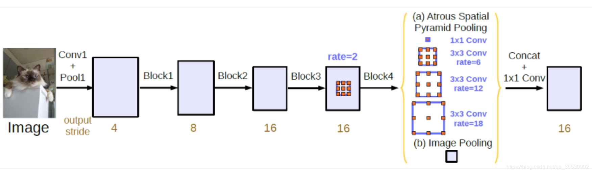
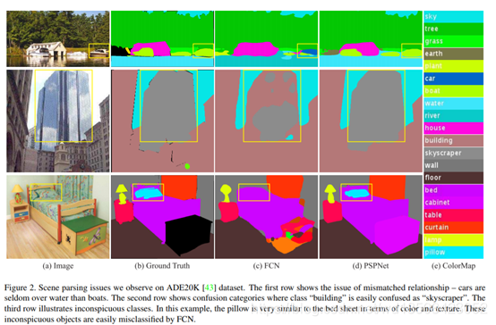
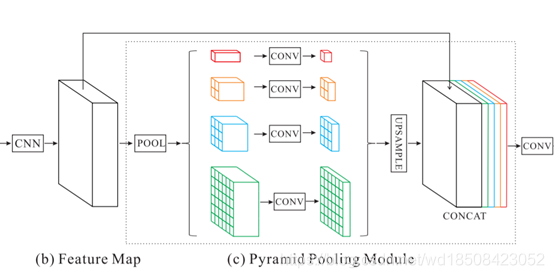

# **语义分割相关知识**
主要介绍语义分割网络结构相关知识

## **ASPP 结构**
```
deeplabV2/V3 主要是使用了空洞卷积的特性来融合不同尺度的特征信息。
```

空洞空间卷积池化金字塔(atrous spatial pyramid pooling (ASPP))对所给定的输入以不同采样率的空洞卷积并行采样，相当于以多个比例捕捉图像的上下文。

<div align=center>

</div>

上图为deeplab v2的ASPP模块，deeplabv3中向ASPP中添加了BN层，其中空洞卷积的rate的意思是在普通卷积的基础上，相邻权重之间的间隔为rate-1, 普通卷积的rate默认为1，所以空洞卷积的实际大小为k +(k − 1)(rate−1)，其中k为原始卷积核大小。

**输出大小如何计算？**

<div align=center>

</div>

**问题：** 当rate接近feature map大小时，3×3滤波器不是捕获全图像上下文，而是退化为简单的1×1滤波器，只有滤波器中心起作用。

**改进：** Concat（1×1卷积 ， 3个3×3空洞卷积 +pooled image feature）并且每个卷积核都有256个且都有BN层。图像级特征，即将特征做全局平均池化，经过卷积再融合,如下图Image Pooling。

<div align=center>

</div>

## **PPM 结构**

```
一般可以粗略地认为感受野就是使用上下文信息的大小。在很多网络中，我们都很重视全局信息的获取。在FCN中，就是没有充分的场景的上下文信息，导致在一些不同尺度的物体分割上处理不好。
```

<div align=center>

</div>

```
总之，PPM就是一种相对较好的充分利用全局信息的方式。这种保留全局信息的思路其实与ASPP(Atrous Spatial Pyramid Pooling) 很相似。从直觉上来看，这种多尺度的pooling确实是可以在不同的尺度下来保留全局信息，比起普通的单一pooling更能保留全局上下文信息。
```
<div align=center>

</div>

```
原文中采用4种不同金字塔尺度，金字塔池化模块的层数和每层的size是可以修改的。论文中金字塔池化模块是4层，每层的size分别是1×1,2×2,3×3,6×6。

首先，对特征图分别池化到目标size，然后对池化后的结果进行1×1卷积将channel减少到原来的1/N,这里N就为4。接着，对上一步的每一个特征图利用双线性插值上采样得到原特征图相同的size，然后将原特征图和上采样得到的特征图按channel维进行concatenate。得到的channel是原特征图的channel的两倍，最后再用1×1卷积将channel缩小到原来的channel。最终的特征图和原来的特征图size和channel是一样的。
```
