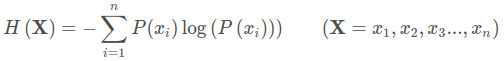
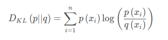
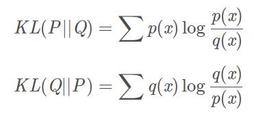
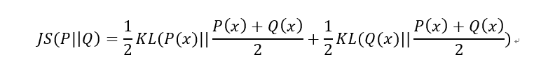
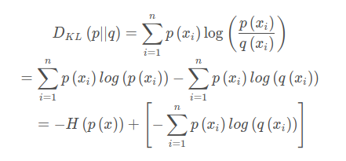
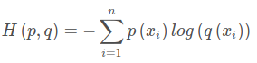

#  <div align=center> <font color="red">**语义分割损失函数**</font></div>
**Tips**:<font color="red">当前的例子都是以pytorch框架问基础</font>

## **交叉熵损失函数 (cross_entropy_loss)**
### **一. 简介**
交叉熵是信息论中的一个重要概念，主要用于度量两个概率分布间的差异性，要理解交叉熵，需要先了解下面几个概念。

**1. 信息量:**

信息奠基人香农（Shannon）认为“信息是用来消除随机不确定性的东西”，也就是说衡量信息量的大小就是看这个信息消除不确定性的程度。信息量的大小与信息发生的概率成反比。概率越大，信息量越小。概率越小，信息量越大。<font color="red">设某一事件发生的概率为P(x)，其信息量表示为：**I(x)=−log(P(x))**</font>,其中I(x)表示信息量，这里log表示以e为底的自然对数。

**2. 信息熵:**

信息熵也被称为熵，用来表示所有信息量的期望。期望是试验中每次可能结果的概率乘以其结果的总和。
所以信息量的熵可表示为：（这里的X是一个离散型随机变量）
<div align=center> </div>

**3. 相对熵（KL散度）**

如果对于同一个随机变量X有两个单独的概率分布P(x)和Q(x)，则我们可以使用KL散度来衡量这两个概率分布之间的差异。公式化如下：
<div align=center> </div>
在机器学习中，常常使用P(x)来表示样本的真实分布，Q(x)来表示模型所预测的分布。KL散度越小，表示P(x)与Q(x)的分布更加接近，可以通过反复训练Q(x)来使Q(x)的分布逼近P(x)。

**4. kl散度**
```
用来衡量两个分布之间的差异，等于一个交叉熵减去一个信息熵（交叉熵损失函数的由来）
```
<div align=center> </div>

性质：

1. 非负性（用Jenson‘s inequality 证明）
2. 不对称性，即KL(P||Q)≠KL(Q||P)

问题：

正是由于KL散度的不对称性问题使得在训练过程中可能存在一些问题，为了解决这个问题，我们在KL散度基础上引入了JS散度

**5. JS散度(Jensen-Shannon)**
```
JS散度度量了两个概率分布的相似度，基于KL散度的变体，解决了KL散度非对称的问题。一般地，JS散度是对称的，其取值是0到1之间。定义如下：
```
<div align=center> </div>

KL散度和JS散度度量的时候有一个问题：
```
如果两个分配P,Q离得很远，完全没有重叠的时候，那么KL散度值是没有意义的，而JS散度值是一个常数。这在学习算法中是比较致命的，这就意味这这一点的梯度为0。梯度消失了。
```

**但是不同于KL主要又两方面：**

（1）值域范围

JS散度的值域范围是[0,1]，相同则是0，相反为1。相较于KL，对相似度的判别更确切了。

（2）对称性

即 JS(P||Q)=JS(Q||P)，从数学表达式中就可以看出。


### **二. 交叉熵**

首先将KL散度公式拆开：
<div align=center> </div>
前者H(p(x))表示信息熵，后者即为交叉熵，KL散度 = 交叉熵 - 信息熵.交叉熵公式化如下所示：

<div align=center> </div>

在机器学习训练网络时，输入数据与标签常常已经确定，那么真实概率分布P(x)也就确定下来了，所以信息熵在这里就是一个常量。由于KL散度的值表示真实概率分布P(x)与预测概率分布Q(x)之间的差异，值越小表示预测的结果越好，所以需要最小化KL散度，而交叉熵等于KL散度加上一个常量（信息熵），且公式相比KL散度更加容易计算，所以在机器学习中常常使用交叉熵损失函数来计算loss就行了。

### **三.语义分割使用交叉熵例子**
```
# score (N, C, H, W).  target  (N, H, W)
# CrossEntropyLoss会自动的进行softmax计算
class CrossEntropy(nn.Module):
    def __init__(self, ignore_label=-1, weight=None):
        super(CrossEntropy, self).__init__()
        self.ignore_label = ignore_label
        self.criterion = nn.CrossEntropyLoss(
            weight=weight,
            ignore_index=ignore_label
        )

    def _forward(self, score, target):
        # score = score.unsqueeze(0)
        ph, pw = score.size(2), score.size(3)
        h, w = target.size(1), target.size(2)
        if ph != h or pw != w:
            score = F.interpolate(input=score, size=(
                h, w), mode='bilinear', align_corners=config.MODEL.ALIGN_CORNERS)
        loss = self.criterion(score, target)
        return loss

    def forward(self, score, target):
        if config.MODEL.NUM_OUTPUTS == 1:
            score = [score]
        return self._forward(score, target)
```


---
