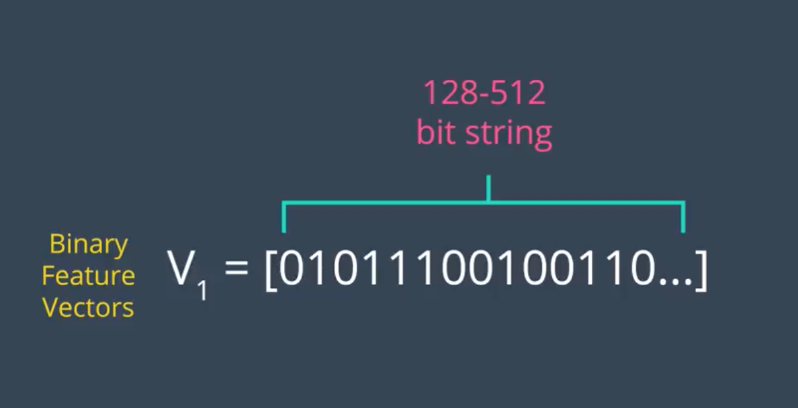
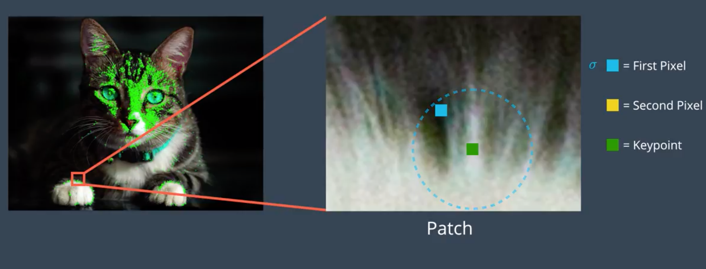
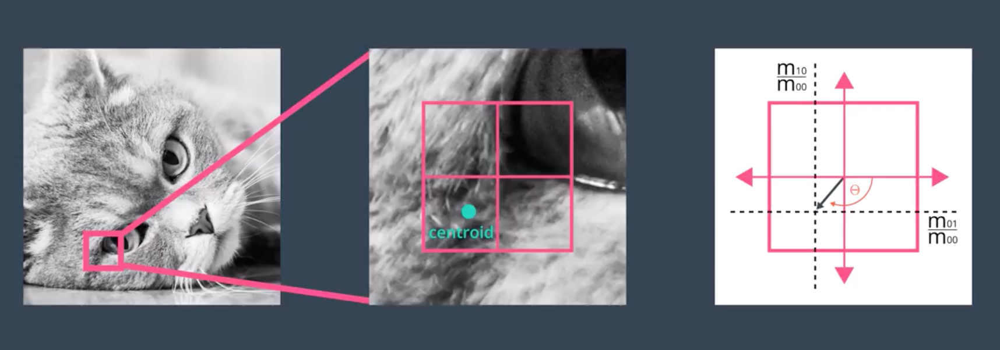

#  **传统图像处理**

## **Bag of words(词袋)**
<font color="#FF0000">最初的Bag of words，也叫做“词袋”，在信息检索中，Bag of words model假定对于一个文本，忽略其词序和语法，句法，将其仅仅看做是一个词集合，或者说是词的一个组合，文本中每个词的出现都是独立的，不依赖于其他词是否出现，或者说当这篇文章的作者在任意一个位置选择一个词汇都不受前面句子的影响而独立选择的。</font>

**词袋构建**
```
step1.
现在Computer Vision中的Bag of words来表示图像的特征描述也是很流行的。大体思想是这样的，假设有5类图像，每一类中有10幅图像，这样首先对每一幅图像划分成patch（可以是刚性分割也可以是像SIFT基于关键点检测的），这样，每一个图像就由很多个patch表示，每一个patch用一个特征向量来表示，咱就假设用Sift表示的，一幅图像可能会有成百上千个patch，每一个patch特征向量的维数128。
step2.
接下来就要进行构建Bag of words模型了，假设Dictionary词典的Size为100，即有100个词。那么咱们可以用K-means算法对所有的patch进行聚类，k=100，我们知道，等k-means收敛时，我们也得到了每一个cluster最后的质心，那么这100个质心（维数128）就是词典里德100 个词了，词典构建完毕。
step3.
词典构建完了怎么用呢？是这样的，先初始化一个100个bin的初始值为0的直方图h。每一幅图像不是有很多patch么？我们就再次计算这些patch和和每一个质心的距离，看看每一个patch离哪一个质心最近，那么直方图h中相对应的bin就加1，然后计算完这幅图像所有的 patches之后，就得到了一个bin=100的直方图，然后进行归一化，用这个100维的向量来表示这幅图像。对所有图像计算完成之后，就可以进行分类聚类训练预测之类的了。
```
应用点： slam回环检测.

---
## **特征点提取**

### **FAST特征点**
**FAST定义：**
```
FAST的全称为Features From Accelerated Segment Test。Rosten等人将FAST角点定义为：若某像素点与其周围领域内足够多的像素点处于不同的区域，则该像素点可能为角点。也就是某些属性与众不同，考虑灰度图像，即若该点的灰度值比其周围领域内足够多的像素点的灰度值大或者小，则该点可能为角点。
```

**计算步骤：**
```
1. 从图片中选取一个像素P，下面我们将判断它是否是一个特征点。我们首先把它的亮度值设为Ip。
2. 设定一个合适的阈值t。
3. 考虑以该像素点为中心的一个半径等于3像素的离散化的Bresenham圆，这个圆的边界上有16个像素（如图1所示）。
4. 现在，如果在这个大小为16个像素的圆上有n个连续的像素点，它们的像素值要么都比Ip+t大，要么都比Ip−t小，那么它就是一个角点。（如图1中的白色虚线所示）。n的值可以设置为12或者9，实验证明选择9可能会有更好的效果。
```

```
上面的算法中，对于图像中的每一个点，我们都要去遍历其邻域圆上的16个点的像素，效率较低。我们下面提出了一种高效的测试（high-speed test）来快速排除一大部分非角点的像素。该方法仅仅检查在位置1，9，5和13四个位置的像素，首先检测位置1和位置9，如果它们都比阈值暗或比阈值亮，再检测位置5和位置13。如果P是一个角点，那么上述四个像素点中至少有3个应该必须都大于Ip+t或者小于Ip−t，因为若是一个角点，超过四分之三圆的部分应该满足判断条件。如果不满足，那么p不可能是一个角点。对于所有点做上面这一部分初步的检测后，符合条件的将成为候选的角点，我们再对候选的角点，做完整的测试，即检测圆上的所有点。

缺点：
1. 当我们设置n<12时就不能使用快速算法来过滤非角点的点；
2. 检测出来的角点不是最优的，这是因为它的效率取决于问题的排序与角点的分布；
3. 对于角点分析的结果被丢弃了；
4. 多个特征点容易挤在一起。
```

<div  align=center>

图1.
</div>


**非极大值抑制**
```
从邻近的位置选取了多个特征点是另一个问题，我们可以使用Non-Maximal Suppression来解决。
1. 为每一个检测到的特征点计算它的响应大小（score function）V。这里V定义为点p和它周围16个像素点的绝对偏差的和。
2. 考虑两个相邻的特征点，并比较它们的V值。
3. 值较低的点将会被删除。
```

**总结**
```
FAST算法比其他已知的角点检测算法要快很多倍，但是当图片中的噪点较多时，它的健壮性并不好，而且算法的效果还依赖于一个阈值t。而且FAST不产生多尺度特征而且FAST特征点没有方向信息，这样就会失去旋转不变性。
```

## **Brief描述子**
**BRIEF 是 Binary Robust Independent Elementary Features 的简称,它的作用是根据一组关键点创建二元特征向量。二元特征向量又称为二元描述符，是仅包含 1 和 0 的特征向量。在 BRIEF 中 每个关键点由一个二元特征向量描述，该向量一般为 128-512 位的字符串，其中仅包含 1 和 0。**
```
计算机运行的是二进制或机器代码，因此使用二元特征向量的一大优势是可以非常高效地存储在内存中，并且可以快速计算。速度对实时应用来说极为关键，这些特性不仅使 BRIEF 速度非常快，而且使 BRIEF 能够在计算资源非常有限的设备（例如智能手机）上运行。
```
<div  align=center>

</div>

**BRIEF 如何为每个点创建这些二元描述符？**
```
1. BRIEF 算法首先利用高斯核对给定图像进行平滑处理，以防描述符对高频噪点过于敏感。
```
```
2.对于给定关键点，例如猫爪上的这个点。
```
<div  align=center>

</div>

```
BRIEF 从该关键点周围界定好的邻域内随机选择一对像素，关键点周围的邻域称为 Patch，它是一个具有特定像素宽度和高度的正方形。这里显示的随机对中的第一个像素，是一个蓝色正方形，它是从以关键点为中心的高斯分布中抽取的一个像素，标准偏差或分散趋势为 σ。
```
<div  align=center>

</div>

```
这里显示为黄色正方形的像素，是随机对中的第二个像素。它是从以该第一个像素为中心的高斯分布中抽取的像素，标准偏差为 σ/2，经验表明这种高斯选择提高了特征匹配率。
```

```
BRIEF 然后开始为关键点构建二元描述符，方法是如下所示地比较这两个像素的亮度。如果第一个像素比第二个亮，则为描述符中的相应位分配值 1，否则分配值 0。
```

<div  align=center>

</div>

```
在上面新选取的随机像素中，我们看到现在第一个像素比第二个亮，因此为特征向量中的第二个位分配值 1。
对于 256 位向量，BRIEF 会针对同一关键点重复这一流程 256 次，然后转到下个关键点。接着将 256 个像素亮度比较结果放入该关键点的二元特征向量中。BRIEF 像这样为图像中的每个关键点创建一个向量。
```

**缩放不变性和旋转不变性**

**缩放不变性**
```
1. 给定一个图像 ORB 算法首先开始构建图像金字塔。
2. 图像金字塔是单个图像的多尺度表示法，由一系列原始图像的不同分辨率版本组成。金字塔的每个级别都由上个级别的图像下采样版本组成。下采样是指图像分辨率被降低，比如图像按照 1/2 比例下采样。因此一开始的 4x4 正方形区域现在变成 2x2 正方形。图像的下采样包含更少的像素，并且以 1/2 的比例降低大小。
3. ORB 创建好图像金字塔后，它会使用 FAST 算法从每个级别不同大小的图像中快速找到关键点。
4. 通过确定每个级别的关键点 ORB 能够有效发现不同尺寸的对象的关键点，这样的话 ORB 实现了部分缩放不变性。
5. 现在 ORB 获得了与这个图像金字塔每个级别相关的关键点。在发现金字塔所有级别中的关键点后，ORB 现在为每个关键点分配一个方向，例如朝左或朝右，取决于该关键点周围的强度是如何变化的。
```
**旋转不变性**
```
1. 方法是首先计算以该关键点为中心的方框中的强度形心。强度形心可以看做给定 patch 中的平均像素强度的位置。
2. 计算强度形心后，通过画一条从关键点到强度形心的向量，获得该关键点的方向，如下图所示。这个关键点的方向是向下并朝左，因为这个区域的亮度朝着这个方向增强。（所有尺度上进行计算）
```
<div  align=center>

</div>

```
1. 找到关键点并为其分配方向后，ORB 现在使用修改后的 BRIEF 版本创建特征向量，这个修改后的 BRIEF 版本称为 rBRIEF，即 Rotation-Aware BRIEF。无论对象的方向如何，它都可以为关键点创建相同的向量，使得 ORB 算法具有旋转不变性，意味着它可以在朝着任何角度旋转的图像中检测到相同的关键点。
2. 和 BRIEF 一样 rBRIEF 首先在给定关键点周围的已界定 patch 中随机选择 256 个像素对，以构建 256 位向量。然后根据关键点的方向角度旋转这些随机像素对，使随机点的方向与关键点的一致。最后, rBRIEF 对比随机像素对的亮度并相应地分配 1 和 0 创建对应的特征向量，为图像中的所有关键点创建的所有特征向量集合称之为 ORB 描述符。
```


## **Harris角点检测**
```
在邻域内的各个方向上灰度变化值足够高的点，是图像边缘曲线上曲率极大值的点。
```
    [基于灰度图像的角点检测] 包括基于梯度的方法（通过计算边缘的曲率判断角点），基于模板的方法（考虑像素邻域点的灰度变化, 将与邻点亮度对比足够大的点定义为角点），基于模板梯度组合的方法

    [基于二值图像的角点检测] 将二值图像作为单独的检测目标，可使用各种基于灰度图像的角点检测方法

    [基于轮廓曲线的角点检测] 通过角点强度或曲线曲率提取角点

角点检测的基本思想是：使用角点检测算子，对图像的每个像素计算角点响应函数(Corner Response Function )，阈值化角点响应函数，根据实际情况选择阈值，对阈值化的角点响应函数进行非极大值抑制，并获取非零点作为角点。通过一个小的滑动窗口在邻域检测角点
在任意方向上移动窗口，若窗口内的灰度值都有剧烈的变化，则窗口的中心就是角点。定义角点响应函数

<div  align=center>

</div>

其中w为窗函数（window function），I为图像梯度，那么E就表示了灰度变化的剧烈程度。1977年，Moravec最先提出了如下的角点检测方法：

 1. 对于原始图像，取偏移量(Δx,Δy)为(1,0),(1,1),(0,1),(-1,1)，分别计算每一像素点(xi,yi)的灰度变化
 2. 对于每一像素点(xi,yi)，计算角点响应函数R(xi,yi)=min E
 3. 设定阈值T，将角点响应函数R(xi,yi)中低于T的值设为0
 4. 在窗口范围内进行非极大值抑制：遍历角点响应函数，若某个像素的角点响应函数在窗口内不是最大，该像素置0
 5. 选择非零点作为角点检测结果

Moravec角点检测的缺点

1. 二值的窗口函数导致角点响应函数不够光滑
2. 只在四个方向上计算灰度值变化，导致角点响应函数在多处都有较大响应
3. 对于每个点只考虑E的最小值，导致算法对边缘有很强的反应

1988年，Harris和Plessey对Moravec的方法进行了改进，提出了经典的Harris角点检测算法。Harris首先将Moravec算法中的窗口函数由阶跃函数改为二维高斯函数，并通过泰勒展开考察微小移动，也就是说，如果要求E的最大值以明确角点，就可以令u,v->0，对E做泰勒展开，得

<div  align=center>

</div>


<div  align=center>

</div>

<div  align=center>

</div>

<div  align=center>

</div>

---
## **SIFT算法预备知识：尺度空间与图像金字塔**
```
1999年Lowe提出了SIFT(Scale-invariant feature transform，尺度不变性特征变换)特征检测算法，并于2003年对其完善总结；2006年，Bay等人对SIFT算法进行了改进，提升其效率，提出了SURF(Speeded Up Robust Features，加速鲁棒性特征)算法。
```
**SIFT特征检测算法的特点：**

1. SIFT特征是图像的局部特征，对旋转、尺度缩放、亮度变化保持不变性，对视角变化、仿射变换、噪声也保持一定程度的稳定性
2. 信息量丰富，适用于在海量特征数据库中进行匹配
3. 多量性，少数物体也可以产生大量SIFT特征
4. 高速性，经优化的SIFT匹配算法甚至可以达到实时性

**SIFT特征检测的步骤：**

1. 检测尺度空间的极值点
2. 精确定位特征点(Keypoint)
3. 设定特征点的方向参数
4. 生成特征点的描述子（128维向量）

如果一张照片的像素数目被不断压缩，或者观察者距离照片越来越远，它将逐渐变得模糊，而这个导致照片的呈现内容发生变化的连续的自变量就可以称为尺度。对物体观察的尺度不同，物体呈现的方式也不同。对计算机视觉而言，无法预知某种尺度的物体结构是否有意义，因此有必要将所有尺度的结构表示出来。以下关于尺度空间理论的部分，也可以参考：
http://www.cnblogs.com/ronny/p/3886013.html

利用图像金字塔的方法，我们可以得到一系列大小不一的图像，由大到小，从下到上构成的塔状模型。假设高斯金字塔的第l 层图像为G_l，则有：

<div  align=center>

</div>

式中，N为高斯金字塔层数；R_l和G_l分别为高斯金字塔第l层的行数和列数；ω(m,n)是一个二维可分离的5× 5窗口函数，表达式为：

<div  align=center>

</div>

写成上面的形式是为了说明，二维窗口的卷积算子，可以写成两个方向上的1维卷积核（二项核）的乘积。 上面卷积形式的公式实际上完成了2个步骤：1）高斯模糊；2）降维。按上述步骤生成的G_0,G_1,...,G_N就构成了图像的高斯金字塔，其中G0为金字塔的底层(与原图像相同)，Gn为金字塔的顶层。可见高斯金字塔的当前层图像是对其前一层图像先进行高斯低通滤波，然后做隔行和隔列的降采样(去除偶数行与偶数列)而生成的。

<div  align=center>

</div>

<div  align=center>

</div>

## **SIFT算法**

<div  align=center>

</div>

<div  align=center>

</div>


<div  align=center>

</div>

进而确定特征的方向参数：

 1. 梯度方向直方图的范围：[0, 360]；
 2. 特征点的主方向：直方图的峰值 ；
 3. 特征点的辅方向：直方图的次峰值，能量超过主峰值能量的80\%；

当图像发生旋转时，特征点的主方向相对于像素的梯度方向不变；将多幅待匹配的图像都旋转到令特征点方向为0的位置再匹配，使特征具有旋转不变性。

现在我们将坐标轴方向旋转为特征点的方向，以特征点为中心取窗口，通过高斯加权增强特征点附近像素梯度方向信息的贡献，即在4 × 4的小块上计算梯度方向直方图（ 取8个方向），计算梯度方向累加值，形成种子点，构成4× 4 × 8= 128维特征向量。SIFT特征对旋转、尺度缩放、亮度变化保持不变性，对视角变化、仿射变换、噪声也保持一定程度的稳定性。

对描述子的进一步处理

 1. [去除光照影响] 将特征向量的长度归一化
 2. [减弱扭曲影响] 仿射变换

**关于SIFT算法的几个问题**

本小节主要参考：
http://www.cnblogs.com/ronny/p/4028776.html#3962356

<div  align=center>

</div>

<div  align=center>

</div>

<div  align=center>

</div>

## **SURF算法**

SURF特征(Speeded Up Robust Features，加速鲁棒性特征)是对SIFT特征的进一步优化，基于Hessian矩阵构造金字塔尺度空间，利用箱式滤波器（box filter）简化二维高斯滤波，不需要再进行降采样；通过Haar小波特征设定特征点主方向，这样构建的特征描述子就是64维的；surf构造的金字塔图像与sift有很大不同，就是因为这些不同才加快了其检测的速度。Sift采用的是DOG图像，而surf采用的是Hessian矩阵行列式近似值图像，也写作DOH算子。

<div  align=center>

</div>

<div  align=center>

</div>

SIFT特征与SURF特征的比较：

 1. [构建图像金字塔] SIFT特征利用不同尺寸的图像与高斯差分滤波器卷积；SURF特征利用原图片与不同尺寸的方框滤波器卷积。
 2. [特征描述子] SIFT特征有4×4×8=128维描述子，SURF特征有4×4×4=64维描述子
 3. [特征点检测方法] SIFT特征先进行非极大抑制，再去除低对比度的点，再通过Hessian矩阵去除边缘响应过大的点；SURF特征先利用Hessian矩阵确定候选点，然后进行非极大抑制
 4. [特征点主方向] SIFT特征在正方形区域内统计梯度幅值的直方图，直方图最大值对应主方向，可以有多个主方向；SURF特征在圆形区域内计算各个扇形范围内x、y方向的haar小波响应，模最大的扇形方向作为主方向

## **ORB特征**

本节主要参考了：
https://blog.csdn.net/zouzoupaopao229/article/details/52625678

ORB特征是将FAST特征点的检测方法与BRIEF特征描述子结合起来，并在它们原来的基础上做了改进与优化。ORB算法的速度大约是SIFT的100倍，是SURF的10倍。

ORB（Oriented FAST and Rotated BRIEF）是一种快速特征点提取和描述的算法。这个算法是由Ethan Rublee, Vincent Rabaud, Kurt Konolige以及Gary R.Bradski在2011年一篇名为“ORB：An Efficient Alternative to SIFT or SURF”的文章中提出。ORB算法分为两部分，分别是特征点提取和特征点描述。特征提取是由FAST（Features from Accelerated Segment Test）算法发展来的，特征点描述是根据BRIEF（Binary Robust IndependentElementary Features）特征描述算法改进的。

ORB使用ID3算法训练一个决策树，将特征点圆周上的16个像素输入决策树中，以此来筛选出最优的FAST特征点。

接着，非极大值抑制去除局部较密集特征点。使用非极大值抑制算法去除临近位置多个特征点的问题。为每一个特征点计算出其响应大小。计算方式是特征点P和其周围16个特征点偏差的绝对值和。在比较临近的特征点中，保留响应值较大的特征点，删除其余的特征点。

现在我们可以建立金字塔，来实现特征点的多尺度不变性。设置一个比例因子scaleFactor（opencv默认为1.2）和金字塔的层数nlevels（opencv默认为8）。将原图像按比例因子缩小成nlevels幅图像。缩放后的图像为：I’= I/scaleFactork(k=1,2,…, nlevels)。nlevels幅不同比例的图像提取特征点总和作为这幅图像的oFAST特征点。

<div  align=center>

</div>

<div  align=center>

</div>