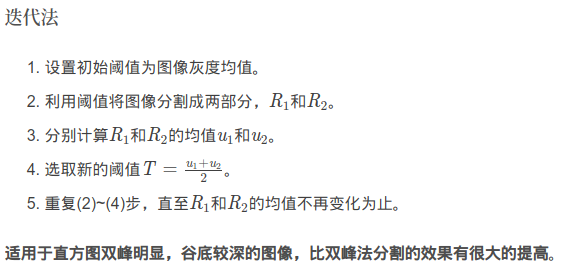
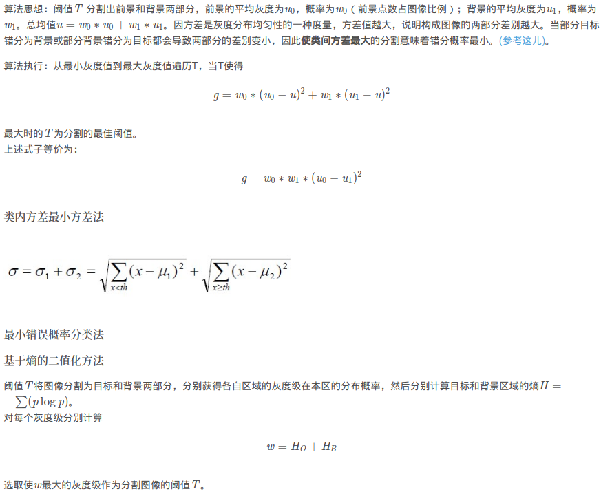
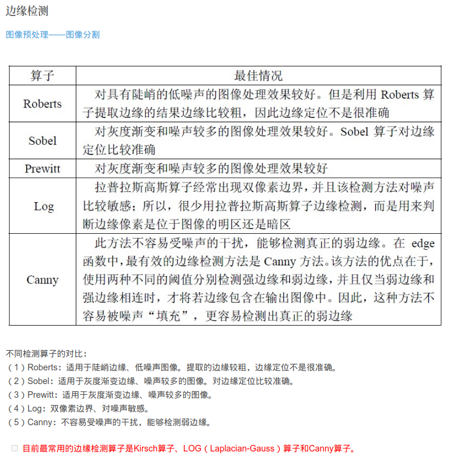

# **图像分割**

[reference link](https://blog.csdn.net/LilyZJ/article/details/90139014)

图像分割是指根据灰度、彩色、纹理、几何形状等特征把图像划分为若干个互不相交的区域，使得这些特征在同一区域内表现出一致性或相似性，而在不同区域间表现出明显的不同。

## **图像分割介绍**

普通的图像分割往往是根据图像的颜色纹理进行划分区域，而语义分割是基于一个语义单元，例如将人，车等目标从图像中分割出来，如果目标存在多种颜色，在普通分割中往往是分割成多个区域。而instance segmentation还要跟进一步，比如一排车连在一起，语义分割的结果是整个一排车在一个分割区域里，而instances segmentation还要将车与车分割开来。

### **1、普通分割**

（即将不同的区域分割开来，结束。在一副图像中，把目标从背景中分离出来。）
将不同分属不同物体的像素区域分开。
如前景与后景分割开，狗的区域与猫的区域与背景分割开。

 这个时期的分割主要是通过提取图片的低级特征，然后进行分割，涌现了一些方法：Ostu、FCM、分水岭、N-Cut等。

### **2、语义分割**

在普通分割的基础上，分类出每一块区域的语义（即这块区域是什么物体）。
如把画面中的所有物体都指出它们各自的类别。这里的语义仍主要指分割出来的物体的类别。

### **3、实例分割（instance segmentation）**
(可以对同一类别的不同物体进行不同的划分，可以清楚地知道分割出来的左边和右边的两个人不是同一个人。)
在语义分割的基础上，给每个物体编号。
如这个是该画面中的狗A，那个是画面中的狗B。

## **传统的图像分割方法**

### **1、基于阈值的图像分割**

理论基础：目标或背景内部的相邻像素间灰度值是相似的，但是不同目标或背景上像素灰度差异较大，反映在直方图上就是不同目标或背景对应不同的峰，分割时，选取的阈值应位于直方图两个不同峰之间的谷上，以便将各个峰分开。

基本思想：通过阈值来定义图像中不同目标的区域归属。

具体做法：首先在图像的灰度取值范围内选择一灰度阈值，然后将图像中的各个像素的灰度值与这个阈值相比较，并根据比较的结果将图像中的像素划分到两类中，若图像中有多个灰度值不同的区域，那么可以选择一系列的阈值以便将每一个像素分到合适的类别中去。

特点：并行区域技术，实现简单、计算量小、性能较稳定，是最基本和最广泛应用的分割技术。适用于目标和背景占据不同灰度级范围的图。
优点：速度快，计算简单，效率高。
缺点：只考虑像素点灰度值本身的特征，一般不考虑空间特征，对噪声比较敏感。

**单阈值分割**

图像若只有目标和背景两大类，只需选取一个阈值，即对于当像素值大于等于阈值T，认定为目标物体像素，令g(i,j)=1; 否则为背景像素，令g(i,j)=0。若图像中存在多个目标需要提取，则需要采用多个阈值将每个目标分割开，称为多阈值分割。

**局部阈值分割**

很多情况下，目标物体和背景的对比度在图像的不同位置并不相同，因此需要根据图像的局部特征分别用不同的阈值对图像进行分割，即局部阈值分割。

**阈值的选取**

阈值分割的结果取决于阈值的选择。常见的阈值选择方法有：利用图像灰度直方图的峰谷法、最小误差法、基于过渡区法、利用像素点空间位置信息的变化阈值法、结合连通信息的阈值方法、最大相关性原则选择阈值和最大熵原则自动阈值法。

**直方图峰谷法**

选择双峰直方图之间的谷作为阈值。适用于目标和背景灰度差较大的图像。

图2. 直方图峰谷法

### **Otsu阈值分割法**

图3. ostu

## **2、基于区域的图像分割**

理论基础：与“基于阈值的分割方法”的理论基础基本一致，都是利用同一物体区域内像素灰度的相似性。

基本思想：将灰度相似的区域合并，把不相似的区域分开，最终形成不同的分割区域。

具体做法：利用同一物体区域内像素灰度的相似性，将灰度相似的区域合并，把不相似的区域分开，最终形成不同的分割区域。

基于区域的图像分割方法主要有两种：区域生长和区域分裂合并算法。区域生长从单个像素出发，逐步合并以形成所需要的分割区域；区域分裂合并从全局出发，逐步分割至所需的分割区域。

种子区域生长法是从一组代表不同生长区域的种子像素开始，接下来将种子像素邻域里符合条件的像素合并到种子像素所代表的生长区域中，并将新添加的像素作为新的种子像素继续合并过程，直到找不到符合条件的新像素为止。该方法的关键是选择合适的初始种子像素以及合理的生长准则。

区域分裂合并法（Gonzalez，2002）的基本思想是首先将图像任意分成若干互不相交的区域，然后再按照相关准则对这些区域进行分裂或者合并从而完成分割任务，该方法既适用于灰度图像分割也适用于纹理图像分割。

**区域生长**

区域生长是串行区域技术，其分割过程的后续步骤的处理要根据前面步骤的结果进行判断而确定。
其基本思想是将具有相似性质的像素集合起来构成区域。具体是先对每个需要分割的区域找一个种子像素点作为生长的起点，然后将种子像素周围邻域中与种子像素具有相同或相似性质的像素合并到种子像素所在区域中。将这些新像素当作新的种子像素继续上面的过程，直到再没有满足条件的像素可被包括进来。
区域内部的一致性描述是区域生长法的基本准则。一般是灰度，也可以考虑颜色、纹理、形状等。

**优点：** 计算简单，对于较均匀的连通目标有较好的分割结果。
**缺点：** 需要人为选取种子，对噪声敏感，可能导致区域内有空洞。另外串行算法当目标较大时分割速度慢，算法设计时应尽量提高运行效率。

**区域分裂合并**

区域分裂合并从整个图像出发，不断分裂得到各个子区域，然后把前景区域合并，得到前景目标，继而实现目标的提取。
分裂合并的假设是对于一幅图像，前景区域是由一些相互连通的像素组成，因此如果把一幅图像分裂到像素级，那么就可以判断该像素是否为前景像素。当所有像素点或者子区域完成判断后，把前景区域或者像素合并就可以得到前景目标。

## **3、基于边缘检测的图像分割**

理论基础：通常不同区域之间的边缘上像素灰度值的变化往往比较剧烈，这是边缘检测方法得以实现的主要假设之一。

基本思想：基于边缘检测的分割方法试图通过检测包含不同区域的边缘来解决分割问题。

具体做法：首先利用合适的边缘检测算子（一阶导数或二阶导数）提取出待分割场景不同区域的边界，然后对边界内的像素进行连通和标注，从而构成分割区域。
边缘检测方法一般利用图像一阶导数的极大值或二阶导数的过零点信息来提供判断边缘点的基本依据。

优点：边缘定位准确、运算速度快。
缺点：不能保证边缘的连续性和封闭性；在高细节区域存在大量碎边缘，难以形成一个大区域。因此，单独的边缘检测只能产生边缘点。需要进行后续处理以完成分割。
常采用边缘生长技术最大程度的保证边缘的封闭性。

图4. 边缘检测

## **4、基于形态学分水岭的图像分割**

理论基础：分水岭分割（Watershed）法（Meyer，1990）是一种基于拓扑理论的数学形态学的分割方法。

基本思想：把图像看作是测地学上的拓扑地貌，图像中每一点像素的灰度值表示该点的海拔高度，每一个局部极小值及其影响区域称为集水盆，而集水盆的边界则形成分水岭。

具体做法：该算法的实现可以模拟成洪水淹没的过程，图像的最低点首先被淹没，然后水逐渐淹没整个山谷。当水位到达一定高度的时候将会溢出，这时在水溢出的地方修建堤坝，重复这个过程直到整个图像上的点全部被淹没，这时所建立的一系列堤坝就成为分开各个盆地的分水岭。

分水岭算法对微弱的边缘有着良好的响应，但图像中的噪声会使分水岭算法产生过分割的现象。

## **5、基于图论的图像分割**

理论基础：图论中无向图的最优化问题。

基本思想：将图像映射为带权无向图，将像素点当作图的节点，利用最小剪切准则得到图像的最佳分割，即：把图像分割问题转化为一个无向图G=（V,E）的最优化问题。

具体做法：无向图中的节点表示图像中的像素，节点与节点之间的边表示像素之间的关系，根据一定的规则为每条边赋予一个权值，利用一定的最优化准则使分割结果中区域内的边有较低的权值，区域间的边有较高的权值，即区域之间的代价函数最小的划分便是该图最优的分割。

基于图论分割的基本原则是使划分成的两个区域（A,B）的内部相似度最大，区域（A,B）之间的相似度最小，同时应使得划分的区域尽量避免出现歪斜分割。为了能够得到精确的分割结果，设计割集准则至关重要，常见的割集准则有Minimum Cut、Average Cut、Normalize Cut、Min-max Cut、Ratio Cut等。

**结合特定工具的图像分割算法**

1. 基于小波分析和小波变换的图像分割方法
2. 基于马尔科夫随机场模型的图像分割方法
3. 基于遗传算法的图像分割方法

**基于人工智能的图像分割方法**

1. 基于人工神经网络的图像分割

2. 基于聚类的分割

**理论基础：** 图像分割就是图像中的像素进行分类。

**基本思想：** 图像分割就是将图像的像素进行分类，于是，很自然的将聚类应用于图像分割问题中。

**具体做法：** 给出一个目标函数，使得聚类过程中，目标函数达到最小为止。

    目前常见的基于聚类的分割方法主要有：C-均值聚类分割算法（HCM）、模糊C-均值聚类分割算法（FCM）。FCM聚类是HCM的改进，其区别主要在于：HCM算法对于对象的划分是硬性的，而FCM则是一种柔性的模糊划分；FCM模糊聚类算法的向量可以同时属于多个聚类，用0~1间的隶属度来确定每个对象属于各个类的程度，而HCM聚类算法中，一个给定的对象只能属于一个类。
3. 主动轮廓模型

**视频分割方法**

**1、基于时域的视频对象分割方法**

**理论基础：** 同一物体的各个部分往往具有一致的时间属性。

**基本思想：** 时域分割主要时利用视频相邻图像之间的连续性和相关性进行分割。

**具体做法：** 一种是通过当前帧和背景帧相减来获得差分图像，另外一种是利用两帧之间或者多帧之前的差来获得差分图像。

 基于时域的视频对象分割方法主要包括：背景差分法、帧间差分法。

**2、基于运动的视频对象分割方法**

**理论基础：** 光流场和参数估计方面的理论知识。

**基本思想：** 主要是基于光流场等方法进行运动参数估计，求出符合运动模型的像素区域，进而合并区域构成运动对象进行视频分割。

**具体做法：** 首先求出光流场并进行参数估计，接着求出符合运动模型的像素区域，最后合并区域构成运动对象进行视频分割。

 基于运动的视频对象分割方法主要包括：光流法、参数化方法。

**【补充小知识】：** 当人的眼睛与被观察的物体发生相对运动时，物体的影像在视网膜平面上形成一系列连续变化的图像，这一系列的图像信息不断“流过”视网膜，好像是一种光的“流”，所以被称为“光流”。光流是基于像素定义的，所有的光流的集合称为光流场。