#  Anchor-free应用一览：目标检测、实例分割、多目标跟踪

[参考网址](https://zhuanlan.zhihu.com/p/163266388) 

**（一） 目标检测**

首先，我们来看一下anchor free在目标检测中的应用。首先我们要回答为什么要有 anchor？在前几年，物体检测问题通常都被建模成对一些候选区域进行分类和回归的问题。在单阶段检测器中，这些候选区域就是通过滑窗方式产生的 anchor；在两阶段检测器中，候选区域是 RPN 生成的 proposal，但是 RPN 本身仍然是对滑窗方式产生的 anchor 进行分类和回归。

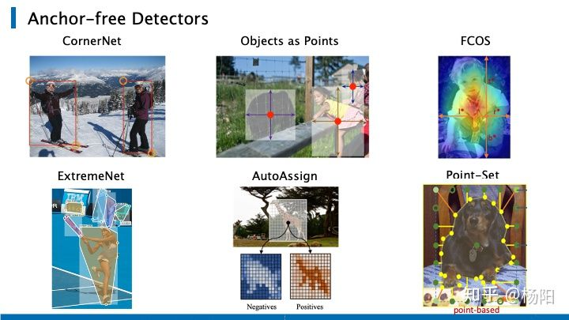

这里我列出的几种anchor-free 方法，是通过另外一种手段来解决检测问题的。CornetNet通过预测成对的关键点（左上角与右下角）来表征目标框；CenterNet和FCOS通过预测物体中心点及其到边框的距离来表征目标框；ExtremeNet是通过检测物体四个极值点，将四个极值点构成一个物体检测框；AutoAssign也是近期的一篇论文，提出一种在anchor free检测器上，正负样本标签的新的分配策略； Point-Set是近期ECCV 2020的一个工作，提出来一个更加泛化的point-based的anchor表示形式，统一了目标检测、实例分割、姿态估计的三个大任务，后面我们会进一步展开。

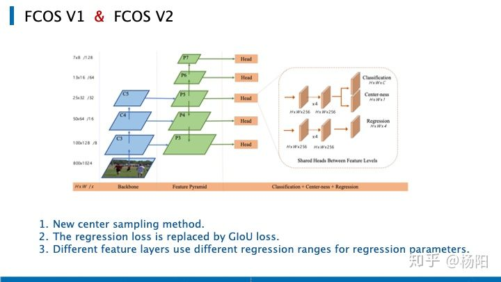

首先我们来简单回顾一下FCOS的网络架构，其中C3, C4, C5表示骨干网络的特征图，P3到P7是用于最终预测的特征级别。这五层的特征图后分别会跟上一个head，head中包括了三个分支，分别用于分类、中心点置信度、回归的预测。整体的架构非常简洁，有很多人通过修改FCOS的输出分支，用于解决实例分割、关键点检测、目标追踪等其他任务。

下边我列出来原作者在更新论文版本时，做出的三点细节上的调整，一是使用了新的中心点采样的方式，在判断正负样本时，考虑了不同阶段的步长值，去调整了正样本所处框的大小​。而非像FCOS v1中，直接判断其是否落在gt bbox里。这种新的center sampling方式，使得难判别的样本减少，是否使用center-ness branch造成的精度区别也减小了。二是将回归的loss换成了GIoU loss。三是FCOS v2 的不同特征层在回归参数的时候，使用了不同的reg范围（除以了stride）。（而在FCOS v1中，是用过乘以一个可以学习的参数，该参数在FCOS v2有保留，但重要性减小。）

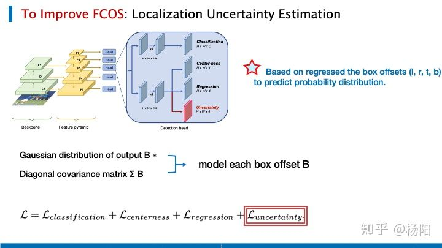

为了提升fcos的效果，特别考虑到一些不稳定环境，由于传感器噪声或不完整的数据，目标探测器需要考虑定位预测的置信度，有人提出加入一个预测bbox的不确定度的分支。

这里的不确定度是通过预测bbox的四个offset的分布得到的。这里假设每一个示例都是独立的，用多元高斯分布的输出与协方差矩阵的对角矩阵去表征每一个bbox的offset。在FCOS的分类、中心点、回归的三个loss上，新增了一个衡量bbox offset的不确定度的loss。下边我们来具体看一下他的实现方式。

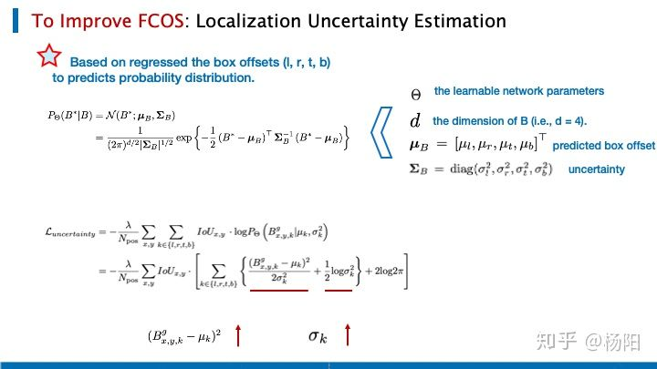

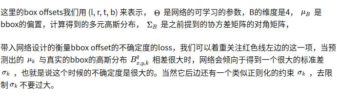

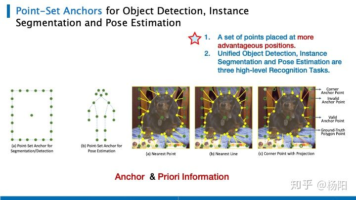

下面我们来看看，《Point-Set Anchors for Object Detection, Instance Segmentation and Pose Estimation》这个point-based的网络，是如何使用回归的思路去统一Object Detection, Instance Segmentation，Pose Estimation三个大任务的。作者称这是统一这三大任务的第一人。

作者认为，在object detection领域，无论是若干个IOU大于一定阈值的anchor表示正样本，还是用物体的中心点来表示正样本。不论是anchor based或者anchor-free based的方法，对于正样本在原图的定位，都是基于回归的形式直接回归矩形坐标，或者是矩形长宽+矩形中心点offset。Anchor从某种程度上来说，表示的只是一种先验信息，anchor可以是中心点，也可以是矩形，同时它还可以提供更多的模型设计思路，如正负样本的分配，分类、回归特征的选择。所有作者的思路是，能不能提出更加泛化的anchor，泛化的应用于更多的任务中，而不只是目标检测中，并给出一个更好的先验信息。

对于Instance Segmentation和Object Detection，使用最左边的Anchor，其有两个部分：一个中心点和n个有序锚点，在每个图像位置，我们会改变边界框的比例和长宽比来形成一些anchor，这里和anchor-based的方法一样，涉及到一些超参数的设置。对姿态估计中的anchor，使用训练集中最常见的姿态。Object Detection的回归任务比较简单，用中心点或者左上/右下角点回归即可。对于Instance Segmentation来说，作者使用了特定的匹配准则去匹配右图中绿色的Point-set anchor中的anchor points和黄色的gt实例的points，并且转换为回归任务。

右边的三个图https://zhuanlan.zhihu.com/p/163266388分别是将绿色与黄色的点，最近的相连；将绿色的点与最近的边缘相连；最右侧中时作者优化后的方式，对角点采用最近点的方法，根据角点得到的最近四个点将gt的轮廓划分成4个区域。将上边界与下边界上绿色的点，做垂线对应到有效的gt point（若不在区域内，则无效，例如图中的绿色空心点）。

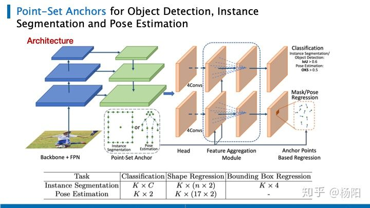

总的来说，Point-set用它提出的新的anchor的设计方式代替传统的矩形anchor，并在头部附加一个并行的回归分支用于实例分割或姿态估计。图中展示了它的网络架构，和retinanet一样，作者使用了不同尺度的特征层，head包含了用于分类、分割姿态的回归、检测框的回归的子网络。每一个子网络都包含了四个3乘3的、stride为1的卷积层，只在姿态估计任务上使用的FAM模块，和一个输出层。下边的表格中，列出的是输出层的维度，分别对应了三个任务。

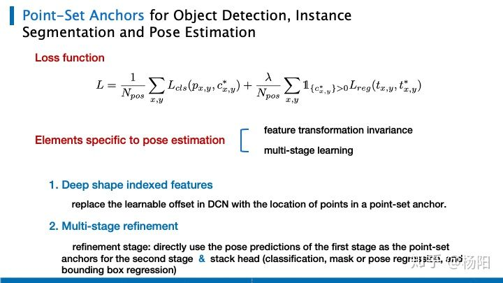

其损失函数非常简单，对分类使用focal loss，对回归任务使用L1 loss。https://zhuanlan.zhihu.com/p/163266388

除了目标归一化和将先验知识嵌入anchor的形状之外，作者也提到了我们如何进一步用anchor去聚合特征，以保证特征变换不变性、并拓展到多阶段学习当中。

（1）我们将可变卷积中的可学习偏移量替换为point-based anchor中点的位置。

（2）由于人体形状的这个回归，是相对检测更加困难的。一方面是由于它对特征的提取要求非常大，另一方面是不同的关键点之间存在差异。所以作者提出，可以直接使用第一阶段的姿态预测作为第二阶段的anchor（分类、掩模或位姿回归、边界盒回归），使用额外的细化阶段进行姿态估计。

**（二）实例分割**

下边要介绍是三篇在实例分割领域的模型，他们都参考了FCOS的做法，将目标检测中anchor-free的思想，迁移到了实例分割的任务上。网络的具体细节不会展开讲，这里只会说到他们在解决实例分割任务时，在FCOS的整体架构上做了哪一些调整。

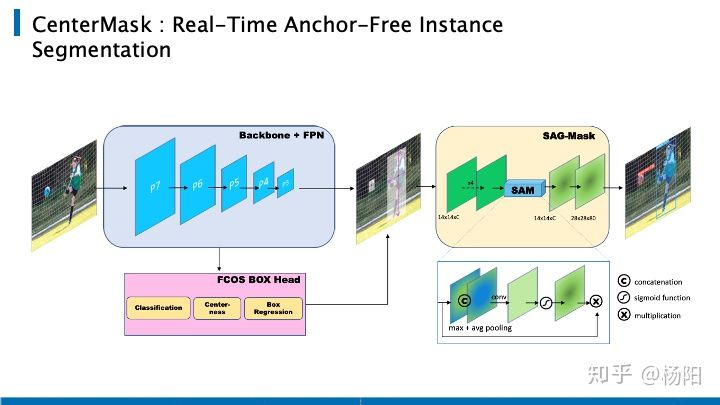

首先讲到的是CenterMask，把这个放在最前面是因为他的想法非常直接，这个结构可以理解成 FCOS + MaskRCNN 的 mask的分支。

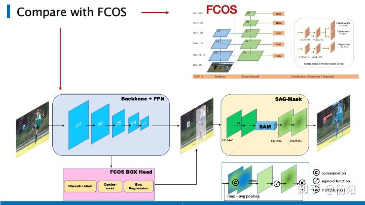

我们可以将它和FCOS做一下对比，输入图像通过 FCOS 得到目标框，这一部分是一样的。之后类似 MaskRCNN，用 ROIAlign 把对应的区域 crop 出来，resize 到 14 x14 ，最后经过 mask branch 计算 loss。想法非常简单。

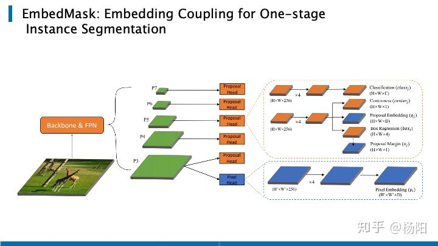

第二篇是EmbedMask，在保证近似精度的基础上，它的最快速度可以达到MaskRCNN的三倍。它采取了one-stage方法，相当于直接使用语义分割得到分割结果之后，在使用聚类或者一些手段将同一个实例的整合到一起，得到最终实例的分割结果。

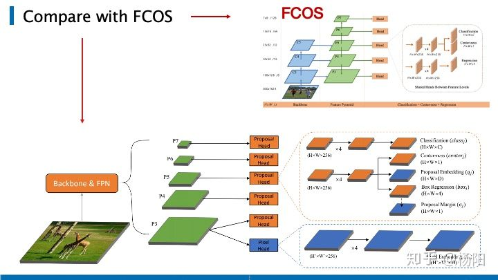

整个网络的结构如上图所示，还是一个FPN的结构，在分辨率最大的特征曾P3使用pixel的embedding，将每个pixel都embedding成一个D长度的向量，因此最后得到的是HWD的特征图。然后依次对每个特征图P3、P4、P5、P6、P7使用proposal head，也就是传统的目标检测的head，再其中的改进就是，对于每个proposal也都embedding成一个D长度的向量。使用一个margin来定义两个embedding之间的关联程度，如果小于这个embedding，就认为这个pixel和这个proposal是同一个instance。但是呢，文中提出使用一个人为定义的margin，会导致一些问题，因此呢，本文就提出了一个learnable margin，让网络自动学习每个proposal的margin，就如结果图中所示的proposal margin那条路径。对比FCOS，EmbedMask加入了图中蓝色的模块。

虽然EmbedMask和CenterMask等工作都是基于一阶段的检测算法，来做实例分割，但是它的核心要点，其实并没有变，都是基于一个足够好的detector来从proposal里面生成mask。事实证明这非常有效，基于一个足够好的detector的实例分割方法不仅仅有利于找到更多的mask，同时这些mask的生成反过来会提升detector本身的效果。所以你可以看到这两个实例分割的box AP都要比FCOS要高，当然这也是必然。

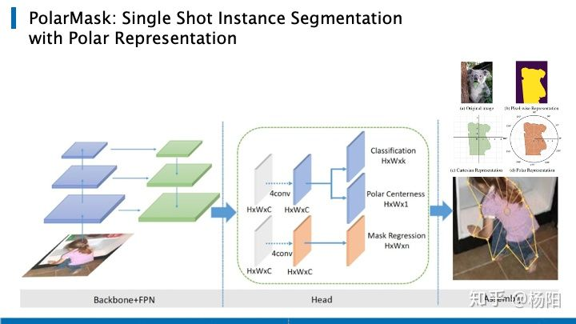

第三篇是PolarMask，它也是基于FCOS，把实例分割统一到了FCN的框架下。PolarMask提出了一种新的instance segmentation建模方式，在将极坐标的360度等分成36分，通过预测这36个方向上，边缘到极坐标中心的距离，从而得到物体的轮廓。

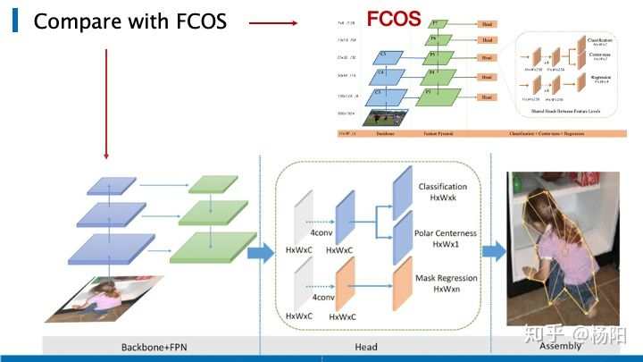

