# Overview
https://en.wikipedia.org/wiki/Backpropagation
```
Backpropagation computes the gradient in weight space of a feedforward neural network, with respect to a loss function. Denote:
1. x: input (vector of features)
2. y: target output
    For classification, output will be a vector of class probabilities (e.g., (0.1,0.7,0.2), and target output is a specific class, encoded by the one-hot/dummy variable (e.g.,(0,1,0)).
3. C: loss function or "cost function"
    For classification,this is usually cross entropy,while for regression it is usually squared error loss
4. L: the number of layers
5. w_{jk}^{l}: the weights between layer l-1 and l, where w_{jk}^{l} is the weight between the k-th node in layer l-1 and the j-th node in layer l
6.  f^{l}: activation functions at layer l
    For classification the last layer is usually the logistic function for binary classification, and softmax (softargmax) for multi-class classification, while for the hidden layers this was traditionally a sigmoid function (logistic function or others) on each node (coordinate), but today is more varied, with rectifier (ramp, ReLU) being common.
```

## Matrix multiplication
```
Given an input–output pair (x,y), the loss is:
给一个输入输出对样本，计算损失值公式如下：
```
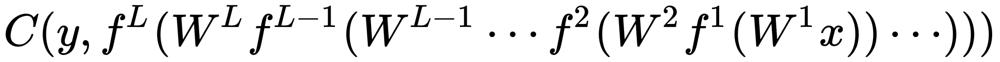
```
The derivative of the loss in terms of the inputs is given by the chain rule; note that each term is a total derivative, evaluated at the value of the network (at each node) on the input x:
在损失函数上对输入变量x求导公式如下：
```
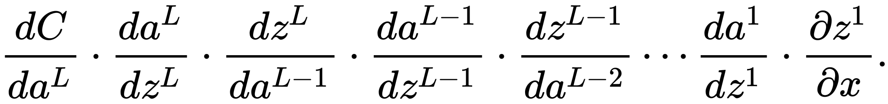
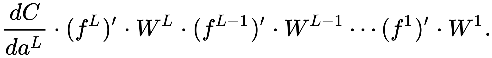

```
The gradient  is the transpose of the derivative of the output in terms of the input, so the matrices are transposed and the order of multiplication is reversed, but the entries are the same:
```


---
Introducing the auxiliary quantity 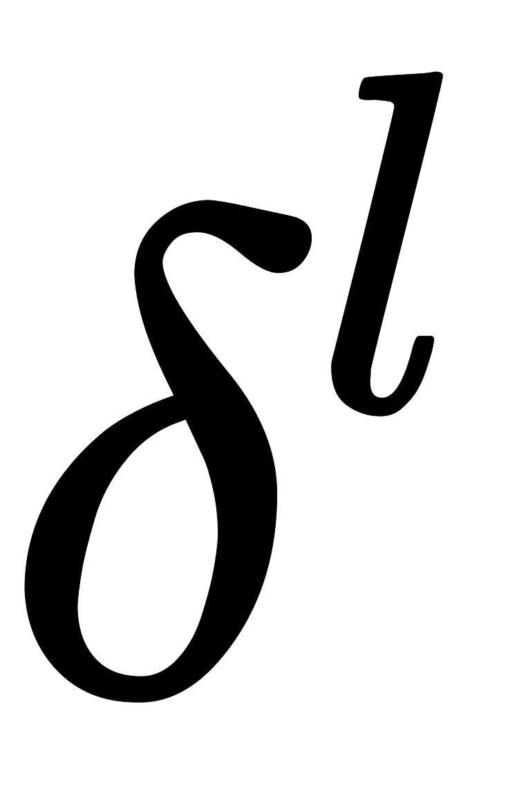 for the partial products (multiplying from right to left), interpreted as the "error at level l" and defined as the gradient of the input values at level l:
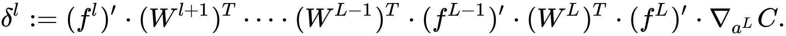

```
The gradient of the weights in layer l is then:
```
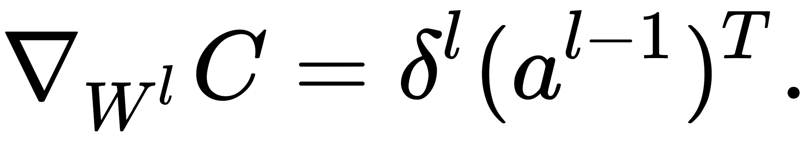

The  can easily be computed recursively as:

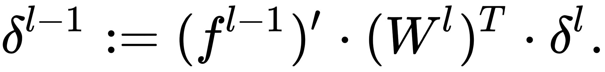

The gradients of the weights can thus be computed using a few matrix multiplications for each level; this is backpropagation.Compared with naively computing forwards (using the  for illustration):

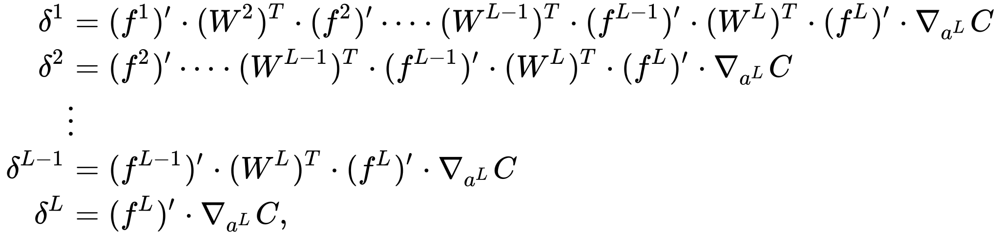

there are two key differences with backpropagation:


## 吴恩达BP算法中公式的数学推导（不漏步，不跳步）
[转载自 ：](https://blog.csdn.net/qq_43277802/article/details/105511162)https://blog.csdn.net/qq_43277802/article/details/105511162

<div align=center>
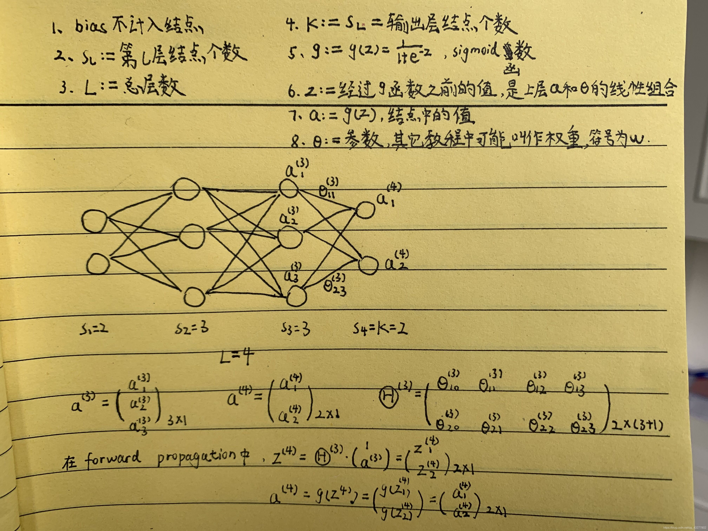
</div>
（补充第9条 J:=损失函数/代价函数）

**我们的根本问题/需求：求出神经网络的参数的最优值，使得代价函数J最小。**
1. 先计算损失函数J是什么（即使你想直接进入算导数环节，也得搞清楚J是什么东西才能算吧）
<div align=center>
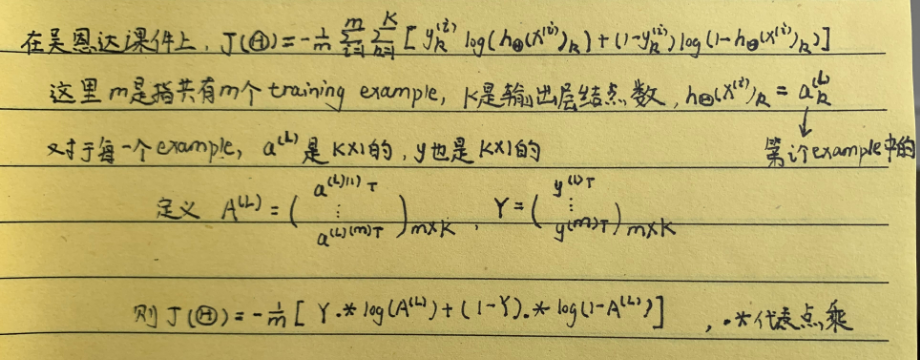
</div>
这样,代价函数J就有了一个简洁的矩阵表达式。等等，你问为什么J（Θ）的表达式中没有 Θ ？咳咳，这是因为a(L)或者A(L)（神经网络的输出值）其实就是由Θ通过forward propagation算出来的啦。对forward propagation有疑问的话可以看下图，没有问题的话可以直接跳过下图：
<div align=center>
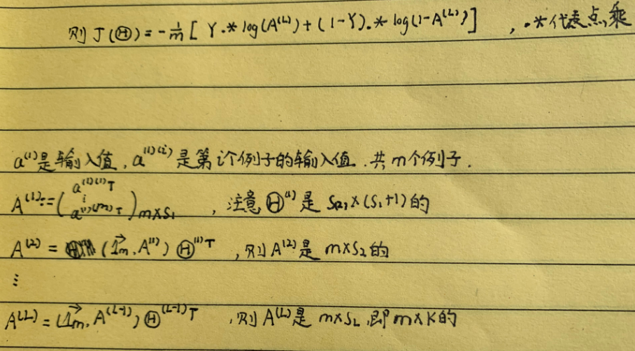
</div>


2. 接下来的任务就是要求出J对于每个θ的导数。

想法1：将J直接写成Θ的的表达式，然后直接矩阵求导，简直完美解决。
想法很好，其实之前的logistic regression正是这么做的。But，在神经网络中，你可以看到我们的J是写成了A(L)的表达式，然后A(L)可以由Θ递推出来。为什么不把J直接写成Θ的表达式呢，这样可以直接求导，哪还需要什么BP算法？可是，臣妾做不到啊！大家可以看到每次在A(i)推出A(i+1)的过程中，都加了一个m×1维的向量，这样的话咱们只能往前迭代，但是没办法具体写出A(L)关于Θ的表达式，这样，直接用J关于Θ的表达式来矩阵求导的计划就泡汤了。

想法2：BP算法
正常想法行不通，于是BP算法应运而生。BP想法：J对θ求导不是不能一次性全部求出来吗？问题就在于中间的嵌套迭代过程不能直接写成θ的具体表达式。那么我们求导也可以迭代着求，具体数学推导如下（本文核心）：
<div align=center>
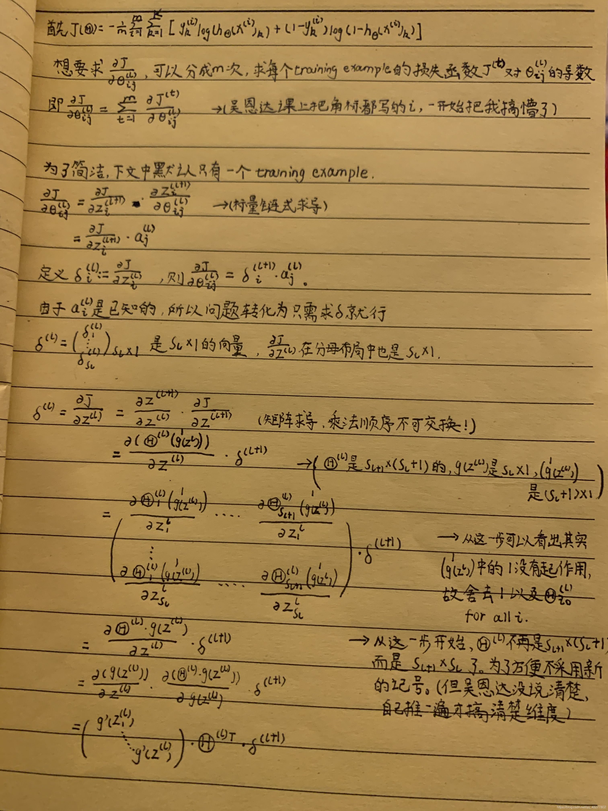
</div>

OK，现在δ从后往前的递推关系式也有了，最后只需要求出δ(L)就可以算出所有的δ了。计算δ（L）：
<div align=center>
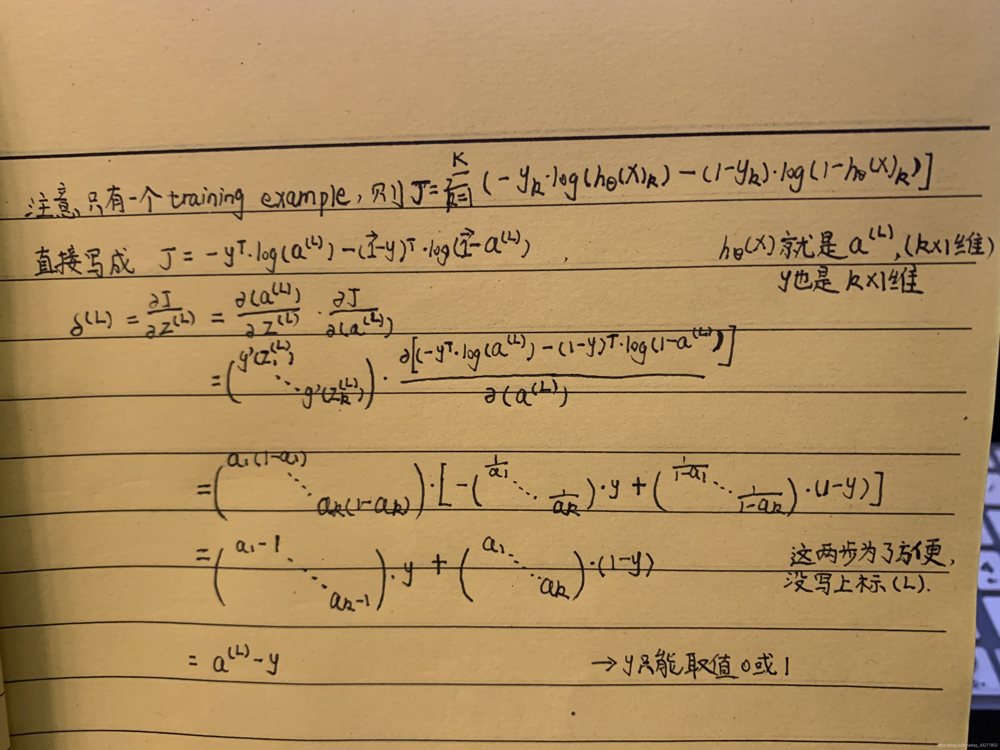
</div>

所以 δ(L)=a(L)-y。根据前面推导的δ往回递推的公式，可以算出所有δ的值，进而算出所有J对θ的导数，BP算法大胜利！

**总结：**

BP算法的本质就是倒着算导数或者说倒着算δ（导数由δ唯一决定），先算δ(L)再算δ(L-1)，再算δ(L-2)… …倒着算，所以是BackPropagation。《吴恩达机器学习》中将δ称作是每一个结点的 error，确实可以这么理解，但是在数学上看，δ只不过是求导中间所定义的一个变量罢了。BP算法的目的就是求导，之所以出现这么麻烦的事情，还是因为J不能具体写成Θ的直接表达式，不能直接求导了。
## Matrix Derivative矩阵求导
[矩阵求导 : ](https://www.jianshu.com/p/186ea261f2e4) https://www.jianshu.com/p/186ea261f2e4
