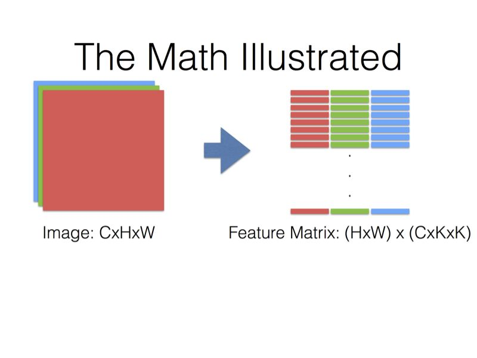

#  **神经网络相关知识**

## **BN**
```
Batchnorm主要解决的问题
---------------------
1. 深度学习的话尤其是在CV上都需要对数据做归一化，因为深度神经网络主要就是为了学习训练数据的分布，并在测试集上达到很好的泛化效果，但是，如果我们每一个batch输入的数据都具有不同的分布，显然会给网络的训练带来困难。另一方面，数据经过一层层网络计算后，其数据分布也在发生着变化，此现象称为Internal Covariate Shift，接下来会详细解释，会给下一层的网络学习带来困难。(训练深度网络的时候经常发生训练困难的问题，因为，每一次参数迭代更新后，上一层网络的输出数据经过这一层网络计算后，数据的分布会发生变化，为下一层网络的学习带来困难（神经网络本来就是要学习数据的分布，要是分布一直在变，学习就很难了），此现象称之为Internal Covariate Shift。)。Batch Normalizatoin之前的解决方案就是使用较小的学习率，和小心的初始化参数，对数据做白化处理，但是显然治标不治本。

```
1. 批归一化(Batch Normalization, BatchNorm)已成为现代神经网络稳定训练的默认组件。在BatchNorm中，centering and scaling operations（ 中心化以及缩放操作），对应的均值和方差统计信息，被用于batch 寸尺上的特征标准化
2. 归一化可以加快网络的训练速度，提高学习的稳定性，并且能够对数据做去相关性，突出分布的相对差
3. Batch Norm就是一种归一化方法，能够减小图像之间的绝对差异，突出相对差异，加快训练速度

<div  align=center>

</div>

<div  align=center>

</div>

<div  align=center>

</div>
如果特征维度之间是相互独立的，那么前三步可以认为是PCA白化的过程，当然，这个假设是不成立的。不过即使存在一定的相关性，这样的操作仍然能够加速模型训练过程中的收敛。

如果单纯地使用前三个公式，有可能会影响一些层的表达能力，例如，如果使用激活函数使用sigmoid，那么这个操作会强制输入数据分布在sigmoid接近线性的部分，接近线性的模型显然不好（影响整个模型的表达能力）。所以把前三个公式作为基本变换（单位变换），加上放缩γ和平移β后再拿来使用，这两个参数是可以学习的。

在极端情况下，即γ=√Var[x]，β=E[x]时，经过BN层的数据没有变化。

```
class MyBN:
    def __init__(self, momentum, eps, num_features):
        """
        初始化参数值
        :param momentum: 追踪样本整体均值和方差的动量
        :param eps: 防止数值计算错误
        :param num_features: 特征数量
        """
        # 对每个batch的mean和var进行追踪统计
        self._running_mean = 0
        self._running_var = 1
        # 更新self._running_xxx时的动量
        self._momentum = momentum
        # 防止分母计算为0
        self._eps = eps
        # 对应论文中需要更新的beta和gamma，采用pytorch文档中的初始化值
        self._beta = np.zeros(shape=(num_features, ))
        self._gamma = np.ones(shape=(num_features, ))

    def batch_norm(self, x):
        """
        BN向传播
        :param x: 数据
        :return: BN输出
        """
        x_mean = x.mean(axis=0)
        x_var = x.var(axis=0)
        # 对应running_mean的更新公式
        self._running_mean = (1-self._momentum)*x_mean + self._momentum*self._running_mean
        self._running_var = (1-self._momentum)*x_var + self._momentum*self._running_var
        # 对应论文中计算BN的公式
        x_hat = (x-x_mean)/np.sqrt(x_var+self._eps)
        # 仿射变换：中心化和缩放
        y = self._gamma*x_hat + self._beta
        return y
```


---
## **non-local 相关知识（CV方向）**
为什么提出Non-local?
```
计算机视觉领域，尤其对于动态视频序列中，帧内帧间的依赖关系十分重要。尤其像下图1中视频的行为分类任务，全局内容的理解以及不同帧间的联系对于分类结果导向作用很强。现在比较通用普遍的做法是，通过循环卷积网络联系 t 和 t-1 ，或者通过更深的网络增大感受野提高对全局内容的理解。
尽管如此，这种方式仍旧是比较local的，不论时间方向或者空间位置。甚至，最大的问题是：没法进行远距离信息的来回传递；而且deeper网络计算量大但效率低，梯度优化起来也比较困难。
因此，针对远距离信息传递问题，提高长距离依赖，本论文从传统的非局部均值滤波方法中受到启发，提出了卷积网络中的non-local，即：某一像素点处的响应是其他所有点处的特征权重和，将每一个点与其他所有点相关联，实现non-local 思想。
```
Non-local 的思想和简单数学原理
```
Non-local的核心思想就是上面说的，某一像素点处的响应是其他所有点处的特征权重和。

因此，假设对于一个2D 的7*7特征图，总共是 49*1 （拉平操作）个位置，每个位置都与其他位置（包括本身位置）有关联性度量，就会得到 49*49 的关联性矩阵，而这个关联性矩阵其实可以理解为像素彼此之间的关联权重矩阵，因为不同像素点间的关联性都是不同的，因此经过归一化后的这个权重矩阵本质上就实现了注意力。

当将这个 49*49 的权重再与原特征图 49*1 做矩阵乘时，得到的 49*1 矩阵就是该 2D 特征图所有像素点的响应，也就是关于其他像素点的加权和。因此这里的 2D 特征图的空间位置的注意力操作就是这个non-local操作。
```
<div  align=center>

</div>

## **self-attention 相关知识（CV方向）**
### **Self-Attention Mechanism**
首先介绍Self-Attention机制。Self-Attention是从NLP中借鉴过来的思想，因此仍然保留了Query, Key和Value等名称。下图是self-attention的基本结构，feature maps是由基本的深度卷积网络得到的特征图，如ResNet、Xception等，这些基本的深度卷积网络被称为backbone，通常将最后ResNet的两个下采样层去除使获得的特征图是原输入图像的1/8大小。
<div  align=center>

</div>

**Self-attention结构自上而下分为三个分支，分别是query、key和value。计算时通常分为三步：**
```
1.第一步是将query和每个key进行相似度计算得到权重，常用的相似度函数有点积，拼接，感知机等；
2.第二步一般是使用一个softmax函数对这些权重进行归一化；
3.第三步将权重和相应的键值value进行加权求和得到最后的attention。
```

**self-attention 的pytorch实现代码：**

```
class Self_Attn(nn.Module):
    """ Self attention Layer"""
    def __init__(self,in_dim,activation):
        super(Self_Attn,self).__init__()
        self.chanel_in = in_dim
        self.activation = activation
 
        self.query_conv = nn.Conv2d(in_channels = in_dim , out_channels = in_dim//8 , kernel_size= 1)
        self.key_conv = nn.Conv2d(in_channels = in_dim , out_channels = in_dim//8 , kernel_size= 1)
        self.value_conv = nn.Conv2d(in_channels = in_dim , out_channels = in_dim , kernel_size= 1)
        self.gamma = nn.Parameter(torch.zeros(1))
 
        self.softmax  = nn.Softmax(dim=-1) 
    def forward(self,x):
        """
            inputs :
                x : input feature maps( B X C X W X H)
            returns :
                out : self attention value + input feature 
                attention: B X N X N (N is Width*Height)
        """
        m_batchsize,C,width ,height = x.size()
        proj_query  = self.query_conv(x).view(m_batchsize,-1,width*height).permute(0,2,1) # B X (W*H) X C//8
        proj_key =  self.key_conv(x).view(m_batchsize,-1,width*height) # B X C//8 x (W*H)
        energy =  torch.bmm(proj_query,proj_key) # transpose check  # BX (W*H) X (W*H) 
        attention = self.softmax(energy) # BX (W*H) X (W*H) 
        proj_value = self.value_conv(x).view(m_batchsize,-1,width*height) # B X C X N
 
        out = torch.bmm(proj_value,attention.permute(0,2,1) )
        out = out.view(m_batchsize,C,width,height)
 
        out = self.gamma*out + x
        return out,attention
```

**下面的是可视化的self-attention计算过程：**

<div  align=center>

</div>
<div  align=center>

</div>
<div  align=center>

</div>

**self-attention segmentation paper**

[DANet](https://blog.csdn.net/qq_37935516/article/details/99684663)  |  [CODE](https://github.com/junfu1115/DANet)

[CCNet](https://blog.csdn.net/qq_37935516/article/details/99691994) | [CODE](https://github.com/speedinghzl/CCNet)

[CoordAttention](https://arxiv.org/abs/2103.02907) | [CODE](https://github.com/Andrew-Qibin/CoordAttention)

[OCRNet](https://arxiv.org/abs/1909.11065) | [CODE1](https://github.com/openseg-group/openseg.pytorch)  | [CODE2](https://github.com/HRNet/HRNet-Semantic-Segmentation/tree/HRNet-OCR) 


## **caffe、pytorch 等的卷积计算**
```
pytorch中可以直接使用torch.nn.conv2d()来进行卷积操作。

也可以显示的进行卷积计算，conv2d = unfold + matmul + fold。

unfold操作功能是将图像分块，例如有以输如（N，C，H，W），然后使用（3，4）的windows size
来对其进行分块，在单一channel分块大小为（H - 3 + 1）*（W - 4 + 1），每一块的特征维度为（C * 3 * 4）。
matmul操作功能是将分好的块和卷积核进行矩阵计算。（具体的操作可以参考下方的图示）
fold操作的功能是将计算好的结果reshape回（N，C，H，W），正好号unfold功能相反。
```

[LINK-caffe-CNN](https://www.zhihu.com/question/28385679) pytorch卷积实现原理应该和caffe的相差不大，猜测是这样的，没有看过pytorch源码.但是pytorch使用了很多caffe2的东西。

<div  align=center>




</div>

```
最后一页没画，但是基本上就是Filter Matrix乘以Feature Matrix的转置，得到输出矩阵Cout x (H x W)，就可以解释为输出的三维Blob（Cout x H x W）。Caffe里用的是CHW的顺序，有些library也会用HWC的顺序（比如说CuDNN是两个都支持的），这个在数学上其实差别不是很大，还是一样的意思。

//上面内容来自贾扬清知乎的回答。

```
## **池化**
    抑制噪声，降低信息冗余
    提升模型的尺度不变性、旋转不变形
    降低模型计算量
    防止过拟合
1. **Global Average Pooling(简称GAP，全局池化层)**
     
    具体操作如下图：
   <div>
   
   <div/>
   假设卷积层的最后输出是h × w × d 的三维特征图，具体大小为6 × 6 × 3，经过GAP转换后，变成了大小为 1 × 1 × 3 的输出值，也就是每一层 h × w 会被平均化成一个值。

2. 

