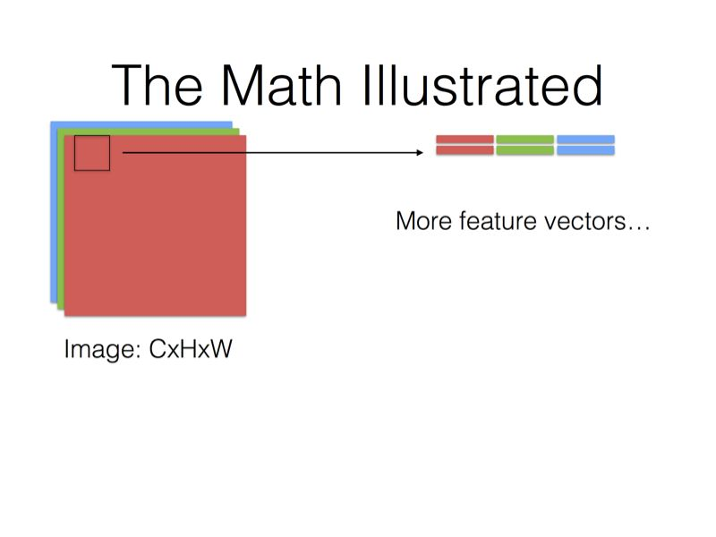
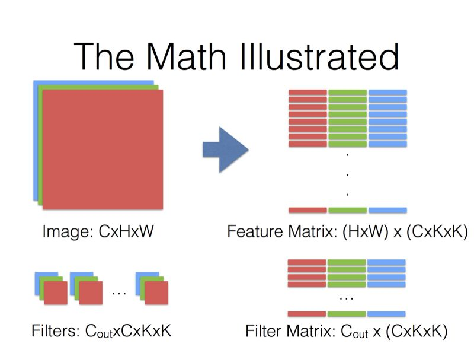

#  **神经网络相关知识**


## **self-attention 相关知识（CV方向）**
### **Self-Attention Mechanism**
首先介绍Self-Attention机制。Self-Attention是从NLP中借鉴过来的思想，因此仍然保留了Query, Key和Value等名称。下图是self-attention的基本结构，feature maps是由基本的深度卷积网络得到的特征图，如ResNet、Xception等，这些基本的深度卷积网络被称为backbone，通常将最后ResNet的两个下采样层去除使获得的特征图是原输入图像的1/8大小。
<div  align=center>

</div>

**Self-attention结构自上而下分为三个分支，分别是query、key和value。计算时通常分为三步：**
```
1.第一步是将query和每个key进行相似度计算得到权重，常用的相似度函数有点积，拼接，感知机等；
2.第二步一般是使用一个softmax函数对这些权重进行归一化；
3.第三步将权重和相应的键值value进行加权求和得到最后的attention。
```

**self-attention 的pytorch实现代码：**

```
class Self_Attn(nn.Module):
    """ Self attention Layer"""
    def __init__(self,in_dim,activation):
        super(Self_Attn,self).__init__()
        self.chanel_in = in_dim
        self.activation = activation
 
        self.query_conv = nn.Conv2d(in_channels = in_dim , out_channels = in_dim//8 , kernel_size= 1)
        self.key_conv = nn.Conv2d(in_channels = in_dim , out_channels = in_dim//8 , kernel_size= 1)
        self.value_conv = nn.Conv2d(in_channels = in_dim , out_channels = in_dim , kernel_size= 1)
        self.gamma = nn.Parameter(torch.zeros(1))
 
        self.softmax  = nn.Softmax(dim=-1) 
    def forward(self,x):
        """
            inputs :
                x : input feature maps( B X C X W X H)
            returns :
                out : self attention value + input feature 
                attention: B X N X N (N is Width*Height)
        """
        m_batchsize,C,width ,height = x.size()
        proj_query  = self.query_conv(x).view(m_batchsize,-1,width*height).permute(0,2,1) # B X CX(N)
        proj_key =  self.key_conv(x).view(m_batchsize,-1,width*height) # B X C x (*W*H)
        energy =  torch.bmm(proj_query,proj_key) # transpose check
        attention = self.softmax(energy) # BX (N) X (N) 
        proj_value = self.value_conv(x).view(m_batchsize,-1,width*height) # B X C X N
 
        out = torch.bmm(proj_value,attention.permute(0,2,1) )
        out = out.view(m_batchsize,C,width,height)
 
        out = self.gamma*out + x
        return out,attention
```

**下面的是可视化的self-attention计算过程：**

<div  align=center>

</div>
<div  align=center>

</div>
<div  align=center>

</div>

**self-attention segmentation paper**

[DANet](https://blog.csdn.net/qq_37935516/article/details/99684663)  |  [CODE](https://github.com/junfu1115/DANet)

[CCNet](https://blog.csdn.net/qq_37935516/article/details/99691994) | [CODE](https://github.com/speedinghzl/CCNet)

[CoordAttention](https://arxiv.org/abs/2103.02907) | [CODE](https://github.com/Andrew-Qibin/CoordAttention)

[OCRNet](https://arxiv.org/abs/1909.11065) | [CODE1](https://github.com/openseg-group/openseg.pytorch)  | [CODE2](https://github.com/HRNet/HRNet-Semantic-Segmentation/tree/HRNet-OCR) 


## **caffe、pytorch 等的卷积计算**
```
pytorch中可以直接使用torch.nn.conv2d()来进行卷积操作。

也可以显示的进行卷积计算，conv2d = unfold + matmul + fold。

unfold操作功能是将图像分块，例如有以输如（N，C，H，W），然后使用（3，4）的windows size
来对其进行分块，在单一channel分块大小为（H - 3 + 1）*（W - 4 + 1），每一块的特征维度为（C * 3 * 4）。
matmul操作功能是将分好的块和卷积核进行矩阵计算。（具体的操作可以参考下方的图示）
fold操作的功能是将计算好的结果reshape回（N，C，H，W），正好号unfold功能相反。
```

[LINK-caffe-CNN](https://www.zhihu.com/question/28385679) pytorch卷积实现原理应该和caffe的相差不大，猜测是这样的，没有看过pytorch源码.但是pytorch使用了很多caffe2的东西。

<div  align=center>




</div>

```
最后一页没画，但是基本上就是Filter Matrix乘以Feature Matrix的转置，得到输出矩阵Cout x (H x W)，就可以解释为输出的三维Blob（Cout x H x W）。Caffe里用的是CHW的顺序，有些library也会用HWC的顺序（比如说CuDNN是两个都支持的），这个在数学上其实差别不是很大，还是一样的意思。

//上面内容来自贾扬清知乎的回答。

```
## **池化**
    抑制噪声，降低信息冗余
    提升模型的尺度不变性、旋转不变形
    降低模型计算量
    防止过拟合
1. **Global Average Pooling(简称GAP，全局池化层)**
     
    具体操作如下图：
   <div>
   
   <div/>
   假设卷积层的最后输出是h × w × d 的三维特征图，具体大小为6 × 6 × 3，经过GAP转换后，变成了大小为 1 × 1 × 3 的输出值，也就是每一层 h × w 会被平均化成一个值。

2. 

