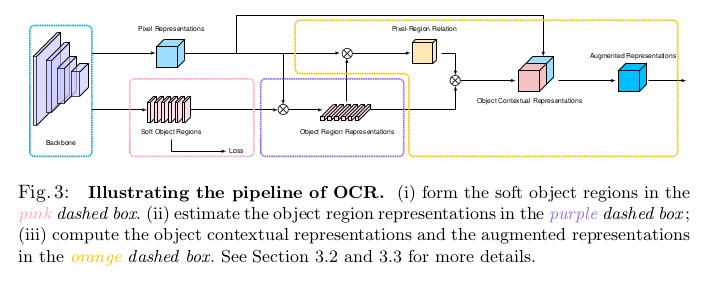

# <div align = center>**论文阅读日志** </div>

## **External Attention**
5月5日，清华大学图形学实验室Jittor团队在arXiv上提交论文《Beyond Self-attention: External Attention using Two Linear Layers for Visual Tasks》[2]， 提出了一种新的注意机制，称之为「External Attention」，基于两个外部的、小的、可学习的和共享的存储器，只用两个级联的线性层和归一化层就可以取代了现有流行的学习架构中的「Self-attention」，揭示了线性层和注意力机制之间的关系

同日，清华大学软件学院丁贵广团队在arXiv上提交了论文《RepMLP: Re-parameterizing Convolutions into Fully-connected Layers for Image Recognition》[3]，展示了结合重参数化技术的MLP也取得了非常不错的效果。

5月6日牛津大学的学者提交了一篇名为《Do You Even Need Attention? A Stack of Feed-Forward Layers Does Surprisingly Well on ImageNet》的论文[4]，也提出了Transformer中的attention是不必要的，仅仅使用Feed forward就可以在ImageNet上实现非常高的结果。

**一、从Self-attention到External-attention**

自注意力机制在自然语言处理和计算机视觉领域中起到了越来越重要的作用。对于输入的Nxd维空间的特征向量F，自注意力机制使用基于自身线性变换的Query，Key和Value特征去计算自身样本内的注意力，并据此更新特征：


由于QKV是F的线性变换，简单起见，我们可以将自注意力计算公式简记如下：


这是 F 对 F 的注意力，也就是所谓的 Self-attention。如果希望注意力机制可以考虑到来自其他样本的影响，那么就需要一个所有样本共享的特征。为此，我们引入一个外部的Sxd维空间的记忆单元M，来刻画所有样本最本质的特征，并用M来表示输入特征。


我们称这种新的注意力机制为External-attention。我们可以发现，公式(5)(6)中的计算主要是矩阵乘法，就是常见的线性变换，一个自注意力机制就这样被两层线性层和归一化层代替了。我们还使用了之前工作[5]中提出的Norm方式来避免某一个特征向量的过大而引起的注意力失效问题。 

为了增强External-attention的表达能力，与自注意力机制类似，我们采用两个不同的记忆单元。


下图形象地展示了External-attention与Self-attention的区别。


图1 Self Attention和External Attention的区别

**二、为什么两层线性层可以超越Self-attention？**

自注意力机制一个明显的缺陷在于计算量非常大，存在一定的计算冗余。通过控制记忆单元的大小，External-attention可以轻松实现线性的复杂度。

其次，自注意力机制仅利用了自身样本内的信息，忽略了不同样本之间的潜在的联系，而这种联系在计算机视觉中是有意义的。打个比方，对于语义分割任务，不同样本中的相同类别的物体应该具有相似的特征。

External-attention通过引入两个外部记忆单元，隐式地学习了整个数据集的特征。这种思想同样在稀疏编码和字典学习中得到了应用。

计图团队在Pascal VOC 的Test set上，可视化了注意力图以及分割的结果，如图2所示，可以发现，使用两层线性层的External attention 的注意力图是合理的。


图2 注意力图以及分割的结果的可视化

**四、External Attention VS MLP-Mixer**

谷歌的工作提出了一种小巧且好用的Mixer-Layer，然后用极其丰富的实验，证明了仅仅通过简单的图像分块和线性层的堆叠就可以实现非常好的性能，开拓了人们的想象。

清华的External Attention则揭示了线性层和注意力机制之间的内在关联，证明了线性变换其实是一种特殊形式的注意力实现，如下公式所示：

Attention(x)=Linear(Norm(Linear(x)))

计图团队的工作和谷歌团队的工作都证明了线性层的有效性。值得注意的是，如果将External-attention不断级联堆叠起来，也是MLP的形式，就可以实现一个纯MLP的网络结构，但External-attention使用不同的归一化层，其更符合注意力机制。这与谷歌团队的工作有异曲同工之妙。

清华的External Attention的部分计图代码已经在Github开源：https://github.com/MenghaoGuo/-EANet

---
## **MLP-Mixer**
[Reference](https://zhuanlan.zhihu.com/p/369960950)
一个比ViT更简洁的纯MLP架构

```
MLP-Mixer是ViT团队的另一个纯MLP架构的尝试。如果MLP-Mixer重新引领CV领域主流架构的话，那么CV领域主流架构的演变过程就是MLP->CNN->Transformer->MLP? 要回到最初的起点了吗？？？
```
**Model Overview**

MLP-Mixer构建了一个纯MLP架构。整体架构如下图所示。


先将输入图片拆分成patches，然后通过Per-patch Fully-connected将每个patch转换成feature embedding，然后送入N个Mixer Layer，最后通过Fully-connected进行分类。

Mixer分为channel-mixing MLP和token-mixing MLP两类。channel-mixing MLP允许不同通道之间进行交流；token-mixing MLP允许不同空间位置(tokens)进行交流。这两种类型的layer是交替堆叠的，方便支持两个输入维度的交流。每个MLP由两层fully-connected和一个GELU构成。

**Mixer Architecture**


Mixer结构如上图所示。每个Mixer结构由两个MLP blocks构成，其中红色框部分是token-mixing MLP，绿色框部分是channel-mixing MLP。

token-mixing MLP block作用在X的列上(即先对X进行转置)，并且所有列参数共享MLP1，得到的输出重新转置一下。

channel-mixing MLP block作用在行上，所有行参数共享MLP2。

**总结**

MLP-Mixer用Mixer的MLP来替代ViT的Transformer，减少了特征提取的自由度，并且巧妙的可以交替进行patch间信息交流和patch内信息交流，从结果上来看，纯MLP貌似也是可行的，而且省去了Transformer复杂的结构，变的更加简洁，有点期待后续ViT和MLP-Mixer如何针锋相对的，感觉大组就是东挖一个西挖一个的，又把尘封多年的MLP给挖出来了。

ViT可以参考计算机视觉"新"范式：Transformer


**一点想法**

patch的拆分其实已经带有归纳偏置了，是在数据层面的local，conv是操作层面的local。而且因为token-mixing MLP的设计，使得MLP-Mixer可以感知到不同patch的顺序，相比ViT，可以省去position embedding。

另外，感觉MLP参数共享的用法和PointNet非常相似(可以把patch理解为3D的点)，如下图所示，但是PointNet因为计算量大问题，后续的PointNet++引入了层级聚合设计，所以MLP-Mixer++大家可以赶紧动手了


PointNet

PointNet++


---
## **SuperPoints**
[code](https://github.com/magicleap/SuperPointPretrainedNetwork)
<p>这篇文章设计了一种自监督网络框架，能够同时提取特征点的位置以及描述子。相比于patch-based方法，本文提出的算法能够在原始图像提取到像素级精度的特征点的位置及其描述子。<br>本文提出了一种单映性适应（<code>Homographic Adaptation</code>）的策略以增强特征点的复检率以及跨域的实用性（这里跨域指的是synthetic-to-real的能力，网络模型在虚拟数据集上训练完成，同样也可以在真实场景下表现优异的能力）。</p>

<h1 id="介绍"><a href="#介绍" class="headerlink" title="介绍"></a>介绍</h1><p>诸多应用（诸如SLAM/SfM/相机标定/立体匹配）的首要一步就是特征点提取，这里的特征点指的是<strong>能够在不同光照&amp;不同视角下都能够稳定且可重复检测的2D图像点位置</strong>。</p>
<p>基于CNN的算法几乎在以图像作为输入的所有领域表现出相比于人类特征工程更加优秀的表达能力。目前已经有一些工作做类似的任务，例如人体位姿估计,目标检测以及室内布局估计等。这些算法以通常以大量的人工标注作为GT，这些精心设计的网络用来训练以得到人体上的角点，例如嘴唇的边缘点亦或人体的关节点，但是这里的问题是这里的点实际是ill-defined（我的理解是，这些点有可能是特征点，但仅仅是一个大概的位置，是特征点的子集，并没有真正的把特征点的概念定义清楚）。</p>
<p>本文采用了非人工监督的方法提取真实场景的特征点。本文设计了一个由特征点检测器监督的具有伪真值数据集，而非是大量的人工标记。为了得到伪真值，本文首先在大量的虚拟数据集上训练了一个全卷积网络（FCNN），这些虚拟数据集由一些基本图形组成，例如有线段、三角形、矩形和立方体等，这些基本图形具有没有争议的特征点位置，文中称这些特征点为<code>MagicPoint</code>，这个pre-trained的检测器就是<code>MagicPoint</code>检测器。这些<code>MagicPoint</code>在虚拟场景的中检测特征点的性能明显优于传统方式，但是在真实的复杂场景中表现不佳，此时作者提出了一种多尺度多变换的方法<code>Homographic Adaptation</code>。对于输入图像而言，<code>Homographic Adaptation</code>通过对图像进行多次不同的尺度/角度变换来帮助网络能够在不同视角不同尺度观测到特征点。<br>综上：<strong>SuperPoint = MagicPoint+Homographic Adaptation</strong></p>
<h1 id="算法优劣对比"><a href="#算法优劣对比" class="headerlink" title="算法优劣对比"></a>算法优劣对比</h1><p></p>
<ul>
<li>基于图像块的算法导致特征点位置精度不够准确；</li>
<li>特征点与描述子分开进行训练导致运算资源的浪费，网络不够精简，实时性不足；或者仅仅训练特征点或者描述子的一种，不能用同一个网络进行联合训练；</li>
</ul>

<h1 id="网络结构"><a href="#网络结构" class="headerlink" title="网络结构"></a>网络结构</h1><p></p>

<p>上图可见特征点检测器以及描述子网络共享一个单一的前向encoder，只是在decoder时采用了不同的结构，根据任务的不同学习不同的网络参数。这也是本框架与其他网络的不同之处：其他网络采用的是先训练好特征点检测网络，然后再去进行对特征点描述网络进行训练。
<br>网络共分成以下4个主要部分，在此进行详述：</p>
<h2 id="1-Shared-Encoder-共享的编码网络"><a href="#1-Shared-Encoder-共享的编码网络" class="headerlink" title="1. Shared Encoder 共享的编码网络"></a>1. Shared Encoder 共享的编码网络</h2><p class="has-jax">从上图可以看到，整体而言，本质上有两个网络，只是前半部分共享了一部分而已。本文利用了VGG-style的encoder以用于降低图像尺寸，encoder包括卷积层，max-pooling层，以及非线性激活层。通过3个max-pooling层将图像的尺寸变成Hc=H/8 和Hc=H/8，经过encoder之后，图像由  

$$I \in \mathcal{R}^{H \times W}$$
变为张量 
$$\mathcal{B} \in \mathbb{R}^{H_c \times W_c \times F}$$

<h2 id="2-Interest-Point-Decoder"><a href="#2-Interest-Point-Decoder" class="headerlink" title="2. Interest Point Decoder"></a>2. Interest Point Decoder</h2>


<p class="has-jax">这里介绍的是特征点的解码端。每个像素的经过该解码器的输出是该像素是特征点的概率（probability of “point-ness”）。<br>通常而言，我们可以通过反卷积得到上采样的图像，但是这种操作会导致计算量的骤增以及会引入一种“checkerboard artifacts”。因此本文设计了一种带有“特定解码器”（这种解码器没有参数）的特征点检测头以减小模型计算量（子像素卷积）。<br>例如：输入张量的维度是 

$$\mathbb{R}^{H_c \times W_c \times 65}$$ 
输出维度是 
$$\mathbb{R}^{H \times W},$$
即图像的尺寸。这里的65表示原图8×8的局部区域，加上一个非特征点<code>dustbin</code>。通过在channel维度上做softmax，非特征点dustbin会被删除，同时会做一步图像的<code>reshape</code>：
$$\mathbb{R}^{H_c \times W_c \times 64} \Rightarrow \mathbb{R}^{H \times W}$$
这就是子像素卷积的意思，俗称像素洗牌

<h2 id="3-Descriptor-Decoder"><a href="#3-Descriptor-Decoder" class="headerlink" title="3. Descriptor Decoder"></a>3. Descriptor Decoder</h2>
首先利用类似于UCN的网络得到一个半稠密的描述子（此处参考文献<a href="https://arxiv.org/abs/1606.03558" target="_blank">UCN</a>，这样可以减少算法训练内存开销同时减少算法运行时间。之后通过双三次多项式插值得到其余描述，然后通过L2-normalizes归一化描述子得到统一的长度描述。特征维度由

$$\mathcal{D} \in \mathbb{R}^{H_c \times W_c \times D}$$
变为
$$\mathbb{R}^{H\times W \times D}$$


<p>由特征点得到其描述子的过程文中没有细讲，看了一下<a href="https://github.com/pytorch/pytorch/blob/f064c5aa33483061a48994608d890b968ae53fb5/aten/src/THNN/generic/SpatialGridSamplerBilinear.c" target="_blank" rel="noopener">源代码</a>就明白了。其实该过程主要用了一个函数即<code>grid_sample</code>，画了一个草图作为解释。</p>
<ul>
<li>图像尺寸归一化：首先对图像的尺寸进行归一化，(-1,-1)表示原来图像的(0,0)位置，(1,1)表示原来图像的(H-1,W-1)位置，这样一来，特征点的位置也被归一化到了相应的位置。</li>
<li>构建grid：将归一化后的特征点罗列起来，构成一个尺度为1*1*K*2的张量，其中K表示特征数量，2分别表示xy坐标。</li>
<li>特征点位置反归一化：根据输入张量的H与W对grid(1,1,0,:)（表示第一个特征点，其余特征点类似）进行反归一化，其实就是按照比例进行缩放+平移，得到反归一化特征点在张量某个slice（通道）上的位置；但是这个位置可能并非为整像素，此时要对其进行双线性插值补齐，然后其余slice按照同样的方式进行双线性插值。注：代码中实际的就是双线性插值，并非文中讲的双三次插值；</li>
<li>输出维度：1*C*1*K。</li>
</ul>

<p></p>

<h2 id="4-误差构建"><a href="#4-误差构建" class="headerlink" title="4. 误差构建"></a>4. 误差构建</h2>

$$\begin{array}{l}{\mathcal{L}\left(\mathcal{X}, \mathcal{X}^{\prime}, \mathcal{D}, \mathcal{D}^{\prime} ; Y, Y^{\prime}, S\right)=} \\ {\qquad \mathcal{L}_{p}(\mathcal{X}, Y)+\mathcal{L}_{p}\left(\mathcal{X}^{\prime}, Y^{\prime}\right)+\lambda \mathcal{L}_{d}\left(\mathcal{D}, \mathcal{D}^{\prime}, S\right)}\end{array}$$
可见损失函数由两项组成，其中一项为特征点检测lossLp ，另外一项是描述子的lossLd
对于检测项loss，此时采用了交叉熵损失函数:
$$\mathcal{L}_{p}(\mathcal{X}, Y)=\frac{1}{H_{c} W_{c}} \sum_{h=1 \atop w=1}^{H_{c}, W_{c}} l_{p}\left(\mathbf{x}_{h w} ; y_{h w}\right)$$
其中：
$$l_{p}\left(\mathbf{x}_{h w} ; y\right)=-\log \left(\frac{\exp \left(\mathbf{x}_{h w y}\right)}{\sum_{k=1}^{65} \exp \left(\mathbf{x}_{h w k}\right)}\right)$$
描述子的损失函数:
$$\mathcal{L}_{d}\left(\mathcal{D}, \mathcal{D}^{\prime}, S\right)=\frac{1}{\left(H_{c} W_{c}\right)^{2}} \sum_{h=1 \atop w=1}^{H_{c}, W_{c}} \sum_{h^{\prime}=1 \atop w^{\prime}=1}^{H_{c}, W_{c}} l_{d}\left(\mathbf{d}_{h w}, \mathbf{d}_{h^{\prime} w^{\prime}}^{\prime} ; s_{h w h^{\prime} w^{\prime}}\right)$$
其中ld为<code>Hinge-loss</code>（合页损失函数，用于SVM，如支持向量的软间隔，可以保证最后解的稀疏性）；
$$l_{d}\left(\mathbf{d}, \mathbf{d}^{\prime} ; s\right)=\lambda_{d} * s * \max \left(0, m_{p}-\mathbf{d}^{T} \mathbf{d}^{\prime}\right)+(1-s) * \max \left(0, \mathbf{d}^{T} \mathbf{d}^{\prime}-m_{n}\right)$$
同时指示函数为$s_{h w h^{\prime} w^{\prime}}$,S表示所有正确匹配对集合:
$$s_{h w h^{\prime} w^{\prime}}=\left\{\begin{array}{ll}{1,} & {\text { if }\left\|\widehat{\mathcal{H} \mathbf{p}_{h w}}-\mathbf{p}_{h^{\prime} w^{\prime}}\right\| \leq 8} \\ {0,} & {\text { otherwise }}\end{array}\right.$$
<h1 id="网络训练"><a href="#网络训练" class="headerlink" title="网络训练"></a>网络训练</h1>


本文一共设计了两个网络，一个是BaseDetector，用于检测角点（注意，此处提取的并不是最终输出的特征点，可以理解为候选的特征点），另一个是SuperPoint网络，输出特征点和描述子。
网络的训练共分为三个步骤：
<ol>
<li>第一步是采用虚拟的三维物体作为数据集，训练网络去提取角点，这里得到的是<code>BaseDetector</code>即，<code>MagicPoint</code>；</li>
<li>使用真实场景图片，用第一步训练出来的网络<code>MagicPoint</code> +<code>Homographic Adaptation</code>提取角点，这一步称作兴趣点自标注（Interest Point Self-Labeling）</li>
<li>对第二步使用的图片进行几何变换得到新的图片，这样就有了已知位姿关系的图片对，把这两张图片输入SuperPoint网络，提取特征点和描述子。</li>
</ol>

<h2 id="预训练Magic-Point"><a href="#预训练Magic-Point" class="headerlink" title="预训练Magic Point"></a>预训练Magic Point</h2>
此处参考作者之前发表的一篇论文<a href="https://arxiv.org/abs/1707.07410" target="_blank" rel="noopener">Toward Geometric Deep SLAM</a>，其实就是MagicPoint，在此不做展开介绍。


<h2 id="Homographic-Adaptation"><a href="#Homographic-Adaptation" class="headerlink" title="Homographic Adaptation"></a>Homographic Adaptation</h2>
算法在虚拟数据集上表现极其优秀，但是在真实场景下表示没有达到预期，此时本文进行了<code>Homographic Adaptation</code>。
作者使用的数据集是<code>MS-COCO</code>，为了使网络的泛化能力更强，本文不仅使用原始了原始图片，而且对每张图片进行随机的旋转和缩放形成新的图片，新的图片也被用来进行识别。这一步其实就类似于训练里常用的数据增强。经过一系列的单映变换之后特征点的复检率以及普适性得以增强。值得注意的是，在实际训练时，这里采用了迭代使用单映变换的方式，例如使用优化后的特征点检测器重新进行单映变换进行训练，然后又可以得到更新后的检测器，如此迭代优化，这就是所谓的self-supervisd。


最后的关键点检测器，即:

$\hat{F}\left(I ; f_{\theta}\right)$，可以表示为再所有随机单映变换/反变换的聚合：
$$\hat{F}\left(I ; f_{\theta}\right)=\frac{1}{N_{h}} \sum_{i=1}^{N_{h}} \mathcal{H}_{i}^{-1} f_{\theta}\left(\mathcal{H}_{i}(I)\right)$$


<h2 id="构建残差，迭代优化描述子以及检测器"><a href="#构建残差，迭代优化描述子以及检测器" class="headerlink" title="构建残差，迭代优化描述子以及检测器"></a>构建残差，迭代优化描述子以及检测器</h2>

利用上面网络得到的关键点位置以及描述子表示构建残差，利用<code>ADAM</code>进行优化。

<h1 id="实验结果"><a href="#实验结果" class="headerlink" title="实验结果"></a>实验结果</h1>


<h1 id="总结"><a href="#总结" class="headerlink" title="总结"></a>总结</h1>

<ol>
<li>it is possible to transfer knowledge from a synthetic dataset onto real-world images</li>
<li>sparse interest point detection and description can be cast as a single, efficient convolutional neural network</li>
<li>the resulting system works well for geometric computer vision matching tasks such as Homography Estimation</li>
</ol>

<p>未来工作:</p>
<ol>
<li>研究Homographic Adaptation能否在语义分割任务或者目标检测任务中有提升作用</li>
<li>兴趣点提取以及描述这两个任务是如何影响彼此的</li>
</ol>
<p>作者最后提到，他相信该网络能够解决SLAM或者SfM领域的数据关联<em>，并且</em><code>learning-based</code>前端可以使得诸如机器人或者AR等应用获得更加鲁棒。</p>

---
## **TokenLabeling 解析**
本文是新加坡国立大学&字节跳动的研究员在Transformer方面的最新研究成果。本文目标不在于提出一种新颖的Transofrmer架构，而是探索了用于提升ViT性能的各种训练技巧。通过一系列实验对比、改进与组合，本文所提方案取得了SOTA方案，超越了EfficientNet、T2TViT、DeiT、Swin Transformer、CaiT等方案。以26M参数量的ViT为例，所提方案在ImageNet上可以取得84.4%的top1精度；当参数量扩展到56M/150M时，模型性能可以进一步提升到85.4%/86.2%，且无需额外数据。

Abstract
```
本文为ImageNet分类任务中的Vision Transformer(ViT)提供了一个强基线方案。尽管ViT在ImageNet任务中取得了非常好的结果，但它们的性能距离强效CNN仍存在差距。
本文目标不在于提出一种新颖的Transofrmer架构，而是探索了用于提升ViT性能的各种训练技巧。本文结果表明：通过简单调节ViT的架构并引入token labeling，本文所提方案既可以取得比CNN与其他Transformer更佳的性能(同等参数量与计算量)。以26M参数量的ViT为例，所提方案在ImageNet上可以取得84.4%的top1精度；当参数量扩展到56M/150M时，模型性能可以进一步提升到85.4%/86.2%，且无需额外数据。
```
<div align=center>

</div>
上图对比了所提方案与其他Transformer在参数量与性能方面的对比，可以看到：本文所提LV-ViT在56M参数量下可以取得比其他Transformer更佳的性能。

Vision Transformer : 
<div align=left>

</div>

Training Techniques
<div align=left>

</div>

<div align=left>

</div>

<div align=left>

</div>

<div align=center>

</div>

<div align=left>

</div>

---
## **ShufflenNetV2 Block解析**
1.Depthwise Convolution
```
在shufflenetV2中采用了与MobileNett同样的深度卷积(DWConv:Depthwise Convolution),目的在于减少卷积计算量，方便在移动设备上运行。
在传统卷积中，一组卷积核对应输出的一个channel，简而言之，卷积核的组数决定输出Tensor的channel。（在计算卷积的时候，设置卷积核个数就是设置卷积核组数，应为在真正计算卷积的时候会把单个卷积核copy到和输入tensor通道相同，然后再进行卷积运算）。
```
一般卷积计算如下图所示：
<div align=center>

</div>

dw卷积计算如下图所示：
<div align=center>

</div>

```
从上面两幅图像可以看出，dw卷积是一个卷积核只是在输入tensor的一个通道中进行卷积运行，一般的卷积是一个卷积核在所有输入tensor中进行卷积运行。这样使得dw卷积的计算量就要小于一般卷积的计算量。
```

2.Pointwise Convolution
```
Pointwise Convolution的运算与普通卷积运算一样，它的卷积核的尺寸为 1×1×C，C等于输入tensor的channel。1x1的卷积*不会改变输入tensor尺度，但是能起到升维或者降维的作用。
```
普通Conv和DWConv+PWConv计算量对比
```
普通卷积:
输入 tensor=[5,5,3]，卷积核尺度=[3,3,3],卷积核组数=6，完成一次卷积操作的计算量为：3x3x3x6=162 
输出tensor=[3,3,6]

## DWConv计算量+PWConv计算量
DWConv：输入 tensor=[5,5,3]，卷积核尺度=[3,3,3],卷积核组数=1，完成一次卷积操作的计算量为：3x3x3x1=27
输出tensor=[3,3,3]
PWConv：卷积核尺度=[1,1,3]，卷积核组数=6,计算量：1x1x3x6=18
输出tensor=[3,3,6]
总计算量：27+18=45
```
由计算量比较可见，最后输出的tensor尺度相同但是计算量却差别巨大，使用DWConv+PWConv可以有效减少计算量。

在pytorch中，当我们需要进行DWConv的是只需要把inchannel,out_channel,groups设置为同一个channel值就可以了。

3.Group Convolution
```
最早见于AlexNet——2012年Imagenet的冠军网络，由于当时硬件条件限制，使得训练十分缓慢，Group Convolution被用来切分网络，使其在2个GPU上并行运行，加速训练过程。但是组卷积的好处并不止于此，分组卷积可以使计算量降低至1/G，在这里并不细讲GConv的好处，需要提的一点是GConv带来的缺点，由于GConv，导致每组之间的交流太少，信息缺少融合，使用在shufflenetV2中就提出了新方法:Shuffle channel。
```

4.Shuffle Channel
```
为了解决GConv的问题，在ShuffleNetV2中提出了Shuffle Channel的方法，通过对通道分组，在重新组合通道，到达混合信息的效果。
```

<div align=center>

</div>

实现代码（pytorch）
```
def channel_shuffle(x: Tensor, groups: int) -> Tensor:
    batch_size, num_channels, height, width = x.size()
    print("batch_size:{}, num_channels:{}, height:{}, width:{}".format(batch_size, num_channels, height, width))

    # 每一组含有的通道数
    channels_per_group = num_channels // groups
    print('每一组含有的通道数:{}'.format(channels_per_group))

    # reshape
    # [batch_size,num_channels,height,width]->[batch_size,groups,channels_per_group,height,width]
    x = x.view(batch_size, groups, channels_per_group, height, width)
    print(x.size())
    print(x)
    # [batch_size,groups,channels_per_group,height,width]->[batch_size,channels_per_group,groups,height,width]
    x = torch.transpose(x, 1, 2).contiguous()
    print(x.size())
    print(x)
    # 展开
    x = x.view(batch_size, -1, height, width)
```
5.Shuffle Net Block
```
在ShuffleNetV2的论文中给出了两种block结构，当DWConv stride=1的时候，采用左边block结构，当DWConv stride=2的时候，采用右边block结构。
1. 当stride=1的时候，需要对input data进行channel split 分割因子为2
2. 当stride=2的时候，不需要对input data进行channel分割，直接进行计算
```
<div align=center>

</div>

```
这里需要注意一下。两个分支计算完成后，最后的操作不是相加(ADD)，而且拼接(Concat)，如果是写成了相加那么channel就不对了，直接变成输入的一半。
```

完整的ShuffleNetV2代码[github](https://github.com/omega-Lee/PyTorch-ShuffleNetV2.git)

---
## **模型设计 DBB**
《Diverse Branch Block: Building a Convolution as an Inception-like Unit》 [Paper](https://arxiv.org/abs/2103.13425)
[Github](https://github.com/DingXiaoH/DiverseBranchBlock)

```
提出一种可以提升CNN性能且“推理耗时无损”的通用模块组件，将其称之为Diverse Branch Block(DBB)，它通过组合不同尺度、不同复杂度的分支(不同分支采用卷积序列、多尺度卷积或者均值池化)丰富特征空间的多样性达到提升单个卷积(注：推理时合并为单个卷积)表达能力的目的。一旦完成训练，一个DBB可以等价地转换为单个卷积以方便布署。
不同于ConvNet架构的推陈出新，DBB在训练时采用了复杂的“微结构”且保持网络整体结构不变；而在推理/部署时，DBB这种复杂结构可以等价转换为单个卷积。这使得DBB可以作为一种“等价嵌入”的模块直接嵌入到现有任意架构中。
通过这种训练-推理时的“异构”，所得模型可以在训练时以更高的复杂度达到更高的性能；而在训练时又可以等价折叠为原始模型以方便布署。在ImageNet数据集上，DBB可以提升模型精度高达1.9%top-1精度；同时对于目标检测以及语义分割均有一定性能提升。

主要贡献包含以下几点：
1. 提出一种包含丰富信息的“微结构”且可以作为”即插即用“模块直接嵌入到现有ConvNet(保持模型的”宏观结构“不变)中提升模型性能；
2. 提出了一种通用模块组件DBB，它将六种矩阵变换等价转为为单个卷积，做到了“推理耗时无损”；
3. 提出了一种特征表达方式类似Inception的DBB模块，它可以直接嵌入到ConvNet并取得了显著的性能提升，比如在ImageNet上取得了1.9%的top-1精度提升。

```
<div align=center>

</div>

```
上图给出了本文所设计的包含六种变换的DBB模块，它包含分支加法组合、深度拼接组合、多尺度操作、均值池化以及卷积序列等。在上述多分支模块合并时会涉及到这样几个变换：(1) Conv-BN的合并：(2)分支合并；(3) 卷积序列合并；(4) 深度拼接合并；(5) 均值池化转换；(6) 多尺度卷积转换等。
```

<div align=center>

</div>

```
上图给出了本文所设计的ＤＢＢ结构示意图。类似Inception,它采用1 x 1,1 x 1 - k x k,1 x 1 -AVG等组合方式对原始k x k卷积进行增强。对于1 x 1 - k x k分支，我们设置中间通道数等于输入通道数并将1 x 1卷积初始化为Identity矩阵；其他分支则采用常规方式初始化。此外，在每个卷积后都添加BN层用于提供训练时的非线性，这对于性能提升很有必要。
```


---
## **Autonomous driving 自动驾驶**
### **《MapFusion: A General Framework for 3D Object Detection with HDMaps》** [Paper](https://arxiv.org/pdf/2103.05929.pdf)

提出了一个简单且有效的框架--MapFusion. MapFusion将地图信息集成到现代三维物体探测器管道中.

---
## **语义分割相关**
### **《A Good Box is not a Guarantee of a Good Mask》**

    在这项工作中，主要考虑了LVIS数据集的两个特征：长尾分布和高质量实例分割mask。
    
    采用两阶段的训练流程。在第一阶段(训练)，结合了EQL和自训练来学习泛化表示。在第二阶段(微调)，利用Balanced GroupSoftmax来促进分类器的改进，并提出一种新颖的proposal 分配策略和一种针对mask head的新的平衡mask损失，以获取更精确的mask预测。

    在训练阶段使用了EQL损失函数、RFS重采样、DA、Self-training等策略。在微调阶段会freeze backbone参数，然后使用balanced group softmax 进行类别平衡，同时在微调阶段更加的重视mask的结果。
    
    使用到的Tricks：
    1. DA（Data Augmentation）：Mosaic, rotate, scale jitter
    2. EQL（Equalization Loss）
    3. RFS（Repeat Factor Sampling）
    4. HTC（Hybrid Task Cascade）
    5. Self-training
    6. ...
[Balanced Group SoftMax Github](https://github.com/FishYuLi/BalancedGroupSoftmax)

**实验指标如下表：**
<div align=center>


</div>
---

### **《OCRNet》 "基于物体区域的上下文信息进行语义分割"**
    微软亚洲研究院提出的 OCR 方法的主要思想是显式地把像素分类问题转化成物体区域分类问题，这与语义分割问题的原始定义是一致的，即每一个像素的类别就是该像素属于的物体的类别，换言之，与 PSPNet 和 DeepLabv3 的上下文信息最主要的不同就在于 OCR 方法显式地增强了物体信息。

    OCR 方法的实现主要包括3个阶段：
    1. 根据网络中间层的特征表示估测一个粗略的语义分割结果作为 OCR 方法的一个输入 ，即软物体区域（Soft Object Regions），
    2. 根据粗略的语义分割结果和网络最深层的特征表示计算出 K 组向量，即物体区域表示（Object Region Representations），其中每一个向量对应一个语义类别的特征表示，
    3. 计算网络最深层输出的像素特征表示（Pixel Representations）与计算得到的物体区域特征表示（Object Region Representation）之间的关系矩阵，然后根据每个像素和物体区域特征表示在关系矩阵中的数值把物体区域特征加权求和，得到最后的物体上下文特征表示 OCR (Object Contextual Representation) 。
    当把物体上下文特征表示 OCR 与网络最深层输入的特征表示拼接之后作为上下文信息增强的特征表示（Augmented Representation），可以基于增强后的特征表示预测每个像素的语义类别。
    
    综上，OCR 可计算一组物体区域的特征表达，然后根据物体区域特征表示与像素特征表示之间的相似度将这些物体区域特征表示传播给每一个像素。

<font color=red>Eg: 在进行15类别分割的时候，通过pink框计算得到 N * 15 * H * W的soft object regions.然后将其和backbone输出的特征进行计算得到物体的区域表示特征Object Region Representations（N * channels * 15 * 1）,此矩阵表示每一个物体类别由channels维度描述子描述.然后使用此描述子和backbone的输出进行相似度计算，然后根据每个像素和物体区域特征表示在关系矩阵中的数值把物体区域特征加权求和，得到最后的物体上下文特征表示。最后拼接主干网络的输出特征和和最终的上下文特征作为增强后的特征。</font>

下图为OCR的pipeline.
<div align=center>
    
</div>
通过实验对比，OCR 方法提出的物体上下文信息的目的在于显式地增强物体信息，通过计算一组物体的区域特征表达，根据物体区域特征表示与像素特征表示之间的相似度将这些物体区域特征表示传播给每一个像素。在街景分割任务中，OCR 方法也比 PSPNet 的 PPM  和 DeepLabv3 的 ASPP更加高效也更加准确。

---
### **《Strip Pooling: Rethinking Spatial Pooling for Scene Parsing》**
作者开源代码： [code](https://github.com/Andrew-Qibin/SPNet)

1. 一般的空间均值池化能捕获到环境的上下文信息，但是由于使用的池化kernel的shape是正方形的，所以在环境中的一些非类似正方形物体上进行上下文信息捕获的时候会得到一些噪音，使得其对物体的描述产生影响。(提高CNN远程关系建模的方法有：扩张卷积、全局/金字塔池化)。在原文中的Figure.1能很好的体现这种影响，下图问copy-Figure.1.
<div align=center>
    
</div>
<!--  -->

**优点**:首先，它沿着一个空间维度部署一个长条状的池化核形状，因此能够捕获孤立区域的长距离关系，如图1a和1c的第一行所示部分所示。其次，在其他空间维度上保持较窄的内核形状，便于捕获局部上下文，防止不相关区域干扰标签预测。集成这种长而窄的池内核使语义分割网络能够同时聚合全局和本地上下文。这与传统的从固定的正方形区域收集上下文的池化有本质的不同。二、方法基于条纹池化的想法，作者提出了两种即插即用的池化模块 — Strip Pooling Module (SPM) 和Mixed Pooling module (MPM)。

2. SPM，实际上和普通池化方法没有区别，就是把池化核（长条形区域）所对应的特征图上位置的像素值求平均

再来看一下整个模块，输入一个特征图，这里实际上为C×H×W，为了方便讲解图中只画了一个通道。我们也以一个通道为例。C个通道的特征图输入处理原理与这里一模一样。输入的特征图经过水平和数值条纹池化后变为H×1和1×W。随后经过卷积核为3的1D卷积与expand后再对应相同位置求和得到H×W的特征图。之后通过1×1的卷积与sigmoid处理后与原输入图对应像素相乘得到了输出结果。//
**在上面的过程中，输出张量中的每个位置都与输入张量中的各种位置建立了关系。例如，在上图中，输出张量中以黑框为界的正方形与所有与它具有相同水平或垂直坐标的位置相连(被红色和紫色边框包围)。因此，通过多次重复上述聚合过程，可以在整个场景中构建长期依赖关系。（我觉得和CCNet 异曲同工之妙）此外，得益于elementwise乘法操作，该SPM也可以被视为一种注意机制。**//
<font color=red>SPM可以直接应用于任何预先训练的骨干网络，而无需从无到有地进行训练。</font>
//
与全局平均池化相比，条纹池化考虑的是较长但较窄的范围，而不是整个特征图，避免了在相距较远的位置之间建立不必要的连接。与需要大量计算来建立每对位置之间关系的基于注意力的模块（no-local ）相比，SPM是轻量级的，可以很容易地嵌入到任何构建块中，从而提高捕获远程空间依赖关系和利用通道间依赖项的能力。

3. MPM，进一步在高语义级别上建模长期依赖关系。它通过利用具有不同内核形状的池化操作来探测具有复杂场景的图像，从而收集有用的上下文信息。之前的研究结果表明，金字塔池模型(pyramid pooling module, PPM)是增强语义分割网络的有效方法。然而，PPM严重依赖于标准的池化操作(尽管不同的池内核位于不同的金字塔级别)。考虑到标准池化和条纹池化的优点，作者改进了PPM，提出了混合池模块(MPM)，它侧重于通过各种池化操作聚合不同类型的上下文信息，以使特征表示更有辨别力。
<!--  -->
<div align=center>


</div>
1. 实验结果可视化
<!--  -->
<div align=center>


</div>
<!-- [Images text](/Paper/strip_pooling_result_table.png) -->

## **致谢**
https://zhuanlan.zhihu.com/p/122571198

---
   