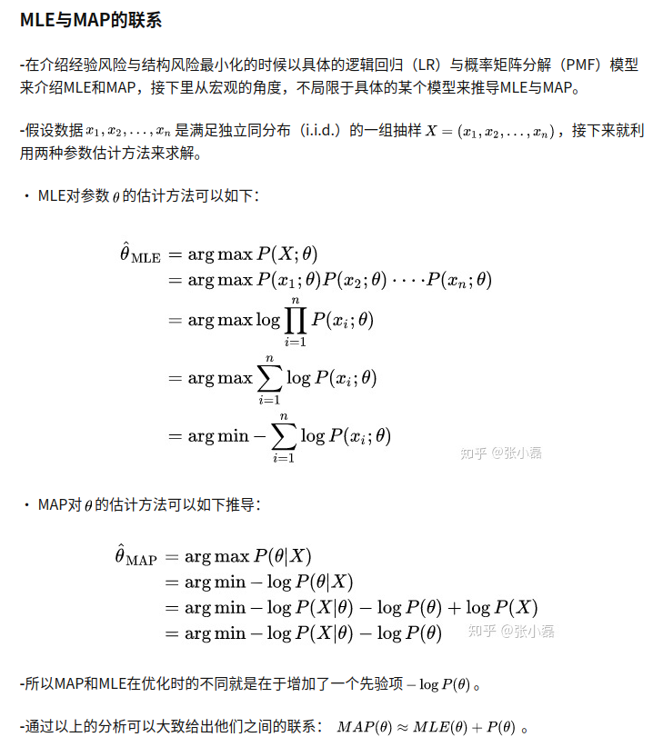

# <div align = center>**数学相关知识** </div>

## **1. 极大似然估计与最大后验概率估计**
[知乎](https://zhuanlan.zhihu.com/p/184028576)

频率学派-极大似然估计（MLE） | 极大似然估计方法（Maximum Likelihood Estimate，MLE）也称为最大概似估计或最大似然估计
```
他们认为模型参数是个定值，希望通过类似解方程组的方式从数据中求得该未知数,这种方法往往在大数据量的情况下可以很好的还原模型的真实情况。

最大似然估计，只是一种概率论在统计学的应用，它是参数估计的方法之一。说的是已知某个随机样本满足某种概率分布，但是其中具体的参数不清楚，参数估计就是通过若干次试验，观察其结果，利用结果推出参数的大概值。最大似然估计是建立在这样的思想上：已知某个参数能使这个样本出现的概率最大，我们当然不会再去选择其他小概率的样本，所以干脆就把这个参数作为估计的真实值。

其求解步骤：
1. 写出似然函数
2. 同时对似然函数两边取对数。（Ln）
3. 对seta预估参数求导，然后使其等于0。最后求出参数seta的预估值。

通过取自然对数（Ln），可以降低似然函数L(θ)中因变量θ的复杂度，方便求解。如果直接对似然函数L(θ)取导并使其为0，并求得使L(θ)取得最大值的θ值，也可以的，但是有可能L(θ)中θ太复杂而导致计算复杂度很高。
```
贝叶斯派-最大后验概率估计（MAP）
```
他们认为世界是不确定的，因获取的信息不同而异。假设对世界先有一个预先的估计，然后通过获取的信息来不断调整之前的预估计。 他们不试图对事件本身进行建模，而是从旁观者的角度来说。因此对于同一个事件，不同的人掌握的先验不同的话，那么他们所认为的事件状态也会不同。

他们认为模型参数源自某种潜在分布，希望从数据中推知该分布。对于数据的观测方式不同或者假设不同，那么推知的该参数也会因此而存在差异。这种方法在先验假设比较靠谱的情况下效果显著，随着数据量的增加，先验假设对于模型参数的主导作用会逐渐削弱，相反真实的数据样例会大大占据有利地位。极端情况下，比如把先验假设去掉，或者假设先验满足均匀分布的话，那她和极大似然估计就如出一辙了。
```

极大似然估计与最大后验概率估计
```
我们这有一个任务，就是根据已知的一堆数据样本，来推测产生该数据的模型的参数，即已知数据，推测模型和参数。因此根据两大派别的不同，对于模型的参数估计方法也有两类：极大似然估计与最大后验概率估计。
```


**MAP与MLE最大区别是MAP中加入了模型参数本身的概率分布，或者说，MLE中认为模型参数本身的概率的是均匀的，即该概率为一个固定值。MAP允许我们把先验知识加入到估计模型中，这在样本很少的时候是很有用的，因为样本很少的时候我们的观测结果很可能出现偏差，此时先验知识会把估计的结果“拉”向先验，实际的预估结果将会在先验结果的两侧形成一个顶峰。通过调节先验分布的参数，比如beta分布的，我们还可以调节把估计的结果“拉”向先验的幅度，越大，这个顶峰越尖锐。这样的参数，我们叫做预估模型的“超参数”。**

**MAP与Bayesian区别：尽管最大后验估计与 Bayesian 统计共享前验分布的使用，通常并不认为它是一种 Bayesian 方法**


<div  align=center>

</div>


