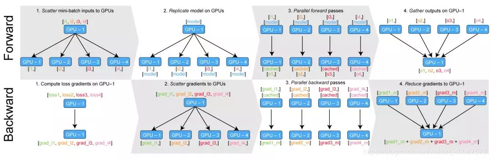

# Pytorch 相关问题及学习

## pytorch 部署转onnx
 **2021.03.04**
```
情形：部署pytorch训练后的模型，将.pth模型使用以下的代码转为.onnx的模型，接着使用onnx2trt将onnx模型转为trt模型，最后在tx2上部署。

torch.onnx.export(net,               # model being run
                x,                         # model input (or a tuple for multiple inputs)
                output_path,   # where to save the model (can be a file or file-like object)
                export_params=True,        # store the trained parameter weights inside the model file
                opset_version=11,          # the ONNX version to export the model to
                do_constant_folding=True,  # whether to execute constant folding for optimization
                input_names = ['inputx'],   # the model's input names
                output_names = ['outputy'], # the model's output names
                verbose=True,
                )

Tips.
1. tx2上分为tensorrt5.1.5和tensorrt7.2.2两个版本，使用tensorrt5.1.5的时候需要使用pytorch1.1.0转存onnx模型,tensorrt7.2.2可以使用pytorch1.7转存模型。
3.tensorrt5.1.5没有prelu激活层，所以需要自己修改。
4.tensorrt7.2.2版本的完整项目在github:https://github.com/liyaoshun/trt_deploy.git (私人仓库) ^.^ ^.^ ^.^

```

```
pytorch模型转存onnx注意事项：
1. 变量需要使用常量形式，如包含有.size()或者.shape[]的语句需要使用torch.tensor(.size(i)).item()
2. F.interpolate 在使用双线性的时候需要设置align_corners=False
3. 使用多卡训练的模型然后再使用单卡测试的时候，BN在转存的时候使用torch.nn.BatchNorm2d代替torch.nn.SyncBatchNorm。
```

## **AdaptivePooling与Max/AvgPooling相互转换**
[LINK](https://www.cnblogs.com/xiaosongshine/p/10750908.html)
```
在pytorch中，使用AdaptiveAvgPool2d操作在转onnx模型的时候会报错：“——ONNX export failed: Couldn‘t export operator aten::adaptive_avg_pool2d”。

1. 因为pytorch是动态尺寸的，所以有AdaptiveAvgPool2d，首先要固定尺寸进行推理
2. 将AdaptiveMax/AvgPool2d替换成Max/AvgPooling
3. 使用均值池化替换，下面是替换代码：

import torch as t
import math
import numpy as np
 
alist = t.randn(2,6,7)
 
inputsz = np.array(alist.shape[1:])
outputsz = np.array([2,3])
 
stridesz = np.floor(inputsz/outputsz).astype(np.int32)
 
kernelsz = inputsz-(outputsz-1)*stridesz
 
adp = t.nn.AdaptiveAvgPool2d(list(outputsz))
avg = t.nn.AvgPool2d(kernel_size=list(kernelsz),stride=list(stridesz))
adplist = adp(alist)
avglist = avg(alist)
 
print(alist)
print(adplist)
print(avglist)

```

## **pytorch 在相同网络中分段设置不同学习率**
```
1. 设置backbone和he的学习率不相同的设置方法,例如有如下的神经网络结构：
class All_Model(torch.nn.Module):
    def __init__(self):
        super(All_Model, self).__init__()
        # backbone
        self.backbone = ...
        # segmentation
        self.seg_head = ...

此时需要分别对backbone和seg_head设置不同的学习率，具体操作如下：
model = All_Model()
base_params = list(map(id, model.backbone.parameters()))
logits_params = filter(lambda p: id(p) not in base_params, model.parameters())
params = [
    {"params": logits_params, "lr": config.lr},
    {"params": model.backbone.parameters(), "lr": config.backbone_lr},
]
optimizer = torch.optim.SGD(params, momentum=config.momentum, weight_decay=config.weight_decay)

如果需要调整不同layer的学习率，可以如下操作：(eg: conv_X, 学习率翻倍)
model = ...
lr = 0.001
rate = 2
conv_X_params = list(map(id, model.conv_X.parameters()))
base_params = filter(lambda p: id(p) not in conv_X_params, net.parameters())
params = [{'params': base_params},
          {'params': net.conv_X_params.parameters(), 'lr': lr * rate}]
optimizer = torch.optim.SGD(params, lr=lr, momentum=0.9)

如果是调整多个layer的学习率，可以如下操作：
conv_x_1_params = list(map(id, net.conv_x_1.parameters()))
conv_x_2_params = list(map(id, net.conv_x_2.parameters()))
base_params = filter(lambda p: id(p) not in conv_x_1_params + conv_x_2_params, model.parameters())
params = [{'params': base_params},
          {'params': net.conv_x_1_params.parameters(), 'lr': lr * rate},
          {'params': net.conv_x_2_params.parameters(), 'lr': lr * rate}]
optimizer = torch.optim.SGD(params, lr=lr, momentum=0.9)
```

```
调整学习率函数：args.warmup和args.base_lr分别是1和初始学习率。函数to的目的就是求出当前epoch在milestone的哪个范围内，不同范围代表不同的衰减率，用返回的数字来区别epoch的范围。之后声明lr是全局的，这样做可能是因为在函数外部有使用lr的地方，函数内容就直接改变的是全局的lr。

def adjust_learning_rate(optimizer, epoch, milestones=None):
    """Sets the learning rate: milestone is a list/tuple"""
 
    def to(epoch):
        if epoch <= args.warmup:
            return 1
        elif args.warmup < epoch <= milestones[0]:
            return 0
        for i in range(1, len(milestones)):
            if milestones[i - 1] < epoch <= milestones[i]:
                return i
        return len(milestones)
 
    n = to(epoch)
 
    global lr
    lr = args.base_lr * (0.2 ** n)
    for param_group in optimizer.param_groups:
        param_group['lr'] = lr

其他的实现学习率调整方法：
每当运行一次 scheduler.step()，参数的学习率就会按照lambda公式衰减。
scheduler = torch.optim.lr_scheduler.LambdaLR(optimizer,
                lambda step : (1.0-step/args.total_iters) if step <= args.total_iters else 0, last_epoch=-1)

多项式学习率衰减方法：
def lr_poly(base_lr, iter, max_iter, power):
    return base_lr*((1-float(iter)/max_iter)**(power))
            
def adjust_learning_rate(optimizer, learning_rate, i_iter, max_iter, power=0.9， nbb_mult=10):
    """Sets the learning rate to the initial LR divided by 5 at 60th, 120th and 160th epochs"""
    lr = lr_poly(learning_rate, i_iter, max_iter, power)
    optimizer.param_groups[0]['lr'] = lr
    if len(optimizer.param_groups) == 2:
        optimizer.param_groups[1]['lr'] = lr * nbb_mult
    return lr
```


## **pytorch 卷积实现方案**
```
pytorch中可以直接使用torch.nn.conv2d()来进行卷积操作。

也可以显示的进行卷积计算，conv2d = unfold + matmul + fold。

unfold操作功能是将图像分块，例如有以输如（N，C，H，W），然后使用（3，4）的windows size
来对其进行分块，在单一channel分块大小为（H - 3 + 1）*（W - 4 + 1），每一块的特征维度为（C * 3 * 4）。
matmul操作功能是将分好的块和卷积核进行矩阵计算。（具体的操作可以参考下方的图示）
fold操作的功能是将计算好的结果reshape回（N，C，H，W），正好号unfold功能相反。
```

[LINK-caffe-CNN](https://www.zhihu.com/question/28385679) pytorch卷积实现原理应该和caffe的相差不大，猜测是这样的，没有看过pytorch源码.但是pytorch使用了很多caffe2的东西。

<div  align=center>


</div>

```
最后一页没画，但是基本上就是Filter Matrix乘以Feature Matrix的转置，得到输出矩阵Cout x (H x W)，就可以解释为输出的三维Blob（Cout x H x W）。Caffe里用的是CHW的顺序，有些library也会用HWC的顺序（比如说CuDNN是两个都支持的），这个在数学上其实差别不是很大，还是一样的意思。

//上面内容来自贾扬清知乎的回答。

```

## **pytorch 训练时出现的错误**
**1. RuntimeError: one of the variables needed for gradient computation has been modified by an inplace operation: [torch.cuda.LongTensor [15, 512, 512]] is at version 2; expected version 1 instead. Hint: the backtrace further above shows the operation that failed to compute its gradient. The variable in question was changed in there or anywhere later. Good luck!**

为啥能定位到是loss导致的报错，主要是看[torch.cuda.LongTensor [15, 512, 512]] ,此tensor为我们的target，故定位错误在损失函数处。
```
出现上面错误提示的原因是在设计损失函数的时候使用了多个loss结合，但是在其中一个loss计算的时候修改了target的shape，导致在求导阶段target被改变，前面的loss求导失败。
解决方案为：
1.将target克隆一份输入到需要修改target的shape的loss函数中。
2.将需要修改shape的loss调用放在所有loss之前，因为在反向求导的时候是先计算后面的loss，然后再计算前面的loss，这样后面的loss不修该target的shape就不会导致反向求导失败。
```

## **torch.backends.cudnn.x 配置问题**
[LINK](https://zhuanlan.zhihu.com/p/141063432?from_voters_page=true)
```
1. 在训练网络的时候如果想每次训练得到的结果是一样的话需要配置相同的参数，使用相同的网络结构、学习率、迭代次数、batch size，然后还需要固定随机种子，cuda的话需要设置如下：
    torch.backends.cudnn.deterministic = True
    torch.backends.cudnn.benchmark = False
    seed = 404
    torch.manual_seed(seed)
    torch.cuda.manual_seed(seed)
    torch.cuda.manual_seed_all(seed)
2. 按照上方的配置存在一个问题，使用了deterministic = True会导致模型运行速度特别慢
```

## **pytorch高版本训练的模型使用低版本加载问题**
```
情形：假设我们现在使用pytorch1.7训练好了pth模型，然后需要在嵌入式平台进行部署，但是嵌入式平台只能用tensorrt5.1.5，此时pytorch1.7对于此环境下来讲就显得高了，需要将pytorch版本降低到pytoch1.1.0，然后再转存模型到 pth->onnx->trt。
1. 如果直接使用pytorch1.1.0加载pytorch1.7训练好的模型会报错。解决方案如下代码：
    切换pytorch版本为1.7执行下面代码
    model_state_file = “xxx/xxx.pth”
    pretrained_dict = torch.load(model_state_file, map_location='cpu')
    torch.save(pretrained_dict, 'xxx/xxxx_new.pth', _use_new_zipfile_serialization=False)
    切换pytorch版本为1.1执行下面代码
    model_state_file = 'xxx/xxxx_new.pth'
    pretrained_dict = torch.load(model_state_file, map_location='cpu')
    model = Gmodel()
    model_dict = model.state_dict()
    model_dict.update(pretrained_dict)
    model.load_state_dict(model_dict)
    net = model
    torch.onnx.export(net,               # model being run
                x,                         # model input (or a tuple for multiple inputs)
                output_path,   # where to save the model (can be a file or file-like object)
                export_params=True,        # store the trained parameter weights inside the model file
                opset_version=9,          # the ONNX version to export the model to
                do_constant_folding=True,  # whether to execute constant folding for optimization
                input_names = ['inputx'],   # the model's input names
                output_names = ['outputy'], # the model's output names
                verbose=True,
                )
    Tips：opset_version=9 一定使用9,如果是11的话会到时upsample出错。
```

## **pytorch 多GPU使用问题**
[LINK](https://zhuanlan.zhihu.com/p/86441879)
```
多GPU分布式训练分为单机多GPU和多机多GPU两种类型，官网的解释如下图所示:
```


### **单机多卡并行训练**
1. torch.nn.DataParallel
    ```
    使用下面的代码将模型分发到不同GPU上.
    model = nn.DataParallel(model)
    model = model.cuda()
    ```
2. 如何平衡DataParallel带来的显存使用不平衡的问题
   官方给的解决方案就是使用 DistributedDataParallel来代替 DataParallel。但是这个函数也存在显存分配不均衡的问题，下方链接是一个平衡策略：
   [Github](https://github.com/Link-Li/Balanced-DataParallel)
   
3. torch.nn.parallel.DistributedDataParallel
   ```
    单机多卡初始化：
    torch.distributed.init_process_group(backend="nccl", init_method="env://",)
    model = torch.nn.parallel.DistributedDataParallel(
                                                    model,
                                                    find_unused_parameters=True,
                                                    device_ids=[args.local_rank],
                                                    output_device=args.local_rank
                                                    )
    此时启动训练代码命令如下：
    python -m torch.distributed.launch --nproc_per_node=2 train.py 
   ```

**Tips**:
    ```
    1. os.environ['CUDA_VISIBLE_DEVICES'] = '0,1,2,3'
    2. 注: 这里如果使用了argparse, 一定要在参数里面加上--local_rank, 否则运行还是会出错的
    ```

### **多机多gpu训练**
    ```
    当前没有使用多机训练代码
    ```

## **paddlepaddle权重转pytorch格式**
主要参考下方代码的实现
[LINK](https://github.com/maomaoyuchengzi/paddlepaddle_param_to_pyotrch)

最重要的地方需要注意的是在转conv的时候需要注意是否是有biass存在，然后在转bn的时候需要转weight、bias、running_mean、running_var这四个权重。如果两个框架编写模型时候的命名不相同的话需要主要其转换的规则。主要是有时候不同框架的权重的保存顺序不同，这个时候就需要进行特殊的处理。还有就是有时候有不同的中间的key名称，需要使用跳过的方式处理。

主要的代码如下：
```
def _load_state():
    dst = "xxx_pretrained.pdparams"
    state = fluid.io.load_program_state(dst)
    return state

# 使用pytorch构建网络结构，用来接受paddle转过来的权重信息。
def get_pytorch_model():
    return Model()

backbone = get_pytorch_model()
state_pp = list(_load_state().keys())

# 下边的替换是基于名称相同时候的操作
for n, m in backbone.named_modules():
    if isinstance(m, BatchNorm2d):
        //***
    elif isinstance(m, Conv2d):
        m.weight.data.copy_(torch.FloatTensor(state_pp[n]))
    else:
        print(n)

```