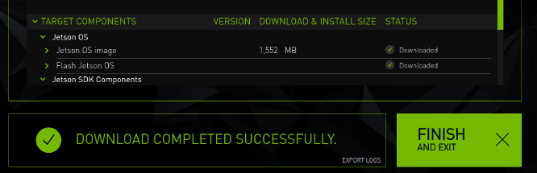

# diary

## **2021.04.01**
**训练模型心得**
```
在使用与训练权重的时候，特别是使用的是在imagenet上的预训练权重的时候，在开始训练其他任务的时候可以现将预训练的权重设置为不可学习（也就是固定预训练权重的参数，pytorch中使用下面的代码可以使得其不能学习），当收敛到平稳后将预训练模型后半部分放开让其可以进行学习，等到再一次平稳后放开所有的参数让其可以学习。同时在最后一次全部参数放开学习的阶段可以让学习率较小。（sgd的学习率可以设置为1e-6,保持不变让其再多跑一段时间。）

for i, p in enumerate(self.parameters()):
        p.requires_grad = False
```

**GPU计算相关知识，主要是GPU线层坐标计算相关问题**

**thread 索引的计算方式**
```
用公式表示：最终的线程Id = blockId * blockSize + threadId
1. blockId ：当前 block 在 grid 中的坐标（可能是1维到3维）
2. blockSize ：block 的大小，描述其中含有多少个 thread
3. threadId ：当前 thread 在 block 中的坐标（同样从1维到3维）

关键点：
1. grid中含有若干个blocks，其中 blocks 的数量由 gridDim.x/y/z 来描述。
某个 block 在此 grid 中的坐标由 blockIdx.x/y/z 描述。
2. blocks 中含有若干个 threads，其中 threads 的数量由 blockDim.x/y/z 来描述。
某个 thread 在此 block 中的坐标由 threadIdx.x/y/z 描述。
```

**1D grid, 1D block 类型的id计算**
```
blockSize = blockDim.x
blockId = blockIdx.x
threadId = threadIdx.x
Id = blockIdx.x * blockDim.x + threadIdx.x
```

**3D grid, 1D block 类型的id计算**
```
blockSize = blockDim.x（一维 block 的大小）
blockId = gridDim.x * gridDim.y * blockIdx.z + gridDim.x * blockIdx.y + blockIdx.x
threadId = threadIdx.x
Id = (gridDim.x * gridDim.y * blockIdx.z + gridDim.x * blockIdx.y + blockIdx.x ) * blockDim.x + threadIdx.x
```

**1D grid, 2D block 类型的id计算**
```
blockSize = blockDim.x * blockDim.y（二维 block 的大小）
blockId = blockIdx.x（一维 grid 中 block id）
threadId = blockDim.x * threadIdx.y + threadIdx.x
Id = blockIdx.x * (blockDim.x * blockDim.y) + blockDim.x * threadIdx.y + threadIdx.x
```

**3D grid, 3D block 类型的id计算**
```
blockSize = blockDim.x * blockDim.y * blockDim.z（三维 block 的大小）
blockId = gridDim.x * gridDim.y * blockIdx.z + gridDim.x * blockIdx.y + blockIdx.x
threadId = blockDim.x * blockDim.y * threadIdx. z + blockDim.x * threadIdx.y + threadIdx.x
Id = (gridDim.x * gridDim.y * blockIdx.z + gridDim.x * blockIdx.y + blockIdx.x) * (blockDim.x * blockDim.y * blockDim.z) + blockDim.x * blockDim.y * threadIdx. z + blockDim.x * threadIdx.y + threadIdx.x
```

**Caffe 框架中都是将数据拉伸为一维，图像坐标计算如下**
```
#define CUDA_KERNEL_LOOP(i, n)                              \
  for (int i = blockIdx.x * blockDim.x + threadIdx.x; i < (n); \
       i += blockDim.x * gridDim.x)


```

## **2021.04.01**
**Tensorrt CMakeLists 中部分命令解释**
```
add_library(${target_name} ${libtype} IMPORTED) 命令要结合set_property(TARGET ${target_name} PROPERTY IMPORTED_LOCATION ${${lib}_LIB_PATH}) 命令一起使用。作用是为target_name链接依赖库。如果使用IMPORTED_LOCATION关键字的话${lib}_LIB_PATH就需要指定到动态库所在位置。
```
```
add_custom_command()：该指令用于添加自定义命令，实现某些操作。比如，编译之前进行一些文件拷贝操作等。
该命令有两种使用方式：
1. 配合add_custom_target使用，该命令生成 add_custom_target 的依赖；
2. 单独使用。在生成目标文件（使用 add_executable() 或 add_library() 命令生成的文件）时自动执行 add_custom_command 指定的命令。
```

## **2021.03.26**
**Jetson TX2 替换为CMake3.16** 
```
1. sudo apt remove cmake
2. sudo apt purge --auto-remove cmake
3. version=3.13
4. build=3
5. mkdir ~/temp
6. cd ~/temp
7. wget https://cmake.org/files/v$version/cmake-$version.$build.tar.gz
8. tar -xzvf cmake-$version.$build.tar.g
9. cd cmake-$version.$build/
10. sudo apt-get install libssl-dev
11. ./bootstrap
12. make -j4
13. sudo make isntall
14. sudo cp ./bin/cmake /usr/bin/
15. cmake --version
输出结果：
cmake version 3.16.3
CMake suite maintained and supported by Kitware (kitware.com/cmake).


Could NOT find OpenSSL, try to set the path to OpenSSL root folder in the system variable OPENSSL_ROOT_DIR (missing: OPENSSL_LIBRARIES OPENSSL_INCLUDE_DIR) 

使用sudo apt-get install libssl-dev命令解决
```


## **2021.03.25**

**Jetson TX2 刷机** 
自从NVIDIA出现JetPack4.2版本之后，安装方式和之前就大不相同，看了前面的几个安装版本之后，感觉新版的好像安装起来更加简洁了，只需要一个SDK就可以，下面来看看详细步骤：

**本机使用的是ubuntu18.04.**

**Step 1.**
下载SDK Manager，从英伟达官网下载[LINK](https://developer.nvidia.com/embedded/jetpack)。下载完成之后是一个.deb文件，安装在一台有Ubuntu的X86架构的电脑就是台式机或者笔记本。
sudo apt install  ./xxxxxx.deb  |  sudo dpkg -i ./xxxxxx.deb

**Step 2.**
运行sdkmanager,然后登录nvidia账号，运行后选择如下图所示，红色框中是不需要选择的，这个是给本机刷cuda使用的，我们不需要。


**Step 3.**
然后进入到下载界面，如下如：


最好的是先进行下载，然后再进行安装，也就是上图中的 **Download now .Install later** 选项先不勾选，等下载后文件后再进行勾选

**Step 4.**
下载完成后点击Finsh按钮，这时就需要准备jetson tx2设备，需要将本机和jetson tx2链接到同一个路由器，然后给tx2接上键盘、鼠标、屏幕。同时使用刷机线将本机和tx2链接。


**Step 5.**
在本机上命令行输入lsusb看看输出有没有nvidia corp的字样，此时应该是没有才对。
```
tx2进入刷机状态操作：
1. tx2通电
2. 按一下power键开机
3. 按下RECOVERY FORCE并保持
4. 接着按一下RESET键
5. 保持按住RECOVERY FORCE键两秒以上并松开
此时tx2已经进入到了刷机状态，在本机（HOST）机上进行验证是否tx2进入了刷机状态，重新在命令行输入lsusb看看输出有没有nvidia corp的字样，有就说明tx2进入了刷机状态。
```
下面给出一张tx2按钮说明图：


**Step 6.**
重新打开sdkmanager，然后进行tx刷机操作，在刷机过程过出现下面的提示，此时需要打开tx2链接的屏幕，然后选在next指导看到ubuntu界面，在next的步骤中有一个账号密码的填写，此时需要将填写的密码也填写到下面图中。可以选择自动也可以选择手动。我这边是选择的自动初始化。**（注意：一定要在同一个网段下，也就是两台设备同时连接到一个路由器上）**


**Step 7.**
刷机完成的界面如下图：


然后将tx2重新启机，最后在命令行输入nvcc -V ,如果此时见面显示有nvidia驱动存在就表示刷机成功。

## **2021.03.19**
**Docker环境搭建：** [Link1](https://docs.docker.com/engine/install/ubuntu/)
[Link2](https://www.jianshu.com/p/49e8f814d6e0)


1. Step 1. ubuntu18.04 上安装docker
   ```
    sudo apt-get update

    sudo apt-get install apt-transport-https ca-certificates curl gnupg lsb-release
    //添加Docker官方GPG key
    curl -fsSL https://download.docker.com/linux/ubuntu/gpg | sudo gpg --dearmor -o /usr/share/keyrings/docker-archive-keyring.gpg
    //设置Docker稳定版仓库
    sudo add-apt-repository "deb [arch=amd64] https://download.docker.com/linux/ubuntu $(lsb_release -cs) stable"
    //添加仓库后，更新apt源索引
    sudo apt-get update
    sudo apt-get install docker-ce docker-ce-cli containerd.io
    apt-cache madison docker-ce
   ```

   ```
   开启docker服务:sudo service docker start
   关闭docker服务:sudo service docker stop
   重启docker服务:sudo service docker restart

   docker状态查看为systemctl status docker.service

   查看images: docker images
   docker ps命令可以查看容器的CONTAINER ID、NAME、IMAGE NAME、端口开启及绑定、容器启动后执行的COMMNAD。最常用的功能是通过ps来找到CONTAINER_ID，以便对特定容器进行操作。
   docker ps 默认显示当前正在运行中的container
   docker ps -a 查看包括已经停止的所有容器
   docker ps -l 显示最新启动的一个容器（包括已停止的
   docker attach命令对应开发者很有用，可以连接到正在运行的容器，观察容器的运行状况，或与容器的主进程进行交互。


    从docker registry server 中下拉image或repository（pull）
    Usage: docker pull [OPTIONS] NAME[:TAG]
    eg： docker pull centos
    也可以明确指定具体的镜像：
    docker pull centos:centos6

    Docker环境信息 — docker [info|version]
    容器生命周期管理 — docker [create|exec|run|start|stop|restart|kill|rm|pause|unpause]
    容器操作运维 — docker [ps|inspect|top|attach|wait|export|port|rename|stat]
    容器rootfs命令 — docker [commit|cp|diff]
    镜像仓库 — docker [login|pull|push|search]
    本地镜像管理 — docker [build|images|rmi|tag|save|import|load]
    容器资源管理 — docker [volume|network]
    系统日志信息 — docker [events|history|logs]
   ```
2. Step 2. 安装nvidia-docker
   [Link](https://www.jianshu.com/p/784d305a9d58)
   ```
   curl https://get.docker.com | sh
   sudo systemctl start docker && sudo systemctl enable docker
   # 设置stable存储库和GPG密钥：
   distribution=$(. /etc/os-release;echo $ID$VERSION_ID)    && curl -s -L https://nvidia.github.io/nvidia-docker/gpgkey | sudo apt-key add -    && curl -s -L https://nvidia.github.io/nvidia-docker/$distribution/nvidia-docker.list | sudo tee /etc/apt/sources.list.d/nvidia-docker.list
    # 要访问experimental诸如WSL上的CUDA或A100上的新MIG功能之类的功能，您可能需要将experimental分支添加到存储库列表中.# # 可加可不加
    curl -s -L https://nvidia.github.io/nvidia-container-runtime/experimental/$distribution/nvidia-container-runtime.list | sudo tee /etc/apt/sources.list.d/nvidia-container-runtime.list
    # nvidia-docker2更新软件包清单后，安装软件包（和依赖项）：
    sudo apt-get update
    sudo apt-get install -y nvidia-docker2
    sudo pkill -SIGHUP dockerd
    # 设置默认运行时后，重新启动Docker守护程序以完成安装：
    sudo systemctl restart docker

    sudo docker run --runtime=nvidia --rm nvidia/cuda:11.1-base nvidia-smi

   ```
   修改docker镜像保存数据路径 [LINK](https://blog.csdn.net/xiawenping/article/details/111461921)
   (1) 首先停止 docker 服务：
   systemctl stop docker
   (2) 然后移动整个 /var/lib/docker 目录到目的路径(/data/docker)：
   mv /var/lib/docker  /data/docker
   (3) 创建软链接
   ln -s /data/docker /var/lib/docker
   Note：命令的意思是 /var/lib/docker 是链接文件名，其作用是当进入/var/lib/docker目录时，实际上是链接进入了 /data/docker 目录
   (4) 重启 docker
   systemctl start docker
   
3. 55

## **2021.03.08**
[LINK](https://github.com/52CV/CVPR-2021-Papers)
浏览cvpr-2021相关论文. 持续跟踪...

##  **混淆矩阵的pytorch实现代码**
```
混淆矩阵的python实现：(pytorch)
# 输入参数
# label (N, H, W)  
# pred  (N, C, H, W)
# size  (H, W)
# num_class  int (15)
# ignore     int (255)
def get_confusion_matrix(label, pred, size, num_class, ignore=-1):
    output = pred.cpu().numpy().transpose(0, 2, 3, 1)
    # 将变形后的输出数据进行最大值挑选出来重新组成一个矩阵，shape(N, H, W)
    seg_pred = np.asarray(np.argmax(output, axis=3), dtype=np.uint8)
    # 标签数据转为矩阵
    seg_gt = np.asarray(
    label.cpu().numpy()[:, :size[-2], :size[-1]], dtype=np.int)
    # 将标签和预测中的忽略数据清除,然后将数据拉伸为***1维***.
    ignore_index = seg_gt != ignore
    seg_gt = seg_gt[ignore_index] # ignore_index中的数据为False | True
    seg_pred = seg_pred[ignore_index]
    # 将预测数据根据标签数据进行混淆矩阵的映射，例如将标签数据中的2 和 预测中的3映射到(2 * num_class + 3) 位置上
    index = (seg_gt * num_class + seg_pred).astype('int32')
    # 统计映射后的数据的bin，就是映射后各个位置上数据的个数情况。
    label_count = np.bincount(index)
    confusion_matrix = np.zeros((num_class, num_class))
    # 根据映射结果将映射到二维矩阵中。
    for i_label in range(num_class):
        for i_pred in range(num_class):
            cur_index = i_label * num_class + i_pred
            if cur_index < len(label_count):
                confusion_matrix[i_label,
                                 i_pred] = label_count[cur_index]
    return confusion_matrix
```


## **2021.03.05**
```
情形：使用ddrnet23-slim_ocr 进行分割模型训练的时候由于ddrnet网络输出的特征通道较小，后面继续接OCR模块的时候经过实验表明效果不是太好。
    下面是一些改进的方法：
1. 将深度聚合金字塔合并模块(DAPPM)和主干网络的特征使用concat替代add操作，增加了ddrnet网络输出特征层的通道。由之前的128变为了256。
2. ddrnet网络结构中存在relu后直接链接relu的情况。同时在主干网络中存在过多的relu激活层。
3. 在DAPPM模块中使用的是BN+RELU_CONV的方式进行前向计算，通常我们使用的是CONV+BN+RELU的方式进行前向计算，通过实验表明，使用前一种方案在训练阶段所占用的显存要比后一种小。（通过对比通道的改变，前一种conv的通道比后一种conv的小。）
```

## **2021.03.04**
```
情形：部署pytorch训练后的模型，将.pth模型使用以下的代码转为.onnx的模型，接着使用onnx2trt将onnx模型转为trt模型，最后在tx2上部署。

torch.onnx.export(net,               # model being run
                x,                         # model input (or a tuple for multiple inputs)
                output_path,   # where to save the model (can be a file or file-like object)
                export_params=True,        # store the trained parameter weights inside the model file
                opset_version=11,          # the ONNX version to export the model to
                do_constant_folding=True,  # whether to execute constant folding for optimization
                input_names = ['inputx'],   # the model's input names
                output_names = ['outputy'], # the model's output names
                verbose=True,
                )

Tips.
1. tx2上分为tensorrt5.1.5和tensorrt7.2.2两个版本，使用tensorrt5.1.5的时候需要使用pytorch1.1.0转存onnx模型,tensorrt7.2.2可以使用pytorch1.7转存模型。
3.tensorrt5.1.5没有prelu激活层，所以需要自己修改。
4.tensorrt7.2.2版本的完整项目在github:https://github.com/liyaoshun/trt_deploy.git (私人仓库) ^.^ ^.^ ^.^

```

```
pytorch模型转存onnx注意事项：
1. 变量需要使用常量形式，如包含有.size()或者.shape[]的语句需要使用torch.tensor(.size(i)).item()
2. F.interpolate 在使用双线性的时候需要设置align_corners=False
3. 使用多卡训练的模型然后再使用单卡测试的时候，BN在转存的时候使用torch.nn.BatchNorm2d代替torch.nn.SyncBatchNorm。
```