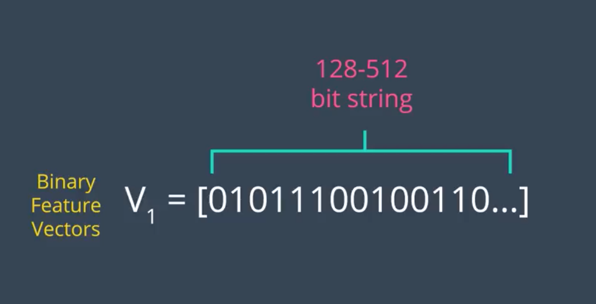
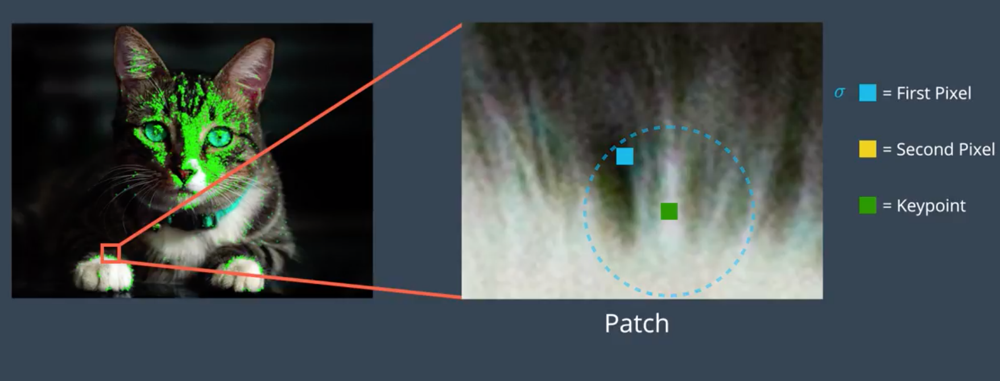
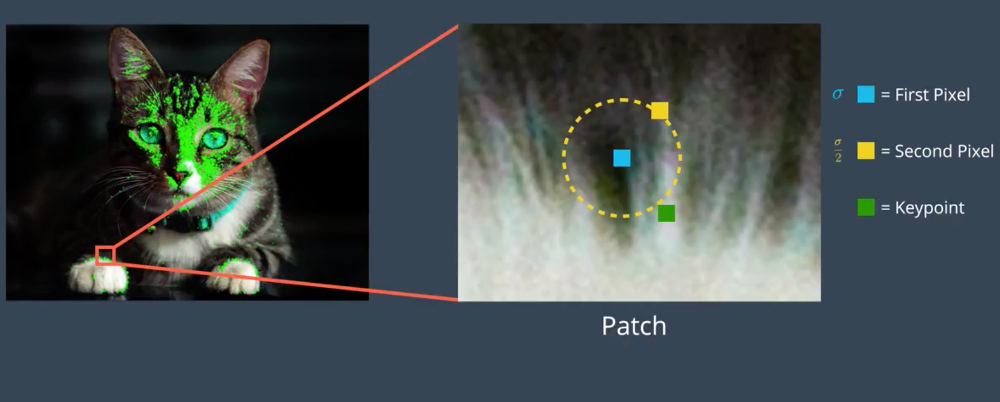
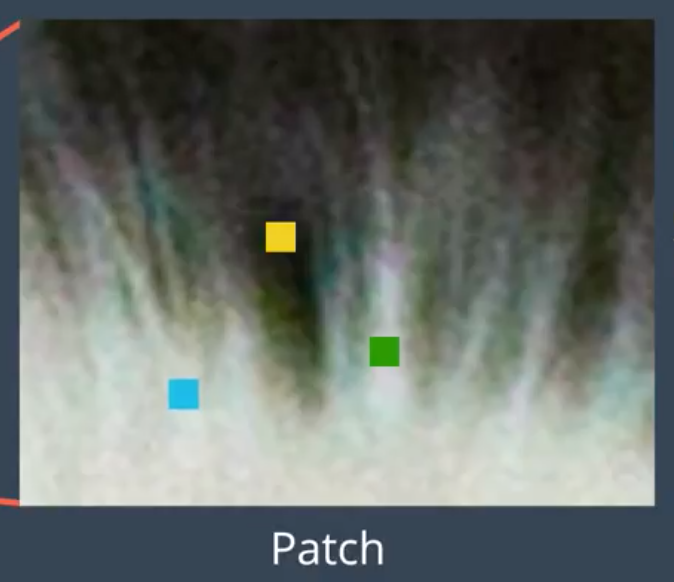
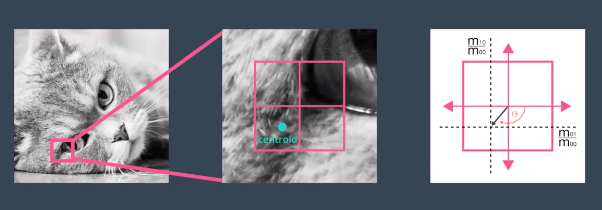

#  **传统图像处理**

## **特征点提取**

### **FAST特征点**
**FAST定义：**
```
FAST的全称为Features From Accelerated Segment Test。Rosten等人将FAST角点定义为：若某像素点与其周围领域内足够多的像素点处于不同的区域，则该像素点可能为角点。也就是某些属性与众不同，考虑灰度图像，即若该点的灰度值比其周围领域内足够多的像素点的灰度值大或者小，则该点可能为角点。
```

**计算步骤：**
```
1. 从图片中选取一个像素P，下面我们将判断它是否是一个特征点。我们首先把它的亮度值设为Ip。
2. 设定一个合适的阈值t。
3. 考虑以该像素点为中心的一个半径等于3像素的离散化的Bresenham圆，这个圆的边界上有16个像素（如图1所示）。
4. 现在，如果在这个大小为16个像素的圆上有n个连续的像素点，它们的像素值要么都比Ip+t大，要么都比Ip−t小，那么它就是一个角点。（如图1中的白色虚线所示）。n的值可以设置为12或者9，实验证明选择9可能会有更好的效果。
```

```
上面的算法中，对于图像中的每一个点，我们都要去遍历其邻域圆上的16个点的像素，效率较低。我们下面提出了一种高效的测试（high-speed test）来快速排除一大部分非角点的像素。该方法仅仅检查在位置1，9，5和13四个位置的像素，首先检测位置1和位置9，如果它们都比阈值暗或比阈值亮，再检测位置5和位置13。如果P是一个角点，那么上述四个像素点中至少有3个应该必须都大于Ip+t或者小于Ip−t，因为若是一个角点，超过四分之三圆的部分应该满足判断条件。如果不满足，那么p不可能是一个角点。对于所有点做上面这一部分初步的检测后，符合条件的将成为候选的角点，我们再对候选的角点，做完整的测试，即检测圆上的所有点。

缺点：
1. 当我们设置n<12时就不能使用快速算法来过滤非角点的点；
2. 检测出来的角点不是最优的，这是因为它的效率取决于问题的排序与角点的分布；
3. 对于角点分析的结果被丢弃了；
4. 多个特征点容易挤在一起。
```

<div  align=center>

图1.
</div>


**非极大值抑制**
```
从邻近的位置选取了多个特征点是另一个问题，我们可以使用Non-Maximal Suppression来解决。
1. 为每一个检测到的特征点计算它的响应大小（score function）V。这里V定义为点p和它周围16个像素点的绝对偏差的和。
2. 考虑两个相邻的特征点，并比较它们的V值。
3. 值较低的点将会被删除。
```

**总结**
```
FAST算法比其他已知的角点检测算法要快很多倍，但是当图片中的噪点较多时，它的健壮性并不好，而且算法的效果还依赖于一个阈值t。而且FAST不产生多尺度特征而且FAST特征点没有方向信息，这样就会失去旋转不变性。
```

## **Brief描述子**
**BRIEF 是 Binary Robust Independent Elementary Features 的简称,它的作用是根据一组关键点创建二元特征向量。二元特征向量又称为二元描述符，是仅包含 1 和 0 的特征向量。在 BRIEF 中 每个关键点由一个二元特征向量描述，该向量一般为 128-512 位的字符串，其中仅包含 1 和 0。**
```
计算机运行的是二进制或机器代码，因此使用二元特征向量的一大优势是可以非常高效地存储在内存中，并且可以快速计算。速度对实时应用来说极为关键，这些特性不仅使 BRIEF 速度非常快，而且使 BRIEF 能够在计算资源非常有限的设备（例如智能手机）上运行。
```
<div  align=center>

</div>

**BRIEF 如何为每个点创建这些二元描述符？**
```
1. BRIEF 算法首先利用高斯核对给定图像进行平滑处理，以防描述符对高频噪点过于敏感。
```
```
2.对于给定关键点，例如猫爪上的这个点。
```
<div  align=center>

</div>

```
BRIEF 从该关键点周围界定好的邻域内随机选择一对像素，关键点周围的邻域称为 Patch，它是一个具有特定像素宽度和高度的正方形。这里显示的随机对中的第一个像素，是一个蓝色正方形，它是从以关键点为中心的高斯分布中抽取的一个像素，标准偏差或分散趋势为 σ。
```
<div  align=center>

</div>

```
这里显示为黄色正方形的像素，是随机对中的第二个像素。它是从以该第一个像素为中心的高斯分布中抽取的像素，标准偏差为 σ/2，经验表明这种高斯选择提高了特征匹配率。
```

```
BRIEF 然后开始为关键点构建二元描述符，方法是如下所示地比较这两个像素的亮度。如果第一个像素比第二个亮，则为描述符中的相应位分配值 1，否则分配值 0。
```

<div  align=center>

</div>

```
在上面新选取的随机像素中，我们看到现在第一个像素比第二个亮，因此为特征向量中的第二个位分配值 1。
对于 256 位向量，BRIEF 会针对同一关键点重复这一流程 256 次，然后转到下个关键点。接着将 256 个像素亮度比较结果放入该关键点的二元特征向量中。BRIEF 像这样为图像中的每个关键点创建一个向量。
```

**缩放不变性和旋转不变性**

**缩放不变性**
```
1. 给定一个图像 ORB 算法首先开始构建图像金字塔。
2. 图像金字塔是单个图像的多尺度表示法，由一系列原始图像的不同分辨率版本组成。金字塔的每个级别都由上个级别的图像下采样版本组成。下采样是指图像分辨率被降低，比如图像按照 1/2 比例下采样。因此一开始的 4x4 正方形区域现在变成 2x2 正方形。图像的下采样包含更少的像素，并且以 1/2 的比例降低大小。
3. ORB 创建好图像金字塔后，它会使用 FAST 算法从每个级别不同大小的图像中快速找到关键点。
4. 通过确定每个级别的关键点 ORB 能够有效发现不同尺寸的对象的关键点，这样的话 ORB 实现了部分缩放不变性。
5. 现在 ORB 获得了与这个图像金字塔每个级别相关的关键点。在发现金字塔所有级别中的关键点后，ORB 现在为每个关键点分配一个方向，例如朝左或朝右，取决于该关键点周围的强度是如何变化的。
```
**旋转不变性**
```
1. 方法是首先计算以该关键点为中心的方框中的强度形心。强度形心可以看做给定 patch 中的平均像素强度的位置。
2. 计算强度形心后，通过画一条从关键点到强度形心的向量，获得该关键点的方向，如下图所示。这个关键点的方向是向下并朝左，因为这个区域的亮度朝着这个方向增强。（所有尺度上进行计算）
```
<div  align=center>

</div>

```
1. 找到关键点并为其分配方向后，ORB 现在使用修改后的 BRIEF 版本创建特征向量，这个修改后的 BRIEF 版本称为 rBRIEF，即 Rotation-Aware BRIEF。无论对象的方向如何，它都可以为关键点创建相同的向量，使得 ORB 算法具有旋转不变性，意味着它可以在朝着任何角度旋转的图像中检测到相同的关键点。
2. 和 BRIEF 一样 rBRIEF 首先在给定关键点周围的已界定 patch 中随机选择 256 个像素对，以构建 256 位向量。然后根据关键点的方向角度旋转这些随机像素对，使随机点的方向与关键点的一致。最后, rBRIEF 对比随机像素对的亮度并相应地分配 1 和 0 创建对应的特征向量，为图像中的所有关键点创建的所有特征向量集合称之为 ORB 描述符。
```