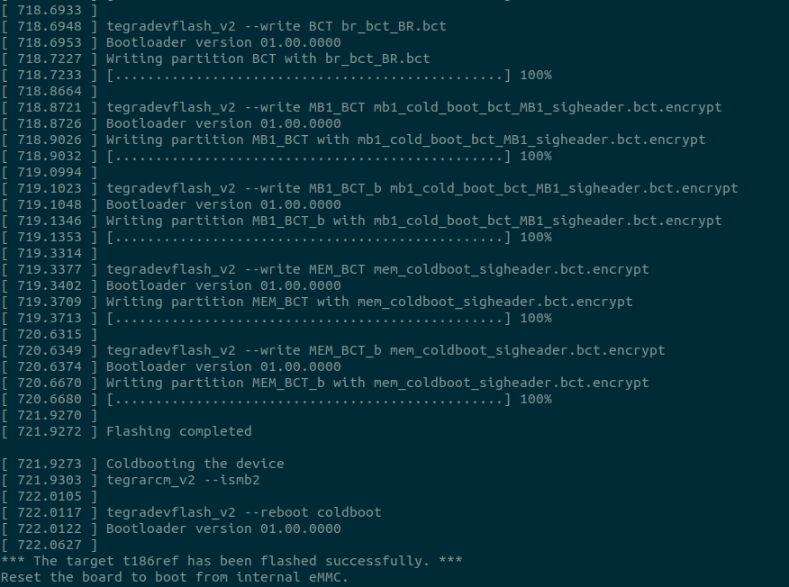

# 升级NX464步骤

```
CCU升级不能搞定，需要单独从deb来升级tensortt，以下是升级的步骤
```

## 对CCU盒子进行最新版本的P3刷机
```
1. 刷机包地址: http://10.11.35.225/dailybuild/CCU/patrol_dev/patrol/patrol_V4.2.412_20240312_014035/patrol_V4.2.412.tar.gz
2. 解压: tar -zxvf patrol_V4.2.412.tar.gz  && cd patrol_V4.2.412
3. 使用强刷数据线连接CCU盒子，同时CCU盒子打开使用命令 sudo reboot forced-recovery 进入到强刷模式.
4. ./nx-flash-keep-ftm.sh     按提示，输入y，开始刷机
显示结如下
```
<div  align=center>

</div>

```
刷机完成后修改IP
1. sudo vi /etc/network/interfaces
2. 将其中的内容改为如下所示
    # interfaces(5) file used by ifup(8) and ifdown(8)
    # Include files from /etc/network/interfaces.d:
    source-directory /etc/network/interfaces.d
    auto eth0
    allow-hotplug eth0
    iface eth0 inet static
    address 10.12.32.166
    gateway 10.12.32.254
    netmask 255.255.255.0
    dns-nameservers 10.12.32.243 61.139.2.69
3. reboot电脑
```

## **升级必要的DEB**

### **升级deepstream-6.0.deb**
1. sudo dpkg -i deepstream-6.0_6.0.1-1_arm64.deb
报错信息如下所示:

```
dpkg: error processing archive deepstream-6.0_6.0.1-1_arm64.deb (--install):
 trying to overwrite '/opt/nvidia/deepstream/deepstream', which is also in package deepstream-5.0 5.0.1-1
Errors were encountered while processing:
 deepstream-6.0_6.0.1-1_arm64.deb
```

**解决方案:(流程)**

```
1. dpkg -l|grep deepstream . 查看安装版本信息
2. sudo apt-get purge --remove deepstream-5.0(grep出来的版本名)
```

**安装时候出现依赖错误,信息如下所示:**
```
Unpacking deepstream-6.0 (6.0.1-1) ...
dpkg: dependency problems prevent configuration of deepstream-6.0:
 deepstream-6.0 depends on libnvinfer8 (>= 8.0.0); however:
  Package libnvinfer8 is not installed.
 deepstream-6.0 depends on libnvinfer-dev (>= 8.0.0); however:
  Version of libnvinfer-dev on system is 7.1.3-1+cuda10.2.
 deepstream-6.0 depends on libnvparsers8 (>= 8.0.0); however:
  Package libnvparsers8 is not installed.
 deepstream-6.0 depends on libnvparsers-dev (>= 8.0.0); however:
  Version of libnvparsers-dev on system is 7.1.3-1+cuda10.2.
 deepstream-6.0 depends on libnvonnxparsers8 (>= 8.0.0); however:
  Package libnvonnxparsers8 is not installed.
 deepstream-6.0 depends on libnvonnxparsers-dev (>= 8.0.0); however:
  Version of libnvonnxparsers-dev on system is 7.1.3-1+cuda10.2.
 deepstream-6.0 depends on libnvinfer-plugin8 (>= 8.0.0); however:
  Package libnvinfer-plugin8 is not installed.
 deepstream-6.0 depends on libnvinfer-plugin-dev (>= 8.0.0); however:
  Version of libnvinfer-plugin-dev on system is 7.1.3-1+cuda10.2.
 deepstream-6.0 depends on libnvvpi1 (>= 1.0.13); however:
  Package libnvvpi1 is not installed.

dpkg: error processing package deepstream-6.0 (--install):
 dependency problems - leaving unconfigured
Errors were encountered while processing:
 deepstream-6.0
```

**更新cudnn**
```
dpkg -l|grep libcudnn
卸载已有的软件
sudo apt-get purge --remove libcudnn8-doc
sudo apt-get purge --remove libcudnn8 

开始安装nx464的cudnn
sudo dpkg -i libcudnn8_8.2.1.32-1+cuda10.2_arm64.deb
sudo dpkg -i libcudnn8-dev_8.2.1.32-1+cuda10.2_arm64.deb

```


**libnvinfer等基础库的安装**
```
1. dpkg -l|grep libnvinfer,显示如下:
ii  libnvinfer-bin                                     7.1.3-1+cuda10.2                    arm64        TensorRT binaries
ii  libnvinfer-dev                                     7.1.3-1+cuda10.2                    arm64        TensorRT development libraries and headers
ii  libnvinfer-doc                                     7.1.3-1+cuda10.2                    all          TensorRT documentation
ii  libnvinfer-plugin-dev                              7.1.3-1+cuda10.2                    arm64        TensorRT plugin libraries
ii  libnvinfer-plugin7                                 7.1.3-1+cuda10.2                    arm64        TensorRT plugin libraries
ii  libnvinfer-samples                                 7.1.3-1+cuda10.2                    all          TensorRT samples
ii  libnvinfer7                                        7.1.3-1+cuda10.2                    arm64        TensorRT runtime libraries

2. 卸载查询出来的库文件
sudo apt-get purge --remove libnvinfer-samples
sudo apt-get purge --remove libnvinfer-doc
sudo apt-get purge --remove libnvinfer-plugin7   | 此时后卸载相关的三个包libnvinfer-bin* libnvinfer-plugin-dev* libnvinfer-plugin7*
sudo apt-get purge --remove libnvinfer7   | 此时会写在6个相关包libnvinfer-dev* libnvinfer7* libnvonnxparsers-dev* libnvonnxparsers7* libnvparsers-dev*
  libnvparsers7*

注意：此时的deepstream-6.0需要的依赖包libnvvpi1还没被安装没，在441环境中是没有安装的，是一个新的安装包. 使用如下安装命令进行安装:
sudo dpkg -i vpi-lib-1.2.3-aarch64-l4t.deb
sudo dpkg -i vpi-dev-1.2.3-aarch64-l4t.deb
在安装vpi-samples-1.2.3-aarch64-l4t.deb和vpi-demos-1.2.3-aarch64-l4t.deb时分别报错: vpi1-samples depends on python-vpi1 (>= 1.2); however:
  Package python-vpi1 is not installed.     |     vpi1-demos pre-depends on xdg-utils
  xdg-utils is not installed.
解决依赖问题:sudo apt-get install -y xdg-utils     | 此时还会报一堆依赖问题，使用命令解决：sudo apt-get -f install    暂时先不处理这个问题,将刚刚安装的软件卸载:sudo apt-get purge --remove  vpi1-demos libfltk-gl1.3 libfltk-images1.3 libfltk1.3

3. 开始安装nx464中的libnvinfer库
sudo dpkg -i libnvinfer8_8.2.1-1+cuda10.2_arm64.deb
sudo dpkg -i libnvparsers8_8.2.1-1+cuda10.2_arm64.deb
sudo dpkg -i libnvonnxparsers8_8.2.1-1+cuda10.2_arm64.deb
sudo dpkg -i libnvinfer-plugin8_8.2.1-1+cuda10.2_arm64.deb
sudo dpkg -i libnvinfer-bin_8.2.1-1+cuda10.2_arm64.deb
sudo dpkg -i libnvinfer-dev_8.2.1-1+cuda10.2_arm64.deb
sudo dpkg -i libnvinfer-doc_8.2.1-1+cuda10.2_all.deb
sudo dpkg -i libnvparsers-dev_8.2.1-1+cuda10.2_arm64.deb
sudo dpkg -i libnvonnxparsers-dev_8.2.1-1+cuda10.2_arm64.deb
sudo dpkg -i libnvinfer-plugin-dev_8.2.1-1+cuda10.2_arm64.deb
sudo dpkg -i libnvinfer-samples_8.2.1-1+cuda10.2_all.deb

```

**安装tensorrt**
```
sudo dpkg -i tensorrt_8.2.1.9-1+cuda10.2_arm64.deb

```

**安装deepstream  （执行完上面的操作后安装deepstream）**
```
sudo dpkg -i deepstream-6.0_6.0.1-1_arm64.deb
cd /opt/nvidia/deepstream  && sudo rm -rf deepstream-5.0

```


**继续卸载安装container**
```
sudo apt-get purge --remove  nvidia-container-csv-tensorrt

```


## **解决cuda版本和驱动不一致问题**
sudo dpkg -i cuda-repo-l4t-10-2-local_10.2.460-1_arm64.deb

sudo dpkg -i cuda-repo-cross-aarch64-ubuntu1804-10-2-local_10.2.460-1_all.deb


sudo dpkg -i nvidia-l4t-core_32.7.4-20230608211515_arm64.deb

sudo dpkg -i nvidia-l4t-cuda_32.7.4-20230608211515_arm64.deb

sudo dpkg -i nvidia-l4t-3d-core_32.7.4-20230608211515_arm64.deb

sudo dpkg -i nvidia-l4t-apt-source_32.7.4-20230608211515_arm64.deb   | 修改后直接update&&upgrade 进行测试.


# **直接使用update&&upgrade方式进行升级464**
1. sudo apt update 
2. sudo apt upgrade
解决方案:
sudo apt --fix-broken install -o Dpkg::Options::="--force-overwrite"
3. 继续sudo apt upgrade
错误提示:
```
/opt/nvidia/l4t-bootloader-config/nv-l4t-bootloader-config.sh: line 592: i2cget: command not found
WARNING. Read i2c-0 slave addr: 0x50 failed.
ERROR. Unsupported board ID: .
Cannot install bootloader package. Exiting...
Starting bootloader post-install procedure.
rootfs AB is not enabled.
ERROR. Procedure for bl_update_payload update FAILED.
Cannot install package. Exiting...
dpkg: error processing package nvidia-l4t-bootloader (--configure):
 installed nvidia-l4t-bootloader package post-installation script subprocess returned error exit status 1
Setting up nvidia-l4t-xusb-firmware (32.7.4-20230608211515) ...
/opt/nvidia/l4t-bootloader-config/nv-l4t-bootloader-config.sh: line 592: i2cget: command not found
WARNING. Read i2c-0 slave addr: 0x50 failed.
ERROR. Unsupported board ID: .
Cannot install bootloader package. Exiting...
Starting xusb firmware post-install procedure.
ERROR. Procedure for xusb firmware update FAILED.
Cannot install package. Exiting...
dpkg: error processing package nvidia-l4t-xusb-firmware (--configure):
 installed nvidia-l4t-xusb-firmware package post-installation script subprocess returned error exit status 1
Setting up libnvinfer-dev (8.2.1-1+cuda10.2) ...
dpkg: dependency problems prevent configuration of nvidia-l4t-initrd:
 nvidia-l4t-initrd depends on nvidia-l4t-xusb-firmware (= 32.7.4-20230608211515); however:
  Package nvidia-l4t-xusb-firmware is not configured yet.

dpkg: error processing package nvidia-l4t-initrd (--configure):
 dependency problems - leaving unconfigured
Setting up libnvparsers8 (8.2.1-1+cuda10.2) ...
Setting up nvidia-l4t-3d-core (32.7.4-20230608211515) ...
Setting up libnvonnxparsers8 (8.2.1-1+cuda10.2) ...
Setting up nvidia-l4t-kernel-headers (4.9.337-tegra-32.7.4-20230608211515) ...
Setting up ubuntu-pro-client-l10n (31.2~18.04) ...
Setting up nvidia-l4t-cuda (32.7.4-20230608211515) ...
Setting up nvidia-l4t-multimedia (32.7.4-20230608211515) ...
Setting up libnvinfer-bin (8.2.1-1+cuda10.2) ...
Setting up libnvinfer-plugin-dev (8.2.1-1+cuda10.2) ...
Setting up nvidia-l4t-camera (32.7.4-20230608211515) ...
Setting up nvidia-container-runtime (3.7.0-1) ...
Setting up libnvparsers-dev (8.2.1-1+cuda10.2) ...
Setting up libnvonnxparsers-dev (8.2.1-1+cuda10.2) ...
Setting up nvidia-docker2 (2.8.0-1) ...
Setting up nvidia-l4t-graphics-demos (32.7.4-20230608211515) ...
Setting up nvidia-l4t-gstreamer (32.7.4-20230608211515) ...
Setting up libnvinfer-samples (8.2.1-1+cuda10.2) ...
Setting up tensorrt (8.2.1.9-1+cuda10.2) ...
Setting up nvidia-container-csv-tensorrt (8.2) ...
Installing new version of config file /etc/nvidia-container-runtime/host-files-for-container.d/tensorrt.csv ...
Processing triggers for man-db (2.8.3-2ubuntu0.1) ...
Processing triggers for libc-bin (2.27-3ubuntu1.6) ...
Processing triggers for nvidia-l4t-kernel (4.9.337-tegra-32.7.4-20230608211515) ...
Errors were encountered while processing:
 nvidia-l4t-bootloader
 nvidia-l4t-xusb-firmware
 nvidia-l4t-initrd
E: Sub-process /usr/bin/dpkg returned an error code (1)

```

# **更新文档**

https://docs.nvidia.com/jetson/archives/l4t-archived/l4t-3261/index.html#page/Tegra%20Linux%20Driver%20Package%20Development%20Guide/updating_jetson_and_host.html#


https://docs.nvidia.com/jetson/archives/l4t-archived/l4t-3261/index.html#page/Tegra%20Linux%20Driver%20Package%20Development%20Guide/updating_jetson_and_host.html#wwpID0E0UI0HA


https://developer.ridgerun.com/wiki/index.php/How_to_Use_A/B_Filesystem_Redundancy_and_OTA_with_NVIDIA_Jetpack


** 手动刷机教程**
https://docs.nvidia.com/jetson/archives/r34.1/DeveloperGuide/text/IN/QuickStart.html#in-quickstart

1. 下载Driver Package (BSP)和Sample Root Filesystem
2. tar xf Jetson_Linux_R32.7.4_aarch64.tbz2
3. cd Linux_for_Tegra/rootfs/
4.  sudo tar xpf ../../Tegra_Linux_Sample-Root-Filesystem_R32.7.4_aarch64.tbz2
5. cd ..
6. sudo ./apply_binaries.sh
7.  sudo ./flash.sh ${BOARD} mmcblk0p1


# **暂时还不能更新的软件列表**

cuda-documentation-10-2/stable 10.2.300-1 arm64 [upgradable from: 10.2.89-1]
cuda-toolkit-10-2/stable 10.2.460-1 arm64 [upgradable from: 10.2.89-1]