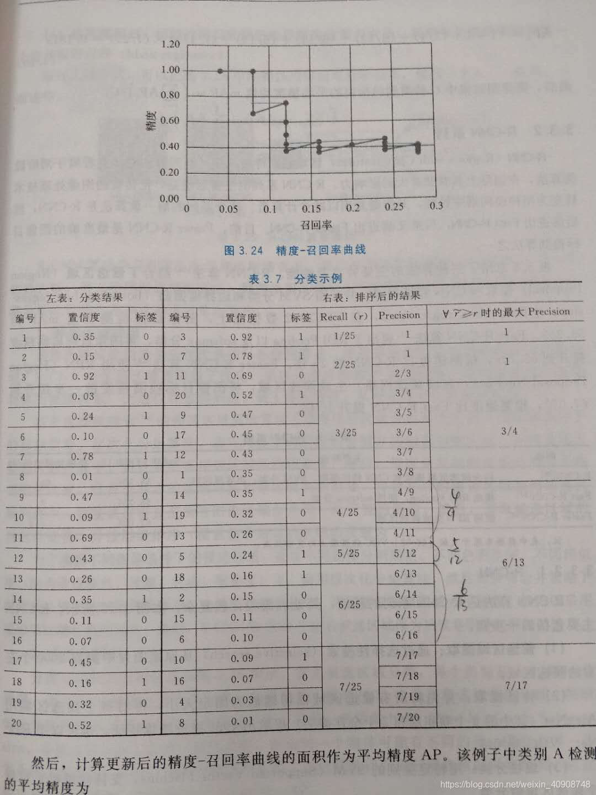

# **mAP计算方式**

[LINK](https://blog.csdn.net/qq_35916487/article/details/89076570)

首先说明计算mAP有多个版本，每个数据集和比赛用的版本和方式也不同，下以VOC与COCO举例说明。精确度（precision），召回率（recall）分别为：

P=TP/TP+FP   : 召回的正样本中正确数量除以所有召回正样本数量
R=TP/TP+FN   : 召回的正确正样本本数量除以所有正样本数量

```
常规的mAP计算为（这是一个N类检测任务）：
1、计算单张图片中class1的精度P（VOC默认IOU大于0.5即为TP，COCO稍复杂些，下文再说）
2、循环所有测试集图片，重复1过程求所有图片P的均值即为class1的AP
3、对剩余N-1类重复1和2过程，对每个类的AP求均值，即为mAP
```

以上分析了mAP值的原始初衷，仔细回想一下影响mAP值（即precision与recall）的有哪些因素呢：
1、IOU（例如IOU取接近0，recall会趋近于1，precision会趋紧于0）
2、bbox的score阈值

为了统一标准，VOC 2007年提出采用IOU阈值确定为0.5，采用11采样点来计算mAP，选择11个不同的recall（[0, 0.1, …, 0.9, 1.0]），可以认为是选择了11个rank，由于按照置信度排序，所以实际上等于选择了11个不同的置信度阈值。2010年以后VOC提出11点改为全部点。
```
以上步骤其实就是在常规计算mAP值外加了一层循环，即选取一系列的recall与precision采用点，相当于上述影响mAP值中的2因素进行全面的计算和求均值。
```

而COCO数据集在计算mAP时针对因素1，即IOU选取也做了调整，即对IOU选取也做了一次循环求均值的过程，IOU选取为 0.50：0.05：0.95

<div align='center'>

</div>


```
每当有一个物体被正确检测后就需要得出一个P用于画图

原本规则是对应同一个Recall的Precision取最大，同时要保证得到的最大Precision是单调递减的（precision monotonically decreasing）。
Recall=4/25 → Max Precision=4/9=0.4444
Recall=5/25 → Max Precision=5/12=0.4167
Recall=6/25 → Max Precision=6/13=0.4615

```
