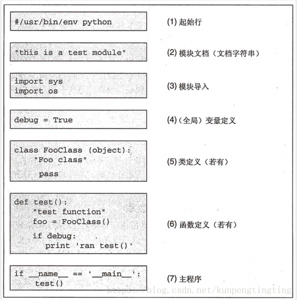

#   <div align = center>**MMCV框架梳理** </div>

## 文件总体结构

```
mmsegmentation
├── LICENSE
├── README.md
├── configs   //配置文件，针对每个网络的一写用户参数设置，比如数据集选用，transform操作配置清单，网络结构的配置清单等等。(只是配置清单，没有实现代码)
├── data        //数据集
├── demo    
├── docker
├── docs
├── mmseg  //分割的核心文件，包括数据集class模板，网络的结构的class模板（包括backbone，编码器，解码器），损失函数，训练，测试的api实现等等
├── mmsegmentation.egg-info
├── pytest.ini
├── requirements
├── requirements.txt
├── resources
├── setup.cfg
├── setup.py
├── tests  //测试工具，用于单独测试各个模块是否正常工作
├── tools  //用户工具箱
```

## configs文件夹
```
configs
├── _base_  //这里存的是更细节的配置信息：包括数据集配置，模型的参数配置，学习率等等
├── ann        //这里存的都是些完整的高定制化配置，用什么数据集，用什么网络，用什么学习率策略，是_base_的组装
├── ccnet
├── danet
├── deeplabv3
├── deeplabv3plus
├── encnet
├── fcn
├── fp16
├── gcnet
├── hrnet
├── nonlocal_net
├── ocrnet
├── psanet
├── pspnet
└── upernet
```

示例：/media/Program/CV/Project/SKMT/mmsegmentation/configs/pspnet/pspnet_r50-d8_512x512_20k_voc12aug.py
```
 _base_ = [
     '../_base_/models/pspnet_r50-d8.py',
     '../_base_/datasets/pascal_voc12_aug.py', '../_base_/default_runtime.py',
     '../_base_/schedules/schedule_20k.py'
 ]
 model = dict(
     decode_head=dict(num_classes=21), auxiliary_head=dict(num_classes=21))
其中,重点在于__base__文件夹：
```
## __base__文件夹

```
_base_
├── datasets      //数据集的配置，包括路径啊，类别啊，预处理的pipeline等等
│   ├── US.py
│   ├── ade20k.py
│   ├── cityscapes.py
│   ├── cityscapes_769x769.py
│   ├── custom_skmt.py
│   ├── pascal_voc12.py
│   └── pascal_voc12_aug.py
├── default_runtime.py
├── file_tree.md
├── models      //配置选用编码器，解码器，loss_decode等等
│   ├── ann_r50-d8.py
│   ├──。。。。。  //省略一下
└── schedules
    ├── schedule_160k.py
    ├── schedule_20k.py
    ├── schedule_40k.py
    └── schedule_80k.py
```

## mmcv文件夹
```
mmcv
├── CONTRIBUTING.md
├── Dockerfile
├── Jenkinsfile
├── LICENSE
├── MANIFEST.in
├── README.md
├── build
│   ├── lib.linux-x86_64-3.7
│   └── temp.linux-x86_64-3.7
├── docs
│   ├── Makefile
│   ├── ...
├── examples
│   ├── config_cifar10.py
│   ├── dist_train_cifar10.sh
│   ├── resnet_cifar.py
│   └── train_cifar10.py
├── mmcv
│   ├── __init__.py
│   ├── __pycache__
│   ├── _ext.cpython-37m-x86_64-linux-gnu.so
│   ├── _flow_warp_ext.cpython-37m-x86_64-linux-gnu.so
│   ├── arraymisc
│   ├── cnn
│   ├── fileio
│   ├── image
│   ├── model_zoo
│   ├── onnx
│   ├── ops
│   ├── parallel
│   ├── runner
│   ├── utils
│   ├── version.py
│   ├── video
│   └── visualization
├── mmcv_full.egg-info
├── requirements.txt
├── setup.cfg
├── setup.py
└── tests
    ├── data
    ├── test_arraymisc.py
    ├── test_cnn
    ├── test_config.py
    ├── test_fileclient.py
    ├── test_fileio.py
    ├── test_fp16.py
    ├── test_image
    ├── test_load_model_zoo.py
    ├── test_logging.py
    ├── test_misc.py
    ├── test_ops
    ├── test_optimizer.py
    ├── test_parallel.py
    ├── test_path.py
    ├── test_progressbar.py
    ├── test_registry.py
    ├── test_runner
    ├── test_timer.py
    ├── test_video
    └── test_visualization.py
这是open-mmlab做的一个python库，可以直接进行安装，是用于计算机视觉研究的基础python库，实际上这里的文件都是针对open-mmlab的众多框架的底层框架库，除了一些底层io，cnn，迭代器等等以外，open-mmlab都遵从了相同的程序的pipeline：
```

## python的执行顺序



```
python在开始执行的时候扫描整个工程，针对每一个类型的模块（这里指的是数据集，backbone，Loss等）都利用Registry对象储存起来，形成一个列表，下面举个例子：

在registry.py里我构建了一个简化版的Registry类，这个类的核心就是register_module方法，这是一个装饰器，用于获取class对象（注意，这里的对象指的是class本身，而不是class的实例，python的所有元素都是对象）。

class Registry:
    """A registry to map strings to classes.

    Args:
        name (str): Registry name.
    """
    def __init__(self, name):
        self._name = name
        self._module_dict = dict()

    def __len__(self):
        return len(self._module_dict)

    def __repr__(self):
        format_str = self.__class__.__name__ + \
                     f'(name={self._name}, ' \
                     f'items={self._module_dict})'
        return format_str

    @property
    def name(self):
        return self._name

    @property
    def module_dict(self):
        return self._module_dict

    def _register_module(self, module_class, module_name=None, force=False):
        self._module_dict[module_name]=module_class


    def register_module(self, name=None, force=False, module=None):
        # use it as a decorator: @x.register_module()
        def _register(*args):
            self._register_module(
                module_class=args, module_name=name, force=force)
            return args

        return _register

同时，我在main下面构建了两个类，TestA和TestB。

from registry import Registry

TEST=Registry('test')
print(TEST)

@TEST.register_module('TestA')
class TestA():

    def __init__(self):
        print('testA.....')
    @classmethod
    def get_class_name(cls):
        return cls.__name__

@TEST.register_module('TestB')
class TestB():

    def __init__(self):
        print('testB.....')
    @classmethod
    def get_class_name(cls):
        return cls.__name__

print(TEST)

main文件的执行顺序是：1. 导入registry文件，扫描整个文件。2. 执行语句 3. 最后扫描到TestA，发现装饰器，跳入装饰器中，装饰器中存在一个解析器_register_module函数，此函数的首参数是TestA class本身（注意，这里未实例化），最后把此class 作为对象存在Registry的实例对象TEST的_module_dict中。再接着向下执行TestB。我们可以看看两次的TEST输出（如果没有指定类名TestA），mmlab的做法是解析出类名放在items的key中的：

Registry(name=test, items={})
Registry(name=test, items={'TestA': (<class '__main__.TestA'>,), 'TestB': (<class '__main__.TestB'>,)})

mmlab利用这样的方式，构建对应的Resistry->读取config->按config指定的配置，从Resistry读取对应的class，然后实例化后返回。
整个过程就是从config各个字符串的配置，变成可执行的对象。
```


## ｍｍseg文件夹

```
这是最重要的文件夹，里面包含了数据集，网络结构，训练，测试的具体实现

mmseg
├── VERSION
├── __init__.py
├── apis
│   ├── __init__.py
│   ├── __pycache__
│   ├── inference.py
│   ├── test.py
│   └── train.py
├── core
│   ├── __init__.py
│   ├── __pycache__
│   ├── evaluation
│   ├── seg
│   └── utils
├── datasets                                      //用于自定义数据集，以及数据集构建器
│   ├── __init__.py
│   ├── __pycache__
│   ├── ade.py
│   ├── builder.py                         //每个dataset文件夹下和model文件夹下都有一个builder文件，作用是利用cfg的字符串信息构建对应的实例对象，比如dataset对象等。
│   ├── cityscapes.py
│   ├── custom.py
│   ├── dataset_wrappers.py
│   ├── pipelines
│   ├── skmt.py
│   ├── us.py
│   └── voc.py
├── file_tree.md
├── models                                     
│   ├── __init__.py
│   ├── __pycache__
│   ├── backbones                   //存放了各种各样的backbone的实现
│   ├── builder.py                    //此builder同上
│   ├── decode_heads             
│   ├── losses
│   ├── segmentors              //分割器，目前是CascadeEncoderDecoder分割器，这是一个nn.Module的派生类
│   └── utils
├── ops
│   ├── __init__.py
│   ├── __pycache__
│   ├── encoding.py
│   ├── separable_conv_module.py
│   └── wrappers.py
├── utils
│   ├── __init__.py
│   ├── __pycache__
│   ├── collect_env.py
│   └── logger.py            //logging的二次封装
└── version.py
```

## builder.py
```
在mmseg/seg/,mmseg/datasets,mmseg/model里都有builder函数，用于将config信息 “编译” 实例对象，比如module模块。

这里的Registry('segmentor')就有点类似java的注解，将模块在启动前写入map中形成映射，然后在使用的时候直接调用就行。python也是在启动的时候扫描所有文件的时候遇到了有Registry就将其缓存到map中。例如下面的这个类:

BACKBONES = Registry('backbone')

@BACKBONES.register_module()
class HRNet(nn.Module):
    ...
这些代码的含义就是将HRNet缓存到BACKBONES中，以便后面使用BACKBONES.get()得到。
```

[LINK](https://blog.csdn.net/qq_20549061/article/details/107871736)